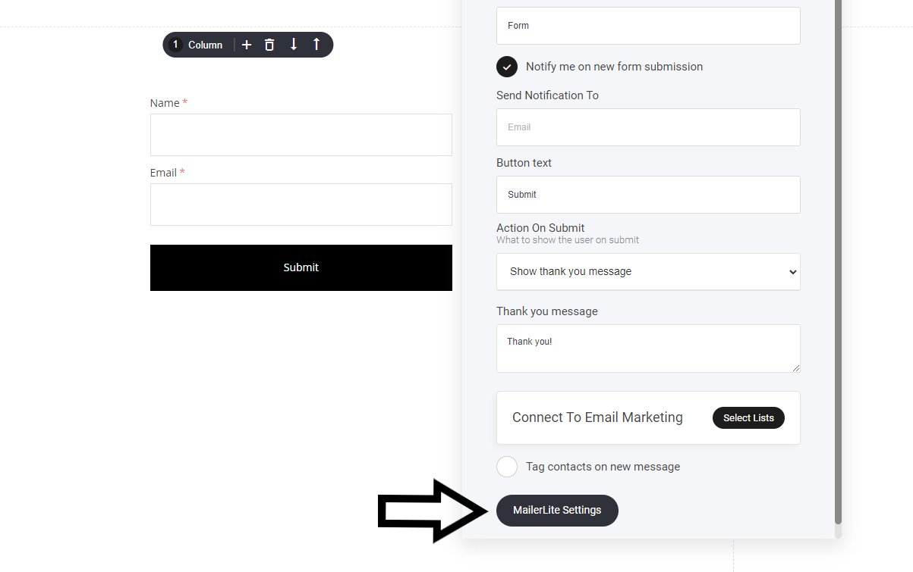

# 他社メールサービスとの統合

MailchimpからActiveCampaignまで、さまざまなネイティブEメール統合機能を提供しており、プロジェクトに簡単に追加することができます。&#x20;

まず、\[設定] > \[アプリケーション] > \[アプリケーションを追加]を選択し、すでに使用しているメールプロバイダを選択します。

<figure><figcaption></figcaption></figure>

各プロバイダーには独自の接続設定があります。そのほとんどは、プロバイダー自身が提供する API キーを追加するだけです。資格情報を貼り付けるだけで、自動的に接続されます。

### Eメールリストへの登録方法

ビルダー内には、訪問者をお好みのメールマーケティングプロバイダーに追加するための様々なオプションがあります。フォームへの入力から、プロジェクト内の決済時まで、あらゆる場面で購入したキャンペーンにユーザーを追加することができます。

接続が成功すると、フォームや決済画面などの下部に、接続したメールプロバイダーの追加オプションが表示されます。この例では、Mailerliteと接続していることが確認できます。これにより、ユーザーがフォームに入力するたびに、選択したMailerliteのメーリングリストに自動的に追加されるようになります。

<figure><figcaption></figcaption></figure>

### 統合できるメールサービス一覧

* **MailChimp**
* **MailerLite**
* **Moosend**
* **GetResponse**
* **Aweber**
* **ActiveCampaign**

