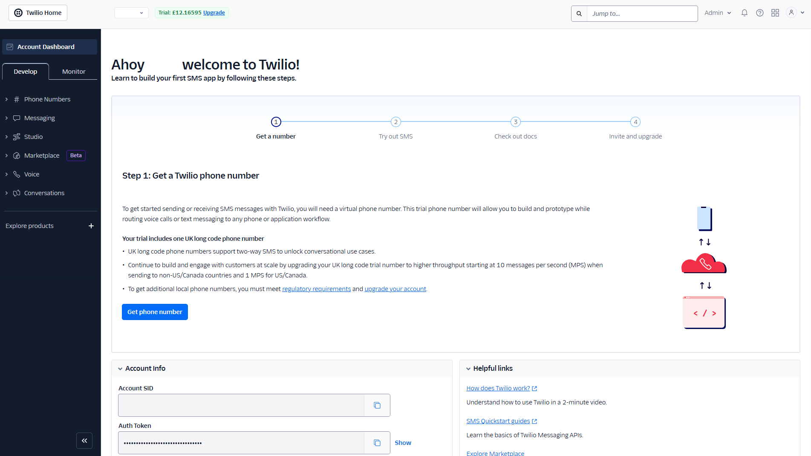
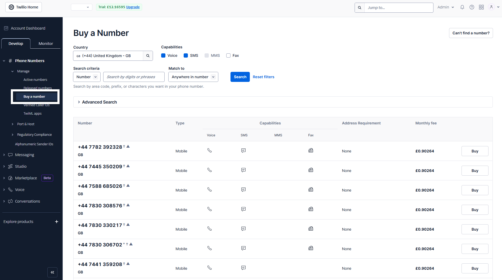
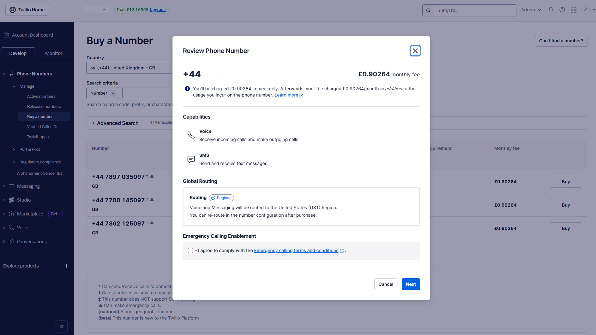
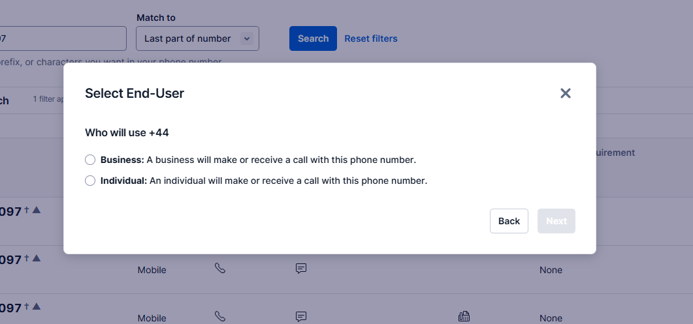
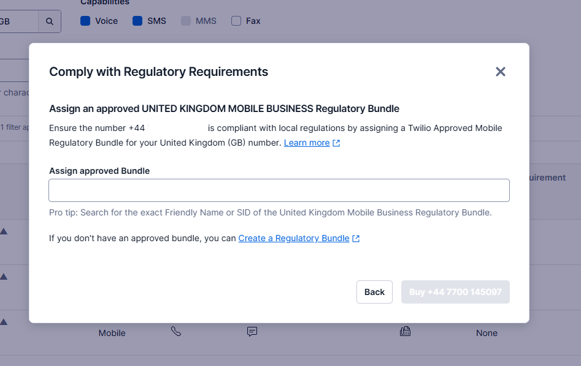
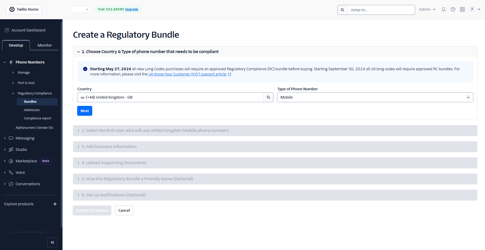
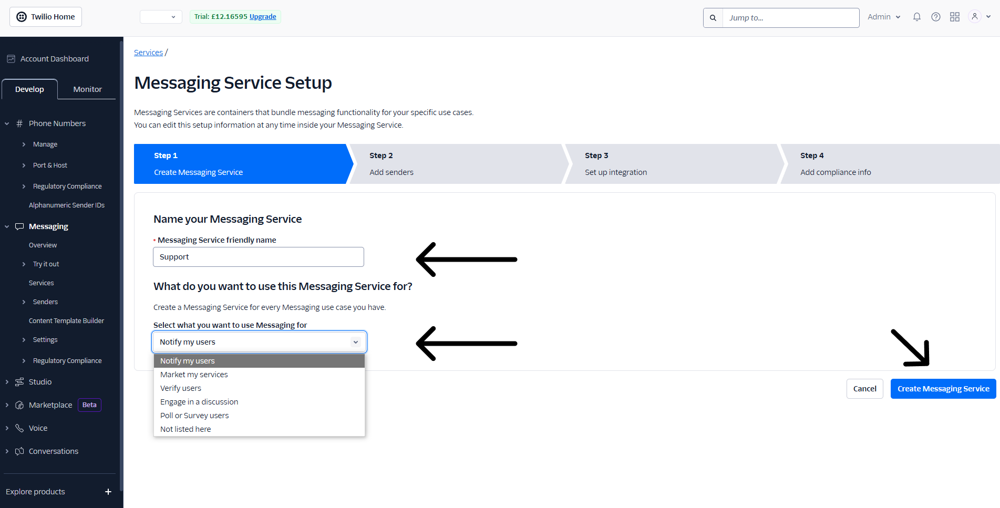
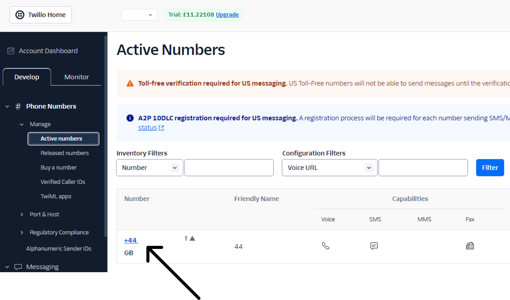
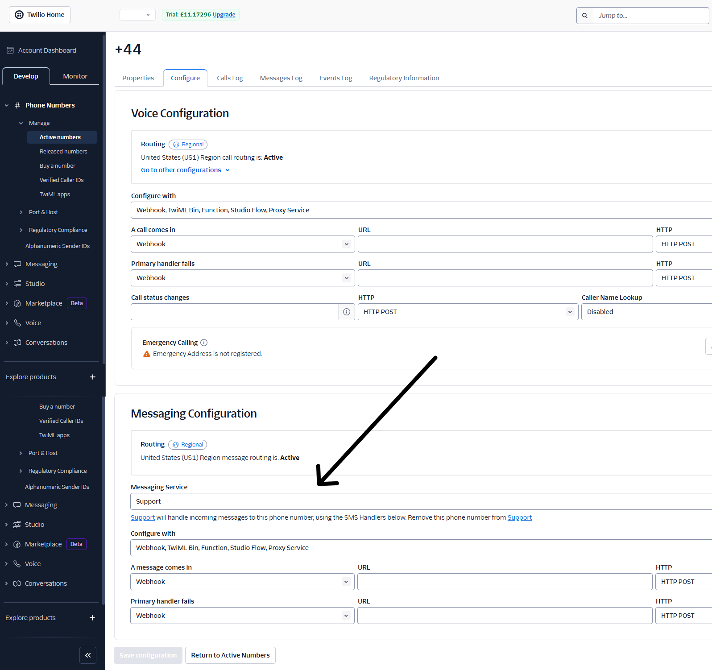
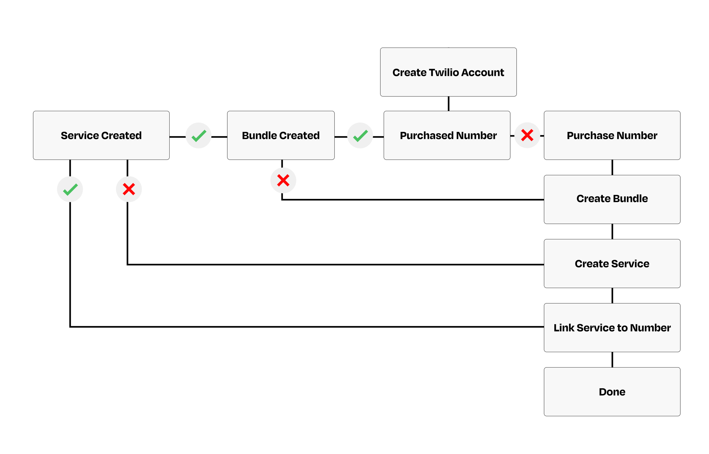

# Twilio

SMS、WhatsApp、音声メッセージの送信を開始するためには、[Twilioのアカウント](https://www.twilio.com/ja-jp)が必要です。

### **Twilioとは？**

**Twilio**は、企業がテキストメッセージの送信や通話の発信、顧客とのコミュニケーションを可能にするサービスです。アプリやウェブサイトにメッセージング機能や通話機能を簡単に追加できるツールキットのようなものです。自分ですべてを構築する必要がなく、SMS、WhatsApp、音声などを通じてユーザーとつながることができます。

### **接続手順**

Twilioアカウントを登録すると、以下のようなTwilioのメインダッシュボードに移動します。


TwilioのSMSとWhatsApp機能を使用するには、電話番号を購入する必要があります。


&#x20;「Get phone number」ボタンをクリックするだけです。

<figure><figcaption></figcaption></figure>

### Twilio番号の購入

ここでは、番号を登録したい国を選択できます。番号自体に含めたい数字を入力できる標準的なフィルターがあります。また、「**詳細検索**」を使用してフィルターを絞り込み、お住まいの市町村に基づくなど、よりローカライズされた番号を取得することもできます。

希望の番号が決まったら、購入を進めてください。


無料で番号を「購入」することもできます。これはテスト目的でのみ使用できるトライアル番号として設定されます。請求先の詳細を入力すると、その番号が有効になります。


<figure><figcaption></figcaption></figure>

完了すると、次のステップに進みます。そこではチェックボックスにチェックを入れ、選択した番号を確認する作業が主になります。

<figure><figcaption>
I agree にチェックを入れ、Next をクリック
</figcaption></figure>

<figure><figcaption></figcaption></figure>

**エンドユーザーの選択**ステップでは、ビジネスまたは個人のいずれかを選択できます。これはあなたの状況に応じて選択してください。例えば、**ビジネス**を選択した場合は、企業の認証情報を入力する必要があります。**個人**を選択した場合は、企業の詳細は不要で、写真付きの身分証明書のみが必要となります。

<figure><figcaption></figcaption></figure>

このステップに到達したとき、まだバンドルを設定していない場合は、先にそれを行う必要があります。すでにTwilioでバンドルを作成している場合は、「Assign Approved Bundle (承認済みバンドルの割り当て)」タブに表示されます。

### バンドルの作成

Twilioでバンドルを作成するには、**メインダッシュボード** > **Regulatory Compliance (規制コンプライアンス)** > **Bundles (バンドル)**&#x306B;移動してください。&#x20;

ステップバイステップのガイドに従って、手順を進めてください。

<figure><figcaption></figcaption></figure>

### サービスの作成

Twilioでメッセージングサービスを作成することで、メッセージを送信できるようになります。メッセージングサービスを設定するには、Twilioの**メインダッシュボード**から**メッセージング** > **サービス**を選択してください。すると、以下の画像のようなダッシュボードが表示されます。


メッセージングサービスは、SMSとWhatsAppのメッセージを一括送信するためのものです。


<figure><figcaption></figcaption></figure>

### サービスと電話番号の連携

最後のステップは、メッセージングサービスとTwilioの電話番号を連携させることです。

まず、メインTwilio**ダッシュボード** > **Phone numbers (電話番号)** > **Manage (管理)** > **Active numbers (有効な電話番号)** に移動してください。

メッセージングサービスを追加したい電話番号をクリックします。

<figure><figcaption></figcaption></figure>

サービスを追加する番号を選択すると、新しいウィンドウが開きます。下の方までスクロールしてください。

**Messaging Service (メッセージングサービス)** タブの下で、作成したサービスを選択することができます。サービスを選択し、左下の**Save (保存)**&#x3092;クリックしてください。

<figure><figcaption></figcaption></figure>

これで、Twilioとの接続が完了し、お客様にSMSとWhatsAppメッセージを送信する準備が整いました。

以下に、参考用の簡単なフロー図を示します。

<figure><figcaption></figcaption></figure>

