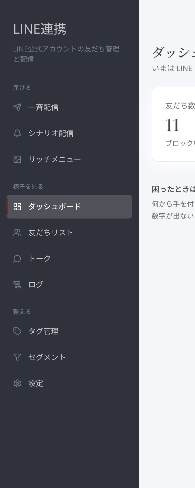
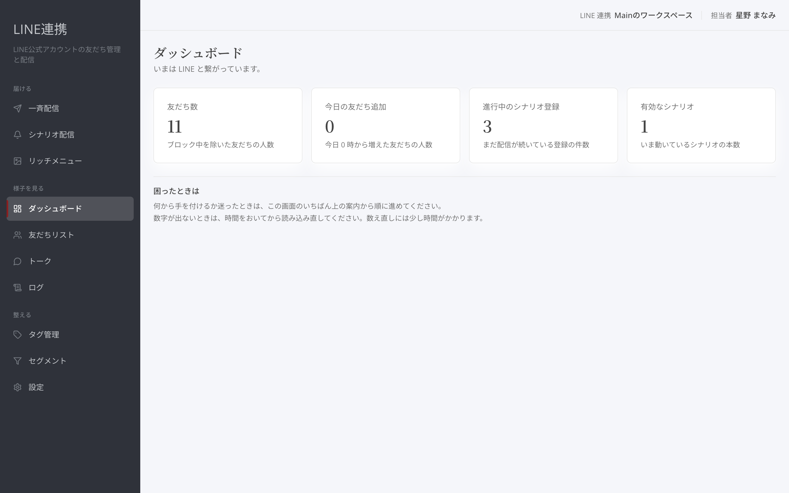
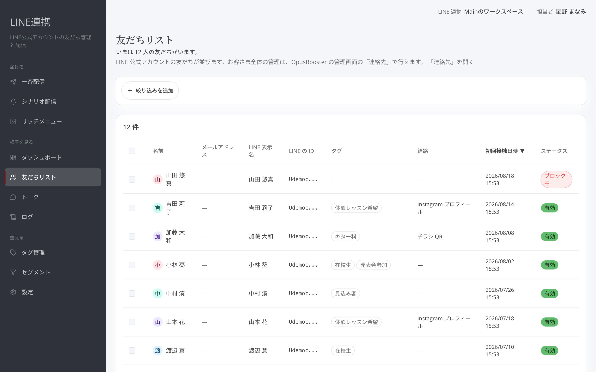

# LINE連携でできること

## これは何のための機能？

LINE連携は、LINE公式アカウントを使って、音楽や作品の案内を友だちに届け、その後の反応を確かめるための場所です。左側のナビには、作業の順番に合わせて「**はじめる**」「**届ける**」「**様子を見る**」「**整える**」の4つの群が並びます。何を開けばよいか迷ったときは、いまやりたいことに近い群から選んでください。

<figure><figcaption>LINE連携のメニューは、始める・届ける・様子を見る・整えるの順に並びます</figcaption></figure>

最初は「**LINE 接続**」から始めます。接続が済む前は「**はじめる**」に表示され、設定を進める入口になります。接続後は日々の作業に集中できるよう、届ける・様子を見る・整えるの群を主に使います。

## まず進める3つのこと

### 1. LINEを接続する

「**LINE 接続**」を開き、案内に沿ってLINE公式アカウントとの接続を設定します。接続ができると、友だち追加やメッセージの受信、配信の準備へ進めます。画面の上部にある「**ダッシュボード**」は、次にやることや日々の数字を確認する入口です。

<figure><figcaption>ダッシュボードでは、接続状況と日々の確認先を見つけられます</figcaption></figure>

### 2. 友だちを確認する

「**様子を見る**」の「**友だちリスト**」では、LINEで友だちになった方を一覧で確認します。友だちはこの画面から作るものではなく、LINEの友だち追加によって増えます。名前やタグなどで絞り込めるので、案内を届けたい相手を探すときにも役立ちます。

<figure><figcaption>友だちの状況を確認して、必要な人を探します</figcaption></figure>

### 3. 配信を作る

「**届ける**」には「**一斉配信**」「**シナリオ配信**」「**リッチメニュー**」があります。まず告知を一度に届けたいときは「**一斉配信**」を開きます。対象を選び、内容を確認してから送る流れです。続けて届ける案内を作りたいときは「**シナリオ配信**」を使います。


**最初の順番:** まず「**LINE 接続**」を終え、次に「**友だちリスト**」で友だちを確認し、最後に「**一斉配信**」で案内を作ると迷いにくくなります。


## 4つの群の歩き方

「**はじめる**」は最初の接続を進める場所です。「**届ける**」は友だちへ内容を送るための場所です。「**様子を見る**」には「**ダッシュボード**」「**友だちリスト**」「**トーク**」「**ログ**」があり、全体・一人ひとり・会話・記録の順に確かめられます。「**整える**」の「**タグ管理**」「**セグメント**」「**設定**」は、送る相手の整理や日常設定に使います。

作品の公開前には「**一斉配信**」で届ける内容を用意し、公開後は「**ダッシュボード**」や「**トーク**」で様子を見てください。原因を確かめたいときだけ「**ログ**」を開く、と考えると日常の作業がすっきりします。

## よくある質問・つまずき

### 最初に友だちリストを開いても、友だちは増やせますか？

友だちは「**友だちリスト**」から作るものではありません。LINEで友だち追加されたときに一覧へ増えます。

### どの画面から配信しますか？

一度に案内を送るときは「**届ける**」の「**一斉配信**」を開きます。

### ログは毎日見る必要がありますか？

日々の確認は「**ダッシュボード**」や「**トーク**」から始められます。届かないなど、記録を確かめたいときに「**ログ**」を開いてください。

---

<!-- cta:opusbooster -->

**自分の場合はどう使えばいいか**

[LINE連携の全体像](https://opusbooster.com/line)を見る。設計から相談したい方は[15分の無料相談](https://opusbooster.com/consultation)、まず触ってみたい方は[14日間の無料トライアル](https://opusbooster.com/register)（クレジットカード不要）から。

