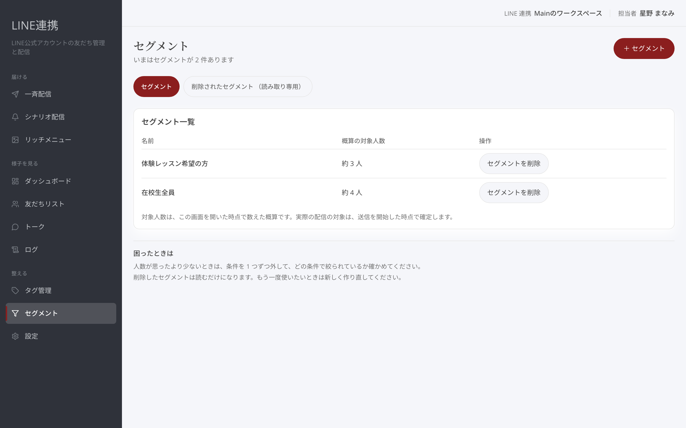
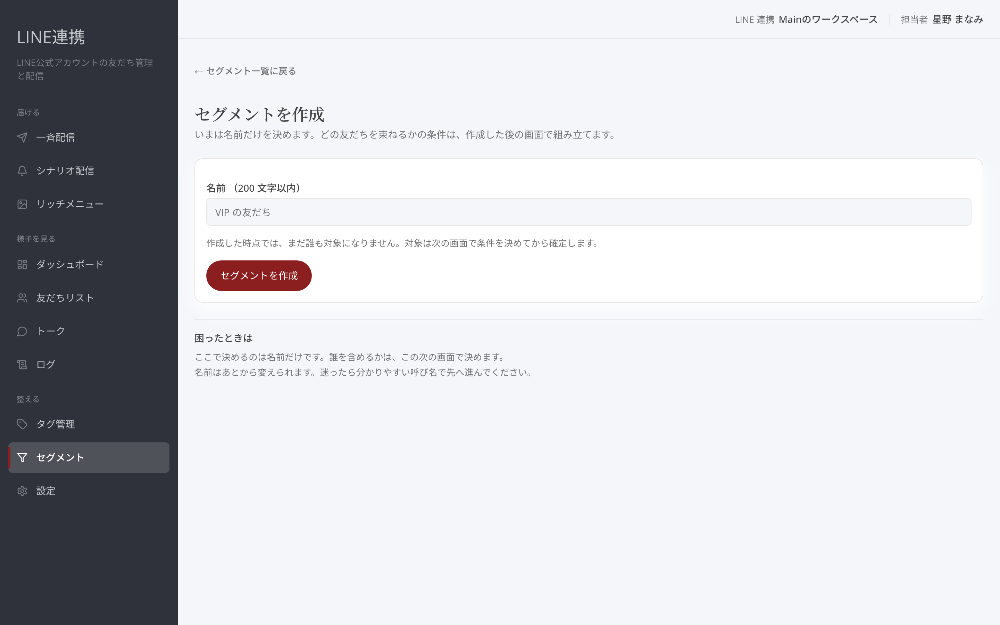
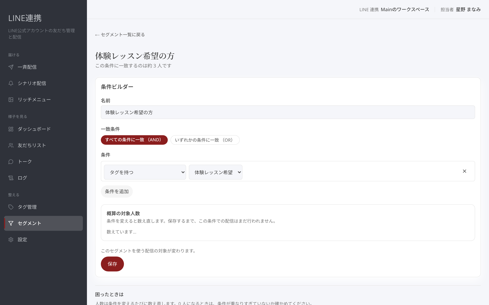
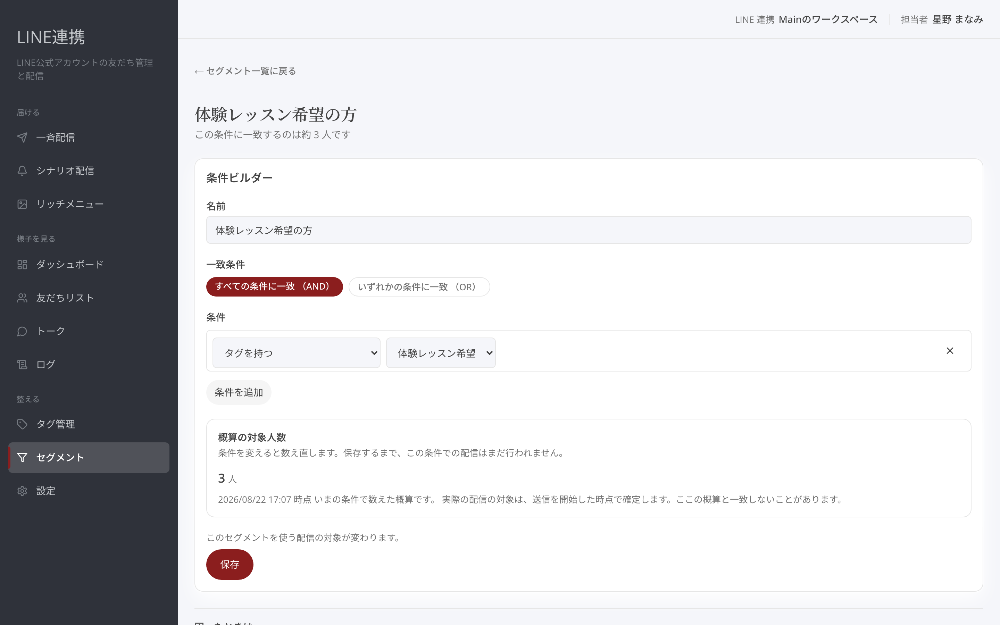

# セグメントで配信先を絞る

## これは何のための機能？

セグメントは、条件に合う友だちをまとめるための機能です。一斉配信で案内を届ける相手を選ぶときに使います。たとえば、特定のタグを持つ友だちだけへ新曲の案内を届ける、といった使い方ができます。「**セグメント一覧**」から作成を始めます。

<figure><figcaption>作成済みセグメントの名前と人数を確認します</figcaption></figure>

## セグメントを作成する

「**＋ セグメント**」から「**セグメントを作成**」を開き、「**名前 （200 文字以内）**」を入力して「**セグメントを作成**」を押します。この段階では名前だけを決めます。どの友だちを束ねるかの条件は、作成後の画面で組み立てます。たとえば「ライブ案内希望者」のように、用途が分かる名前にしましょう。

<figure><figcaption>まずセグメント名を決めます</figcaption></figure>


**条件は作成後に決めます:** 名前だけで作っても、あとから「**条件ビルダー**」で対象を組み立てられます。


## タグ条件を組み合わせる

詳細画面の「**条件ビルダー**」で、「**条件を追加**」を押します。「**条件の種類**」から「**タグを持つ**」または「**タグを持たない**」を選び、「**タグを選択**」でタグを指定します。タグだけの条件なら、「**すべての条件に一致 （AND）**」と「**いずれかの条件に一致 （OR）**」を選べます。条件を整えたら「**保存**」を押してください。

<figure><figcaption>タグを選び、条件を保存します</figcaption></figure>

## 概算人数と一斉配信での使われ方

一覧には「**概算の対象人数**」が表示されます。これは画面を開いた時点で数えた概算です。実際の配信対象は送信を開始した時点で確定するため、人数が一致しないことがあります。一斉配信を作る画面では「**対象セグメント**」として、このセグメントを選びます。案内の内容ごとに相手を分けることで、必要な人へ届けやすくなります。

<figure><figcaption>対象人数は画面を開いた時点の概算です</figcaption></figure>

## よくある質問・つまずき

### 条件がないとどうなりますか？

「条件がまだありません」と表示されます。対象を決めるには「**条件を追加**」から条件を作ってください。

### 概算人数と実際の配信人数が違うことはありますか？

あります。実際の対象は送信開始時点で確定します。

### 削除したセグメントは使えますか？

いいえ。一斉配信の宛先にも、シナリオ配信の開始条件にも選べません。

---

<!-- cta:opusbooster -->

**自分の場合はどう使えばいいか**

[LINE連携の全体像](https://opusbooster.com/line)を見る。設計から相談したい方は[15分の無料相談](https://opusbooster.com/consultation)、まず触ってみたい方は[14日間の無料トライアル](https://opusbooster.com/register)（クレジットカード不要）から。

