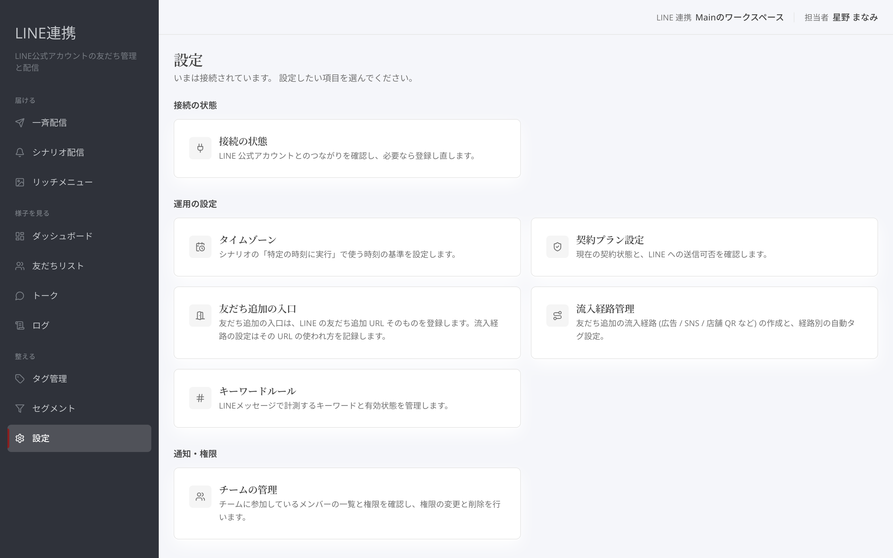
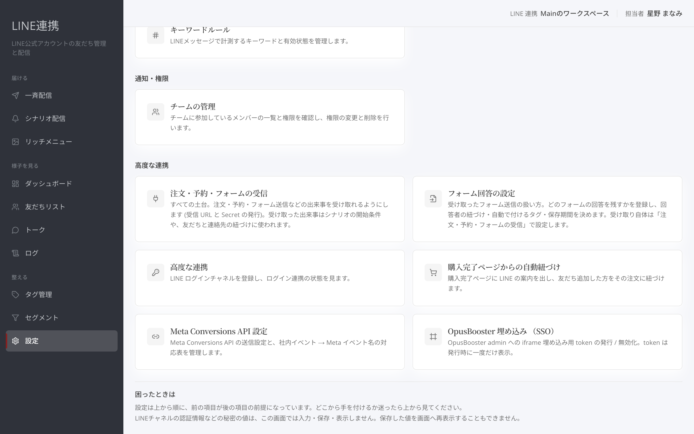

# 設定画面の全体像

## これは何のための機能？

「**設定**」は、LINE連携や日々の運用に必要な項目へ進むための入口です。この画面では保存は行わず、目的のカードを選びます。カードは前の項目が後の項目の前提になる順に並んでいます。迷ったら上から見てください。

<figure><figcaption>目的に合うカードを選びます</figcaption></figure>

## 接続の状態

「**LINEチャネル**」ではLINE公式アカウントとの接続状態を確認します。未接続でもほかの設定は開けますが、先にLINE公式アカウントとつなぐと、配信・トーク・リッチメニューが使えるようになります。初めての接続は[LINE連携のセットアップ](../getting-started/line-setup-wizard.md)をご覧ください。

<figure><figcaption>LINEチャネルのカードを開きます</figcaption></figure>

## 運用の設定

「**時刻の基準**」では、シナリオの「特定の時刻に実行」で使う時刻の基準を設定します。「**契約状態**」では現在の契約状態とLINEへの送信可否を確認します。

「**友だち追加の入口**」は友だち追加用URLの発行元です。「**流入経路管理**」では広告・SNS・店舗QRなどの経路を作り、経路別の自動タグを設定します。「**キーワードルール設定**」ではLINEメッセージで計測するキーワードと有効状態を管理します。詳しくは[キーワードルール](../settings/keyword-rules.md)をご覧ください。

<figure><figcaption>時刻、友だち追加、キーワードの設定カード</figcaption></figure>


**カードは入口です:** 変更や保存は、それぞれのカードを開いた先の画面で行います。


## 通知・権限と高度な連携

「**チーム管理**」では参加メンバーの一覧と権限を確認し、権限の変更と削除を行います。詳細は[チーム管理](../settings/team.md)をご覧ください。

「**注文・予約・フォームの受信**」は、注文・予約・フォーム送信などの出来事を受け取るための設定です。詳しくは[OpusBooster連携](../settings/opusbooster-integration.md)をご覧ください。「**フォーム回答の設定**」ではフォーム回答の扱いを登録します。「**LINEログイン連携**」は[高度な連携](../settings/advanced-linking.md)、「**購入連携の埋め込み**」は[購入連携](../settings/embed-and-plan.md)をご覧ください。Meta Conversions API は[Meta CAPI](../settings/meta-capi.md)で確認できます。

<figure><figcaption>外部との連携に関するカード</figcaption></figure>

## よくある質問・つまずき

### 設定画面で直接保存できますか？

いいえ。設定画面は目的の設定へ進むための入口です。

### 未接続だとほかの設定は開けませんか？

開けます。LINE接続に依存しない設定も通常どおり開けます。

### どこから始めればよいですか？

初めてLINEをつなぐ場合は「**LINEチャネル**」と[LINE連携のセットアップ](../getting-started/line-setup-wizard.md)から始めてください。
