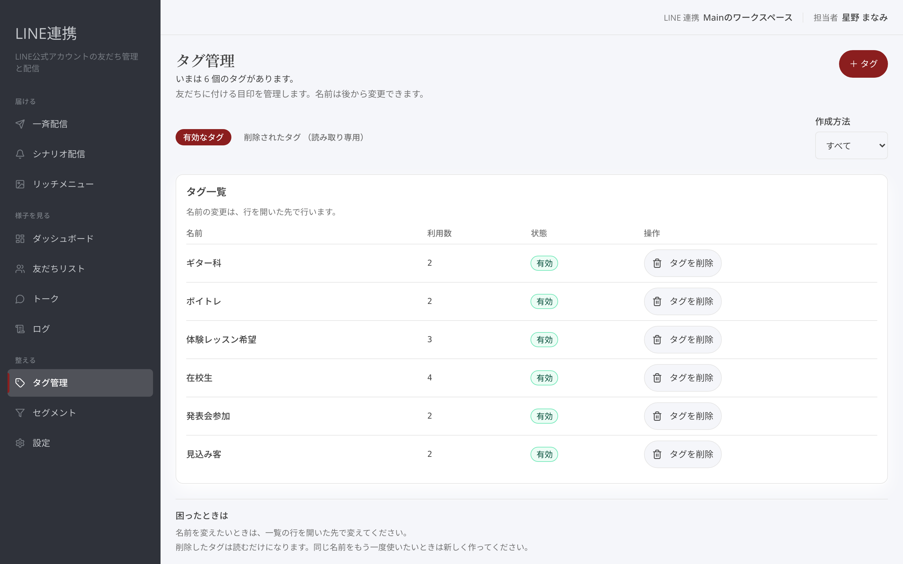
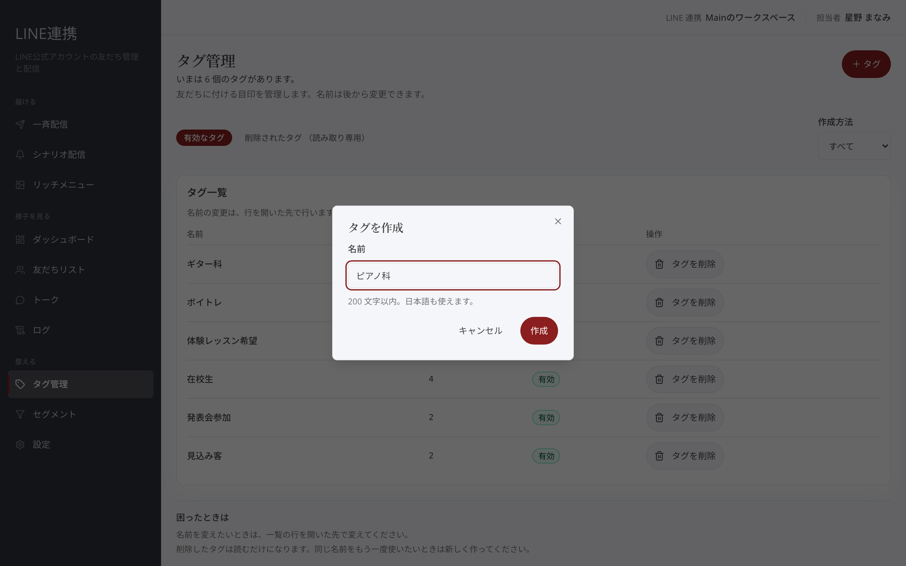
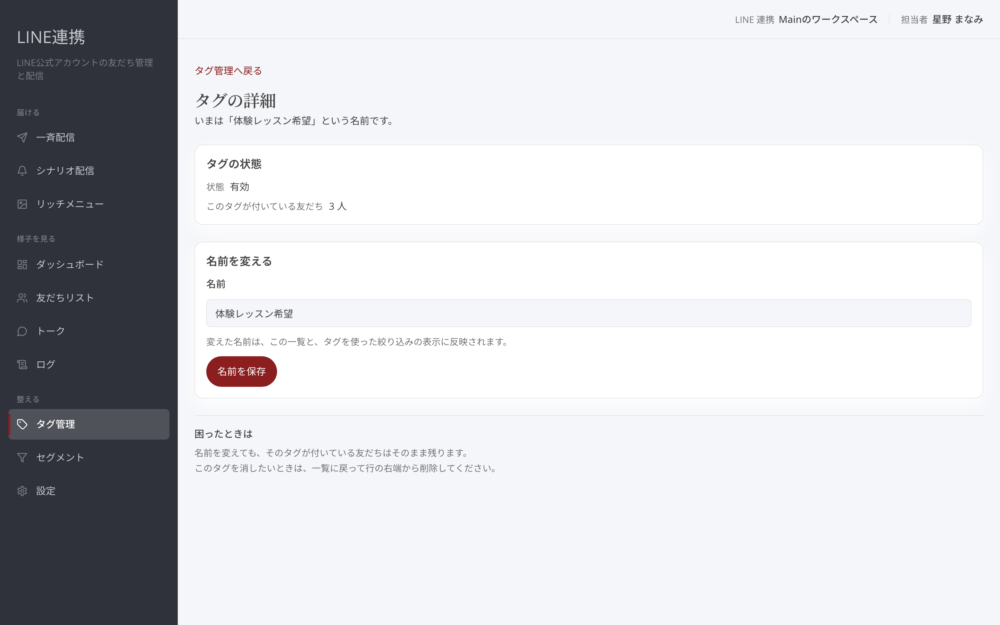
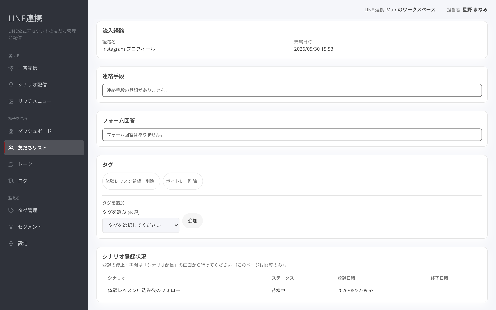

# タグ管理

## これは何のための機能？

タグは友だちに付ける目印です。たとえば、ライブに興味がある人、作品を購入した人、出演者向けなど、あとで見分けたい単位を名前で作れます。「**タグ管理**」ではタグの作成、名前の変更、削除を行います。タグ名は後から変更できます。

<figure><figcaption>タグの名前と利用数を確認します</figcaption></figure>

## タグを作成する

一覧の「**＋ タグ**」を押すと「**タグを作成**」が開きます。「**名前**」を入力し、「**作成**」を押してください。日本語も使えます。作るときは、誰に付いているかを見ただけで分かる短い名前がおすすめです。たとえば「ライブ案内希望」「購入者」「東京公演」のように、目的を一つに絞ると運用しやすくなります。

<figure><figcaption>タグ名を入力して作成します</figcaption></figure>


**名前は後から直せます:** 迷った場合は、まず分かる名前で作り、運用しながら整えてください。


## 名前を変更・削除する

一覧の行を開くと「**タグの詳細**」が表示されます。「**名前を変える**」で新しい名前を入力し、「**名前を保存**」を押します。変えた名前は一覧と、タグを使った絞り込みの表示に反映されます。不要になったタグは「**タグを削除**」から削除します。削除すると、そのタグは付いている友だち全員から外れ、元のタグとして復元できません。

<figure><figcaption>名前の保存と削除を行います</figcaption></figure>

## 友だちに付け外しする

友だちの詳細では、タグを選んで「**追加**」できます。外すときは、その友だちに表示されているタグの削除操作を使います。タグ管理で作るのは目印そのもの、友だち詳細で行うのは一人ひとりへの付け外し、と考えると分かりやすいでしょう。

<figure><figcaption>タグを選んで友だちへ追加します</figcaption></figure>

## よくある質問・つまずき

### 削除したタグを元に戻せますか？

いいえ。元のタグとして復元できず、外れた友だちも戻りません。

### 同じ名前で作り直せますか？

はい。同じ名前で新しく作れますが、以前に外れた友だちは戻りません。

### タグはどこで友だちに付けますか？

友だち詳細でタグを選び、「**追加**」します。

### 名前の付け方に迷います

誰に付ける目印か、何の案内に使うかが分かる名前にすると、あとから選びやすくなります。
