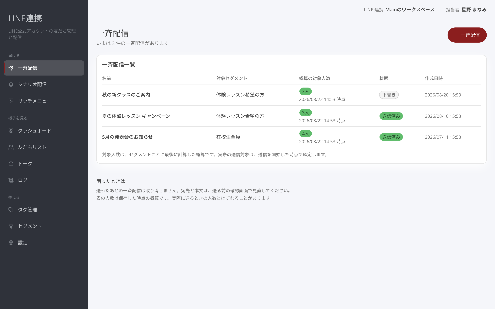
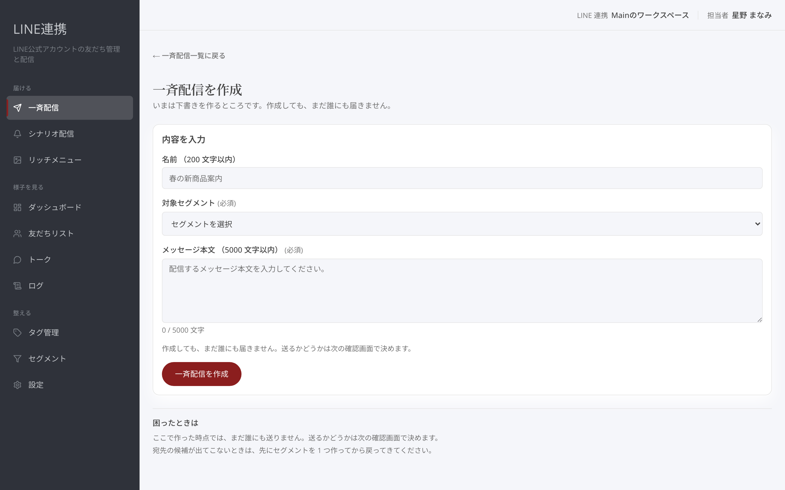
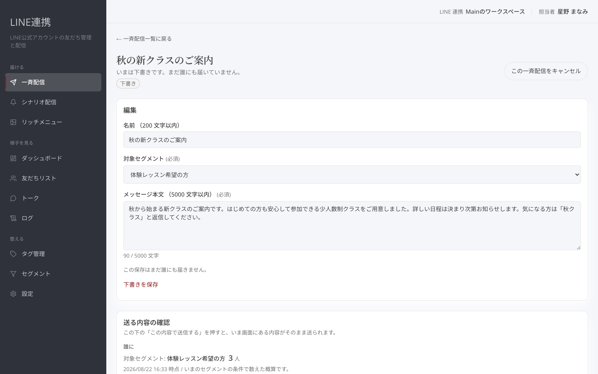
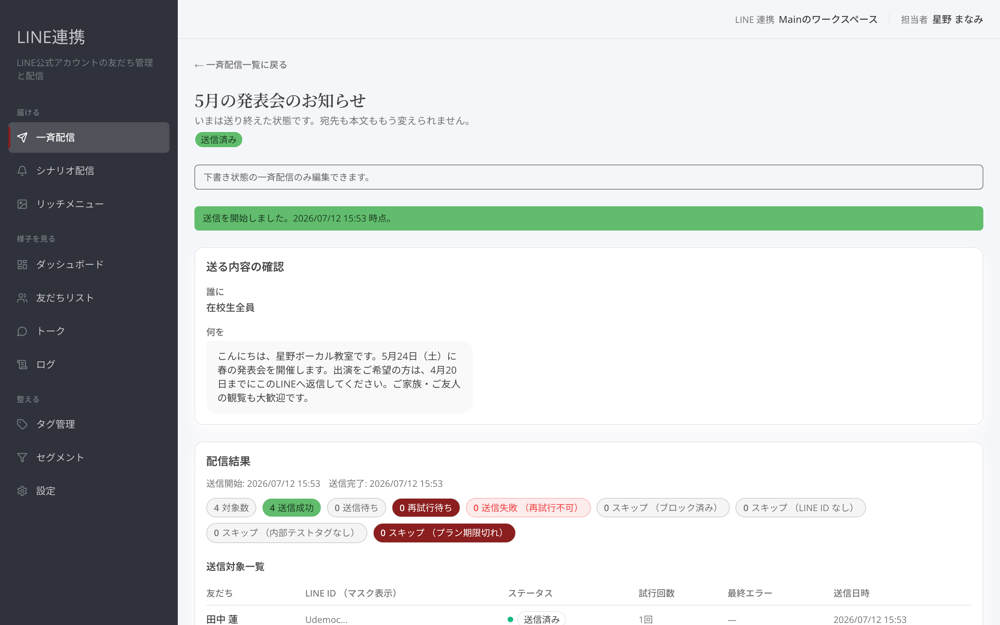

# 一斉配信を送る

## これは何のための機能？

一斉配信は、新曲のリリース案内やライブの告知などを、選んだセグメント（条件に合う友だちをまとめたグループ）へ送るための機能です。一覧画面で「**＋ 一斉配信**」を押すと、作成を始められます。

作成しただけでは送信されません。下書きを作り、内容と宛先を確認してから「**この内容で送信する**」を押します。

<figure><figcaption>一斉配信の一覧。「＋ 一斉配信」から新規作成します</figcaption></figure>

## 送るまでの流れ

### 1. 下書きを作成する

「**＋ 一斉配信**」を押すと、「**一斉配信を作成**」画面が開きます。次の3項目を入力・選択してください。

| 項目 | 入れる内容 |
| --- | --- |
| **名前 （200 文字以内）** | 自分で見分けやすい配信名 |
| **対象セグメント** | 今回の案内を届けたい友だちのセグメント |
| **メッセージ本文 （5000 文字以内）** | LINEで届ける本文 |

宛先は「**対象セグメント**」で選びます。本文の下には文字数も表示されます。

<figure><figcaption>名前・宛先・本文を入力して、下書きを作成します</figcaption></figure>

入力できたら「**一斉配信を作成**」を押します。この操作では、まだ誰にも届きません。次の確認画面で送るかどうかを決めます。


**宛先の候補が出てこないとき:** 先にセグメントを1つ作成してから、この画面に戻ってください。


### 2. 本文と宛先を確認する

作成後は確認画面が開きます。下書きの間は、「**編集**」で名前・「**対象セグメント**」・「**メッセージ本文 （5000 文字以内）**」を変更できます。

途中で作業を止める場合は「**下書きを保存**」を押してください。保存しても送信はされません。保存していない変更があるまま画面を離れると、入力した内容は失われます。

<figure><figcaption>下書きの内容を整え、必要に応じて保存します</figcaption></figure>

編集欄の下にある「**送る内容の確認**」では、誰に・いつ・何を送るかを確認できます。対象人数は、いまのセグメントの条件で数えた概算です。実際の送信対象は、送信を開始した時点で確定するため、ここに表示された人数と一致しないことがあります。

本文はLINEのトーク画面での見え方の目安として表示されます。

<figure><figcaption>宛先・対象人数・本文を確認してから送信します</figcaption></figure>

### 3. 送信する

確認できたら「**この内容で送信する**」を押します。送信を開始した時点で宛先が確定します。


**送信前にもう一度確認してください:** 送ったあとの一斉配信は取り消せません。送信後は宛先も本文も変更できません。


## 送ったあとの見え方

送信を始めると、「**配信結果**」が表示されます。「**対象数**」「**送信成功**」「**送信待ち**」などの件数と、「**送信対象一覧**」を確認できます。状態は「**送信中**」「**送信済み**」などで一覧にも表示されます。

<figure><figcaption>送信後は配信結果と送信対象一覧を確認できます</figcaption></figure>

## よくある質問・つまずき

### 作成したのに、すぐ送られてしまいますか？

いいえ。「**一斉配信を作成**」で作成するのは下書きです。送信は、確認画面で「**この内容で送信する**」を押して開始します。

### 対象人数が表示と違うことはありますか？

あります。確認画面の人数は概算で、実際の送信対象は送信を開始した時点で確定します。

### 送った本文を直したいです

送信後は本文も宛先も変更できません。送る前なら、下書き画面の「**編集**」で直し、「**下書きを保存**」できます。
