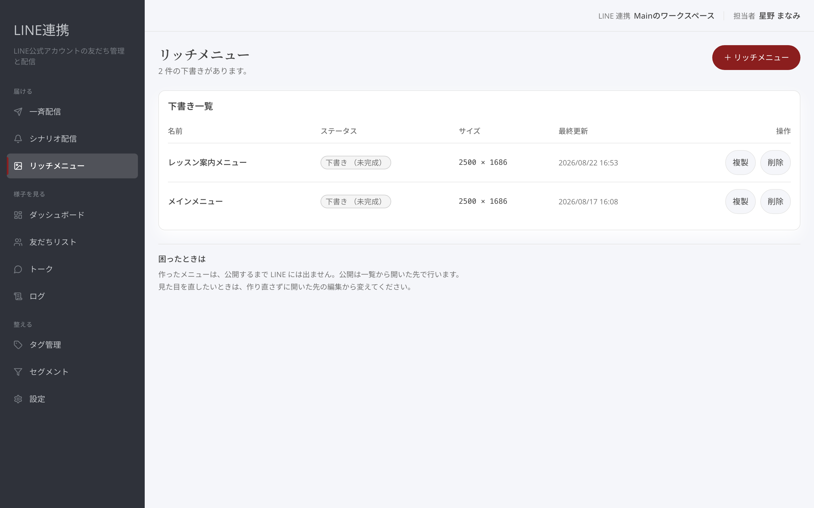
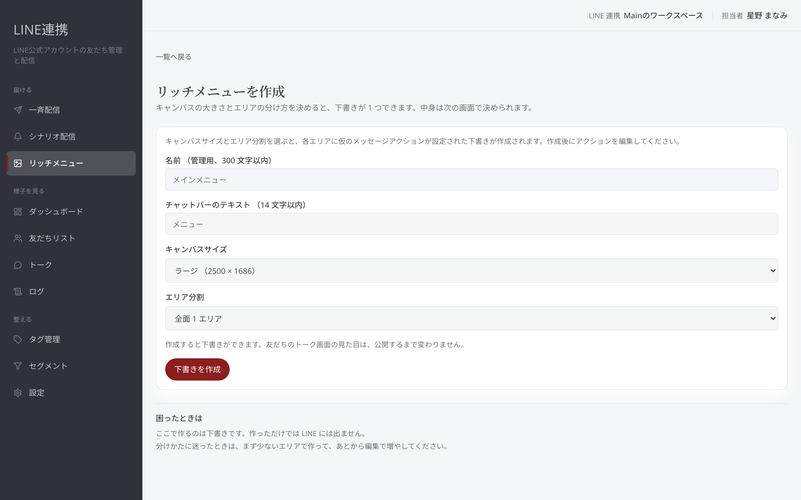
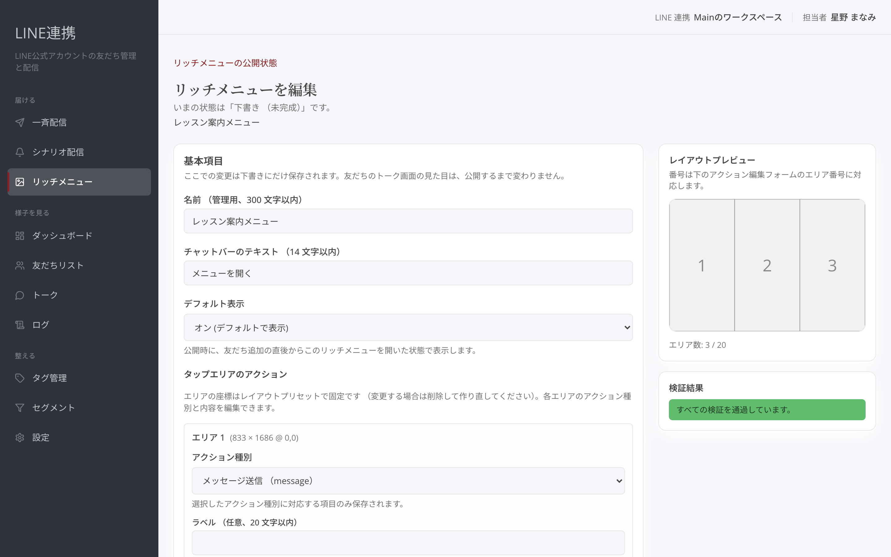
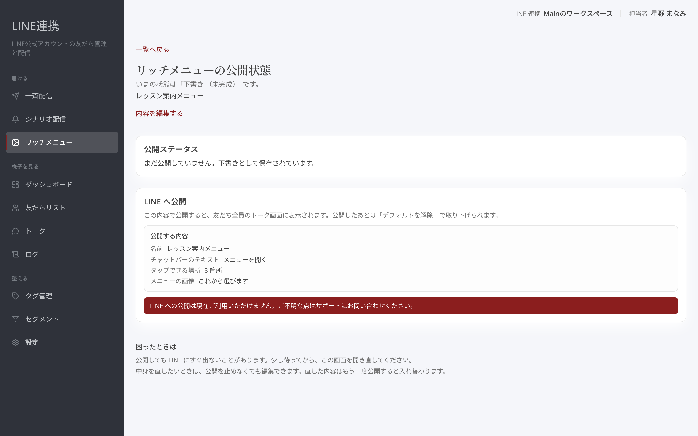

# リッチメニューを作って公開する

## これは何のための機能？

リッチメニューは、友だちのLINEトーク画面に表示されるメニューです。作品ページや予約ページへの案内を、見やすくまとめられます。リッチメニューの一覧から下書きを作り、内容を整えてから「**LINE へ公開する**」で表示します。

<figure><figcaption>一覧から新しいリッチメニューを作ります</figcaption></figure>

## 下書きとレイアウトを作る

「**リッチメニューを作成**」では、名前、チャットバーのテキスト、エリア分割を選び、「**下書きを作成**」を押します。キャンバスの大きさとエリアの分け方を決めると下書きができます。友だちのトーク画面の見た目は、この時点では変わりません。下書きを開いたら「**内容を編集する**」へ進み、画像、各エリアのアクション種別、内容を整えます。レイアウトの位置は選んだエリア分割で決まります。変更後は「**下書きを保存**」を押してください。

<figure><figcaption>名前とエリア分割を選んで下書きを作ります</figcaption></figure>


**下書きのうちは公開されません:** 画像やタップしたときの動きを何度直しても、公開するまでトーク画面には反映されません。


<figure><figcaption>画像とアクションを整え、レイアウトを確認します</figcaption></figure>

## 検証結果を確認する

編集画面の「**検証結果**」で、公開に向けた内容を確認します。「すべての検証を通過しています。」と表示されたら、詳細画面へ戻って公開を進めます。表示された内容に不足があるときは、編集画面に戻って直してください。公開する内容を急いで決めず、名前、チャットバーのテキスト、タップできる場所、メニューの画像を見直すと安心です。

<figure><figcaption>公開前に検証結果を確認します</figcaption></figure>

## LINEへ公開して既定にする

詳細画面の「**LINE へ公開**」で内容を確認し、「**LINE へ公開する**」を押します。公開すると、友だち全員のトーク画面にこのメニューが表示されます。公開後は「**デフォルトを解除**」で取り下げられます。既定に設定する項目は編集画面の「**デフォルト表示**」です。公開時に、友だち追加の直後からこのリッチメニューを開いた状態で表示します。

<figure><figcaption>内容を確認してLINEへ公開します</figcaption></figure>

## よくある質問・つまずき

### 保存しただけでLINEに表示されますか？

いいえ。「**下書きを保存**」は下書きだけを更新します。「**LINE へ公開する**」を押すまで表示は変わりません。

### 公開後に取り下げられますか？

はい。「**デフォルトを解除**」で取り下げられます。

### レイアウトは後から動かせますか？

エリアの位置はレイアウトプリセットで決まります。変更する場合は削除して作り直してください。

---

<!-- cta:opusbooster -->

**自分の場合はどう使えばいいか**

[LINE連携の全体像](https://opusbooster.com/line)を見る。設計から相談したい方は[15分の無料相談](https://opusbooster.com/consultation)、まず触ってみたい方は[14日間の無料トライアル](https://opusbooster.com/register)（クレジットカード不要）から。

