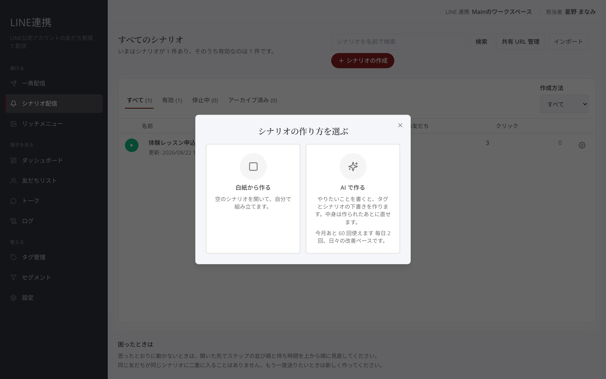
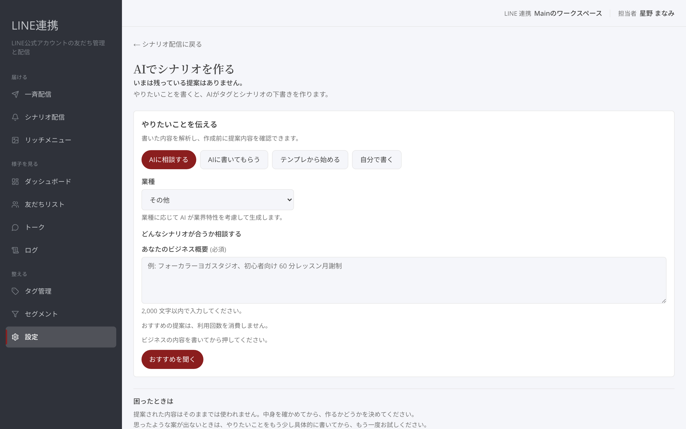

# AIに相談してシナリオを作る

## これは何のための機能？

AIに相談してシナリオを作る機能は、どんな順番で案内すればよいか迷うときに、タグとシナリオの下書きを作る入口です。完成した内容をそのまま公開する機能ではありません。自分の活動に合う形へ確認・編集してから使います。シナリオ一覧で「**＋ シナリオの作成**」を押し、作り方を選ぶ画面で「**AI で作る**」を選びます。

<figure><figcaption>「AI で作る」から相談画面へ進みます</figcaption></figure>

## ビジネスの説明を書く

「AIに相談する」画面では、実現したいことを文章で伝えます。どんな音楽や作品を届けているか、友だちに何を案内したいか、どんな人へ届けたいかを書いてください。詳しいほど、あとで確認しやすい下書きになりやすくなります。入力できたら「**AIに相談する**」を押します。空のままでは進めないため、まずは短い説明でも書いてください。


**最初から完璧でなくて大丈夫です:** 「新曲を聴いてくれた人に次のライブを案内したい」のように、目的を一文で書くところから始められます。


<figure><figcaption>活動内容と実現したいことを文章で伝えます</figcaption></figure>

## 作られた下書きを確認する

相談が終わると、必要なタグとシナリオの下書きが作られます。タグは友だちを見分ける目印で、シナリオはメッセージや待ち時間を並べた流れです。作成されたものは下書きなので、内容を確認してから使ってください。シナリオでは、メッセージの言葉、待ち時間、開始条件を自分の活動に合わせて直せます。AIが提案した分類名も分かりやすい名前に整えられます。作品名や日程のように変わりやすい情報は、特にご自身で確認しましょう。

## 回数表示の見方

「**AI で作る**」の近くには、その月に使える回数について画面の案内が表示されます。利用できる場合は「今月あと N 回」の形式で表示されます。Nの値は画面に出ているものを確認してください。表示内容は利用状況によって変わるため、この記事では固定の回数を案内しません。利用できない旨の表示がある場合も、「**白紙から作る**」は選べます。

<figure><figcaption>回数は画面に表示される案内を確認します</figcaption></figure>

## よくある質問・つまずき

### AIが作った内容はそのまま有効になりますか？

いいえ。タグとシナリオは下書きとして作られます。確認し、開始条件を整えたうえでOnにしてください。

### 説明には何を書けばよいですか？

活動内容、届けたい相手、案内したいことを書くとよいでしょう。最初は一文でも構いません。

### 回数が分かりません

「**AI で作る**」の近くに出る案内を確認してください。利用可能な場合は「今月あと N 回」と表示されます。

---

<!-- cta:opusbooster -->

**自分の場合はどう使えばいいか**

[LINE連携の全体像](https://opusbooster.com/line)を見る。設計から相談したい方は[15分の無料相談](https://opusbooster.com/consultation)、まず触ってみたい方は[14日間の無料トライアル](https://opusbooster.com/register)（クレジットカード不要）から。

