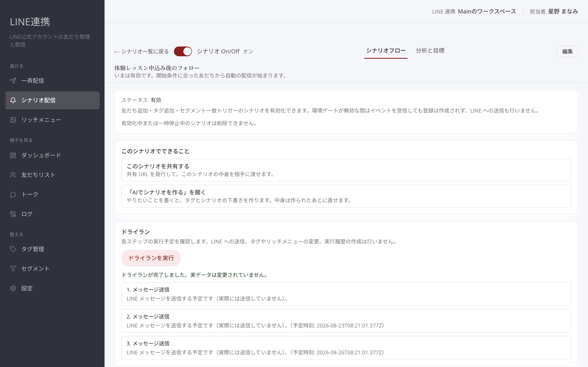

# シナリオ配信を作る

## これは何のための機能？

シナリオ配信は、友だち追加などをきっかけに、決めた順番で案内を届けるための機能です。たとえば、お礼のメッセージを送り、少し待ってから新曲や公演の案内を送る流れを作れます。シナリオ一覧の「**＋ シナリオの作成**」から始めます。

<figure><figcaption>一覧の「＋ シナリオの作成」から始めます</figcaption></figure>

## 白紙のシナリオを作る

「**＋ シナリオの作成**」を押すと、作り方を選ぶ画面が開きます。「**白紙から作る**」を選んでください。画面には「**作成中…**」と表示され、作成が完了すると同時にビルダーへ移動します。作成直後の名前は「**無題のシナリオ**」です。名前や説明は、画面上部の「**編集**」から変えられます。


**作成直後は下書きです:** 白紙から作っただけでは友だちに送られません。内容と開始条件を整えてからOnにします。


<figure><figcaption>「白紙から作る」を選びます</figcaption></figure>

## ステップを順番に追加する

ビルダーでは流れの中にステップを追加します。最初は「**LINEメッセージ送信**」と「**待ち時間**」を組み合わせると分かりやすいでしょう。「**LINEメッセージ送信**」には友だちへ届ける本文を入れます。「**待ち時間**」を間に置けば、次の案内までの間隔を作れます。最初にあいさつを送り、待ち時間のあとに試聴やライブ情報を案内する形です。ステップは上から順に実行されます。

<figure><figcaption>メッセージ送信と待ち時間を順番に置きます</figcaption></figure>

## 開始条件を決めてOnにする

「**編集**」を開くと、「**基本設定**」と「**開始条件**」をまとめて変更できます。開始条件を選び、「**変更を保存**」を押してください。保存するとこのシナリオの設定だけが変わり、すでに送った配信と実行中の登録はそのままです。準備ができたら「**シナリオ On/Off**」で「**On**」にします。有効な状態では、開始条件に合った友だちから自動の配信が始まります。「**Off**」にすると、新規登録の受付とステップ配信の両方が止まります。

<figure><figcaption>名前と開始条件を保存します</figcaption></figure>

## 送る前にドライランで確かめる

「**ドライラン**」の「**ドライランを実行**」では、実行予定を確認できます。LINE送信やデータ変更は行われません。ステップの順番や待ち時間を、公開前に見直すために使ってください。

<figure><figcaption>実際には送らず実行予定だけを確認します</figcaption></figure>

## よくある質問・つまずき

### 白紙から作っただけで配信されますか？

いいえ。開始条件を保存し、「**On**」にして初めて自動の配信が始まります。

### Offにすると何が止まりますか？

新しい友だちの登録と、すでに流れているステップ配信の両方が止まります。

### ドライランでメッセージは届きますか？

届きません。実際の送信やデータ変更を行わず、実行予定だけを確認します。
