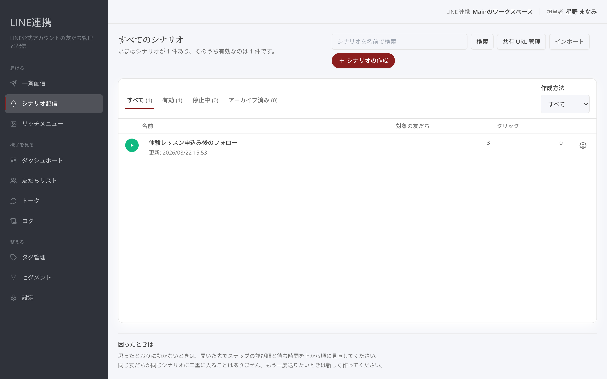
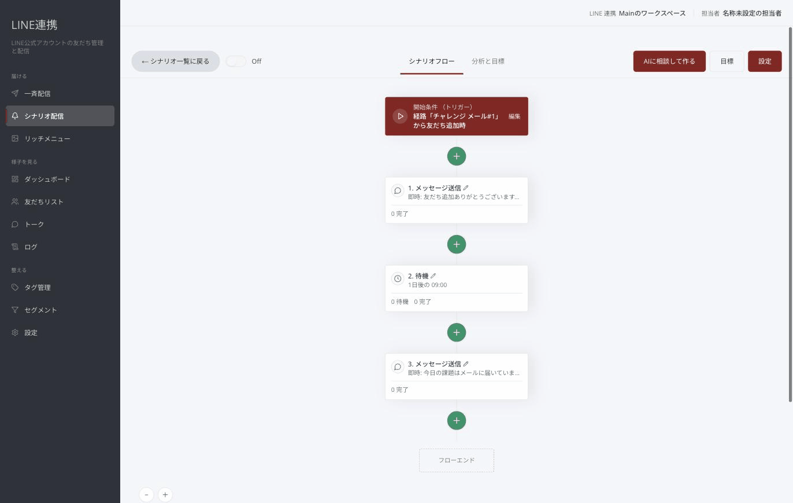
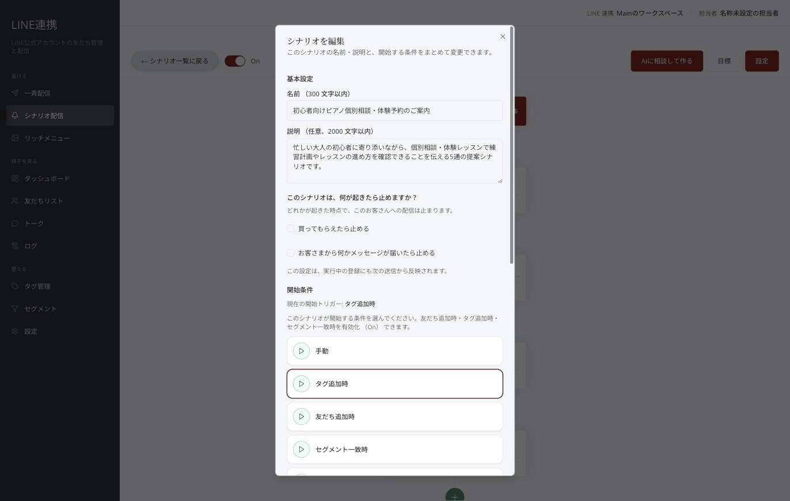
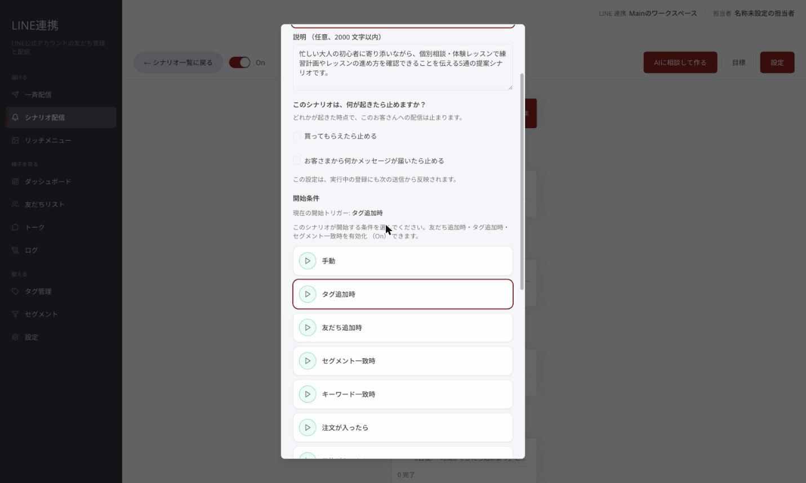
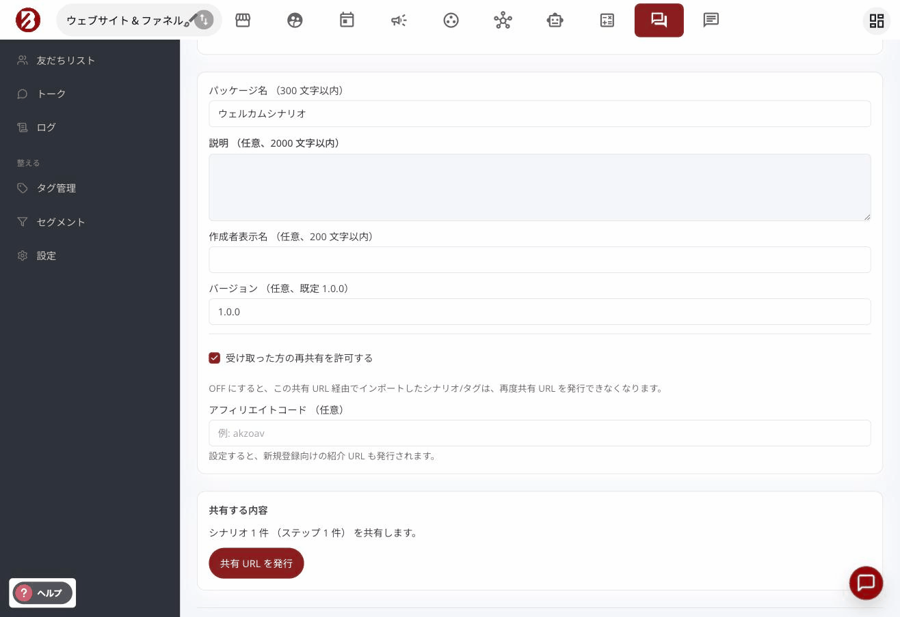
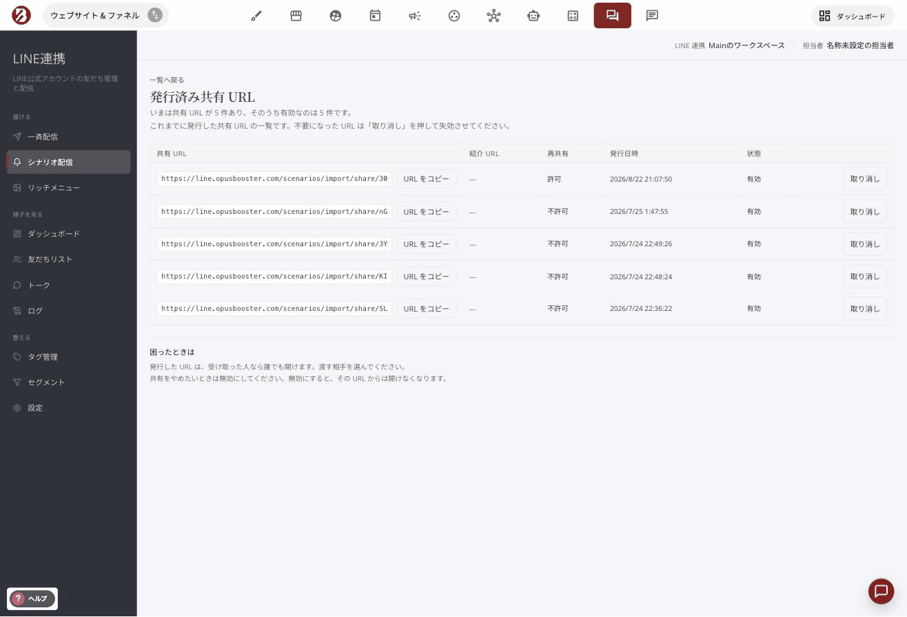
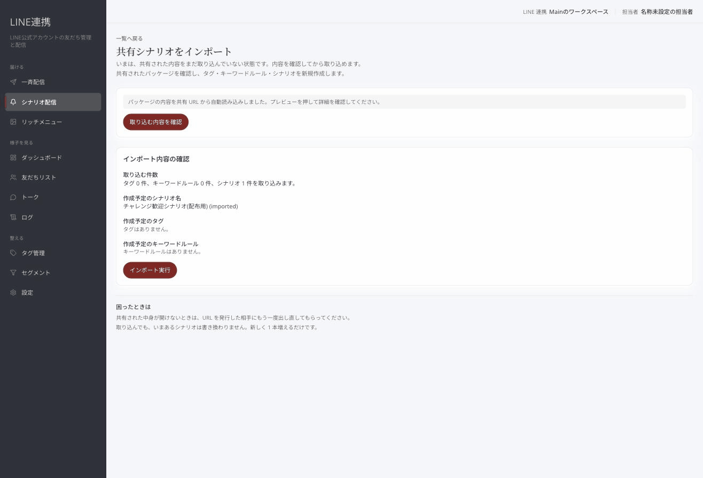

# シナリオ配信を作る

## これは何のための機能？

シナリオ配信は、友だち追加などをきっかけに、決めた順番で案内を届けるための機能です。たとえば、お礼のメッセージを送り、少し待ってから新曲や公演の案内を送る流れを作れます。シナリオ一覧の「**＋ シナリオの作成**」から始めます。

<figure><figcaption>一覧の「＋ シナリオの作成」から始めます</figcaption></figure>

## 白紙のシナリオを作る

「**＋ シナリオの作成**」を押すと、作り方を選ぶ画面が開きます。「**白紙から作る**」を選んでください。画面には「**作成中…**」と表示され、作成が完了すると同時にビルダーへ移動します。作成直後の名前は「**無題のシナリオ**」です。名前や説明は、画面上部の「**設定**」から変えられます。


**作成直後は下書きです:** 白紙から作っただけでは友だちに送られません。内容と開始条件を整えてからOnにします。


<figure><figcaption>「白紙から作る」を選びます</figcaption></figure>

## ステップを順番に追加する

ビルダーでは流れの中にステップを追加します。最初は「**LINEメッセージ送信**」と「**待ち時間**」を組み合わせると分かりやすいでしょう。「**LINEメッセージ送信**」には友だちへ届ける本文を入れます。「**待ち時間**」を間に置けば、次の案内までの間隔を作れます。最初にあいさつを送り、待ち時間のあとに試聴やライブ情報を案内する形です。ステップは上から順に実行されます。

<figure><figcaption>メッセージ送信と待ち時間を順番に置きます</figcaption></figure>

## リンクを開いた人にタグを付ける

テキストのメッセージには、もうひとつ仕掛けを足せます。**本文の中のリンクを開いた友だちに、自動でタグを付ける**設定です。たとえば 7 日間の案内の中で、曲の紹介を開いた人には「曲に興味あり」、メンバー紹介を開いた人には「メンバーに興味あり」と付けておけば、どの案内に反応したかが友だちごとに残り、次の配信の出し分けに使えます。

ステップ編集の「**リンククリックでタグを付ける**」を開き、付けたいタグを選んで保存してください。設定すると、本文の URL は自動で計測用の短いリンクに置き換わって届きます（リンク先はそのままです）。

仕組みとして、次の点を知っておいてください。

- タグが付くのは**同じ配信につき 1 回**です。同じ友だちが何度開いても、二重には付きません。ただし、シナリオをもう一度受講した場合や、この設定を一度オフにしてからオンにし直した場合は、新しい配信として再びタグ付けが働きます。
- 記録されるのは「**リンクが開かれたこと**」です。まれに、メッセージが転送された先で開かれた分が元の友だちの反応として記録されることがあります。
- **タグをきっかけに動く自動化もそのまま動きます。** 付けたタグを開始条件（タグ追加時）にした別のシナリオがあれば、リンクを開いた時点でその配信も始まります。反応した人にだけ深掘りの案内を送る、といった組み合わせができます。
- 設定を**オフにすると、配信済みメッセージのリンクもタグ付けを停止**します。


タグは開いた直後〜数分以内に付きます。付いたかどうかは友だち詳細のタグ欄で確認できます。


## 保存ボタンはありません（操作ごとに保存されます）

画面の右上に「**保存**」ボタンはありません。**自動保存でもありません。** 操作の単位ごとに、その場で保存が確定する作りです。

| 操作 | 保存されるとき |
|---|---|
| 名前・説明・開始条件・再登録の設定・目標 | 「**変更を保存**」を押したとき |
| ステップの中身（本文や送るタイミング） | 「**ステップを保存**」を押したとき |
| ステップの追加 | 「**ステップを追加**」を押したとき |
| ステップの並べ替え（↑ ↓）・削除 | **押した瞬間** |

そのため「編集した内容がどこかに残ったまま保存し忘れる」ことは起こりません。画面を離れても、確定済みの内容はそのまま残ります。


**並べ替えと削除は確認なしですぐ効きます:** ステップの ↑ ↓ とゴミ箱は、押した時点で確定します。削除したステップは元に戻せないので、押す前に対象を確かめてください。


## 開始条件を決めてOnにする

「**設定**」を開くと、上から「**基本設定**」「**このシナリオは、何が起きたら止めますか？**」（目標）「**開始条件**」「**再登録の設定**」をまとめて変更できます。開始条件を選び、「**変更を保存**」を押してください。保存してもすでに送った配信は変わりません。開始条件と再登録の設定は、いま配信中の人には遡って効きません（これから届くイベントの判定に使われます）。**目標だけは、いま配信中の人にも次の配信から効きます。** 準備ができたら「**シナリオ On/Off**」で「**On**」にします。有効な状態では、開始条件に合った友だちから自動の配信が始まります。「**Off**」にすると、新規登録の受付とステップ配信の両方が止まります。

<figure><figcaption>名前と開始条件を保存します</figcaption></figure>

## 目標を決めて、届いた人には止める

案内の途中でお客さまが動いてくれたら、その先の配信は止めたほうが自然です。買ってくださった方に「まだ迷っていませんか」と送り続けるのは、かえって印象を悪くします。

そこで、**何が起きたら配信を止めるか**を決められます。画面上部の「**目標**」、または「**分析と目標**」タブの「**目標を変える**」を押すと設定が開き、「**このシナリオは、何が起きたら止めますか？**」の欄に移動します。この欄は「**設定**」を開いたときの上から 2 番目にあります。

決められるのは 2 つです。

- **買ってもらえたら止める** — 支払いが済んだ注文が入ったときに止まります。注文が作られただけ（未払い）では止まりません。「**対象の商品**」を選べば、その商品を買ったときだけ止まります。既定は「すべての商品」で、何を買っても止まります。
- **お客さまから何かメッセージが届いたら止める** — 返事だけでなく、スタンプや画像が届いた場合も止まります。

どちらか一方でも起きた時点で、その方への配信は止まります。

**AI が作ったシナリオでは、この 2 つが最初から入っています。** 採用する前の画面にも、何が起きたら止まるかが書かれています。ご自分で白紙から作ったシナリオは、どちらも入っていない状態から始まります。

止まった方は「**分析と目標**」タブの「**友だち**」に「**目的を達成して停止**」と表示されます。「**概要**」には、目標を達成して止まった件数が出ます。

<figure><figcaption>何が起きたら止めるかを決めます</figcaption></figure>

## 作ったシナリオを共有 URL で渡す

作ったシナリオは、**共有 URL** にして別の LINE 連携をお使いの方に渡せます。受け取った方は URL を開くだけで取り込み画面に進み、自分の LINE 連携に同じシナリオを新しく作れます。関連するタグとキーワードルールも一緒に渡ります。リッチメニューと登録済みフォームは中身を含めず、受け取った方が自分のものから選び直します。発行・管理・取り込みのいずれも、管理者以上の権限で行えます。

### 発行する

シナリオ一覧の行メニューの「**共有**」、またはビルダーの「**このシナリオを共有する**」から、「**シナリオを共有する**」画面を開きます。「**パッケージ名**」を入力し（説明・作成者表示名・バージョンは任意）、「**共有 URL を発行**」を押すと URL が表示されます。「**URL をコピー**」で控えて、相手に渡してください。

「**受け取った方の再共有を許可する**」のチェックを外して発行すると、その URL から取り込んだシナリオとタグは、受け取った側で再び共有 URL を発行できなくなります。

<figure><figcaption>パッケージ名を入れて「共有 URL を発行」を押します</figcaption></figure>

### 発行した URL を管理する

シナリオ一覧の「**共有 URL 管理**」を開くと、これまでに発行した共有 URL の一覧（URL・再共有の可否・発行日時・状態）が見られます。不要になった URL は「**取り消し**」で失効させます。取り消すと、その URL からはインポートできなくなります。取り消しを元に戻す操作はないので、必要なら発行し直してください。

<figure><figcaption>発行した URL の一覧と「取り消し」</figcaption></figure>

### 受け取った URL から取り込む

受け取った共有 URL を開くと、ログインのあとに「**共有シナリオをインポート**」画面が開きます。内容は URL から自動で読み込まれているので、「**取り込む内容を確認**」を押して、作成されるタグ・キーワードルール・シナリオ名を確かめます。リッチメニューや登録済みフォームを使うステップがある場合は、いまあるものから選ぶか「**使用しない**」を選びます。「**インポート実行**」を押すと、新しいシナリオが 1 本増えます。いまあるシナリオは書き換わりません。

<figure><figcaption>取り込む内容を確認してから「インポート実行」を押します</figcaption></figure>


契約状態が「期限切れ」のあいだは、共有 URL を発行できません。期限切れの発行元から受け取った URL も取り込めません。契約状態は[埋め込みパーツとご利用状況](../settings/embed-and-plan.md)で確認できます。


## よくある質問・つまずき

### 保存ボタンが見当たりません。保存されていますか？

保存されています。この画面に「**保存**」ボタンはなく、操作の単位ごとにその場で確定します。設定は「**変更を保存**」、ステップは「**ステップを保存**」、並べ替えと削除は押した瞬間です。保存が済むと、画面の右上に「**保存しました**」と表示されて消えます。

オートメーションの編集画面のように、フロー全体を編集してから右上の「保存」でまとめて確定する方式ではありません。

### 白紙から作っただけで配信されますか？

いいえ。開始条件を保存し、「**On**」にして初めて自動の配信が始まります。

### Offにすると何が止まりますか？

新しい友だちの登録と、すでに流れているステップ配信の両方が止まります。**シナリオ全体**が止まる操作です。

### 特定の人にだけ配信が届かなくなりました

「**目標**」に当てはまった可能性があります。目標は**その人ごと**に効くので、シナリオは On のままでも、条件に当てはまった方への配信だけが止まります。

「**分析と目標**」タブの「**友だち**」でその方の状態を見てください。「**目的を達成して停止**」と出ていれば目標によるものです。心当たりがなければ、「**設定**」を開いて「**このシナリオは、何が起きたら止めますか？**」の欄で何が入っているかを確認してください。AI が作ったシナリオには、購入と受信メッセージの 2 つが最初から入っています。

### 買ってもらったのに配信が止まりません

いくつか理由が考えられます。

- **支払いがまだ済んでいない** — 注文が作られただけでは止まりません。支払い済みになって初めて止まります。
- **対象の商品を絞っている** — 「**対象の商品**」で特定の商品を選んでいると、その商品を含まない注文では止まりません。すべての注文で止めたい場合は「**すべての商品**」を選んでください。
- **登録より前に作られた注文である** — 目標は、その方がシナリオに登録された**後**に起きたことだけを見ます。登録より前に作られた注文は対象になりません。
- **「注文・予約・フォームの受信」で注文イベントを受け取っていない** — 購入の情報が届かないため、購入では止まりません。[受信設定](../settings/opusbooster-integration.md)を確認してください。この場合、設定画面にも購入の項目は出ません。

### リンクを開いてもらったのにタグが付きません

いくつか理由が考えられます。

- **少し時間がかかることがあります** — タグは開いた直後〜数分以内に付きます。友だち詳細を開き直して確認してください。
- **設定をオフにした** — オフにすると、すでに配信済みのメッセージのリンクもタグ付けを停止します。もう一度オンにしても、次に送られる配信から効きます。
- **タグをアーカイブした** — アーカイブされたタグは付きません。別のタグを選び直してください。
- **同じ配信で一度付いている** — 同じ配信からは 1 回しか付きません。すでに付いたことがある場合、開き直しても変化はありません。

---

<!-- cta:opusbooster -->

**自分の場合はどう使えばいいか**

[LINE連携の全体像](https://opusbooster.com/line)を見る。設計から相談したい方は[15分の無料相談](https://opusbooster.com/consultation)、まず触ってみたい方は[14日間の無料トライアル](https://opusbooster.com/register)（クレジットカード不要）から。

