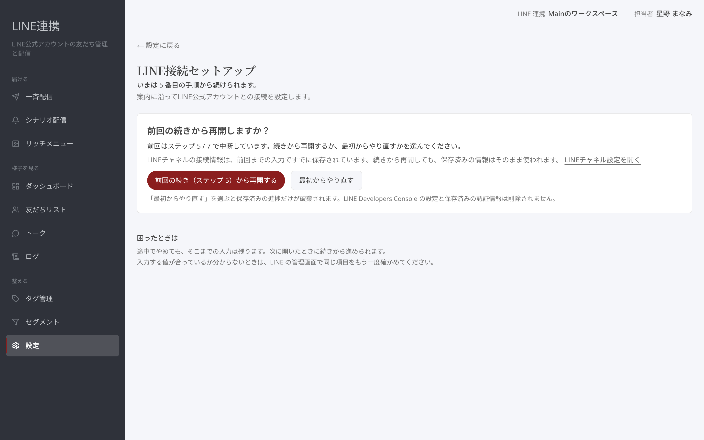
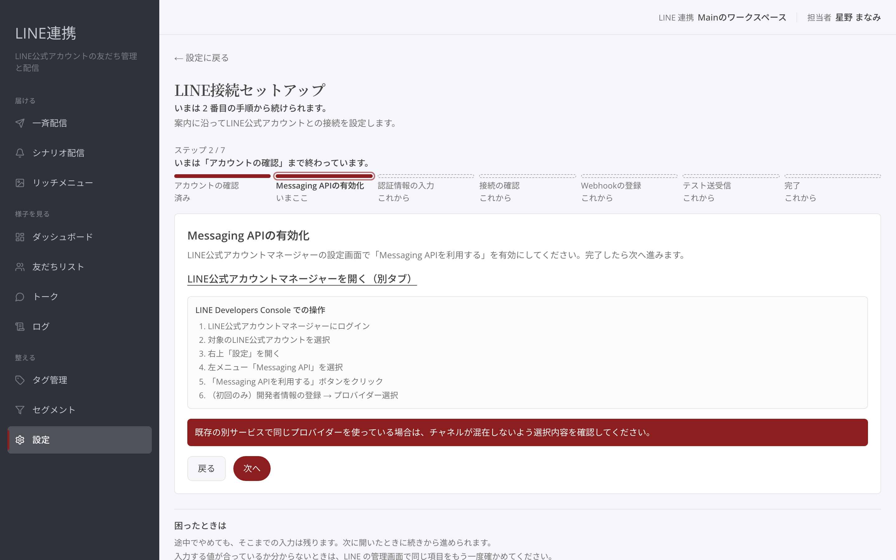
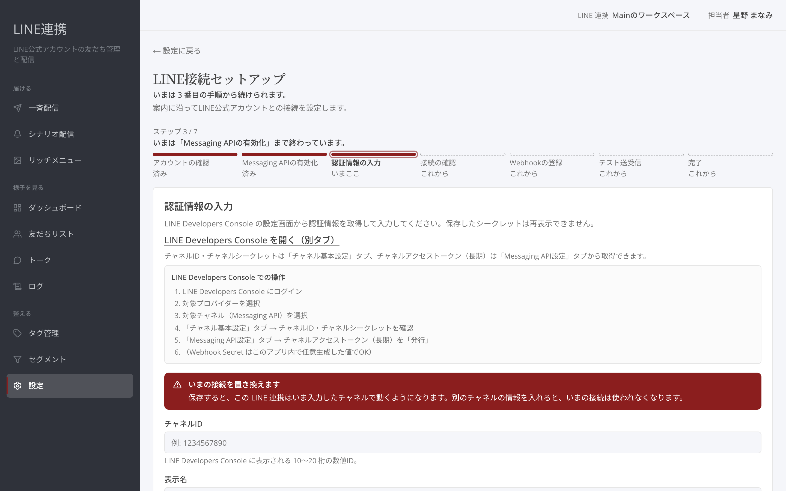
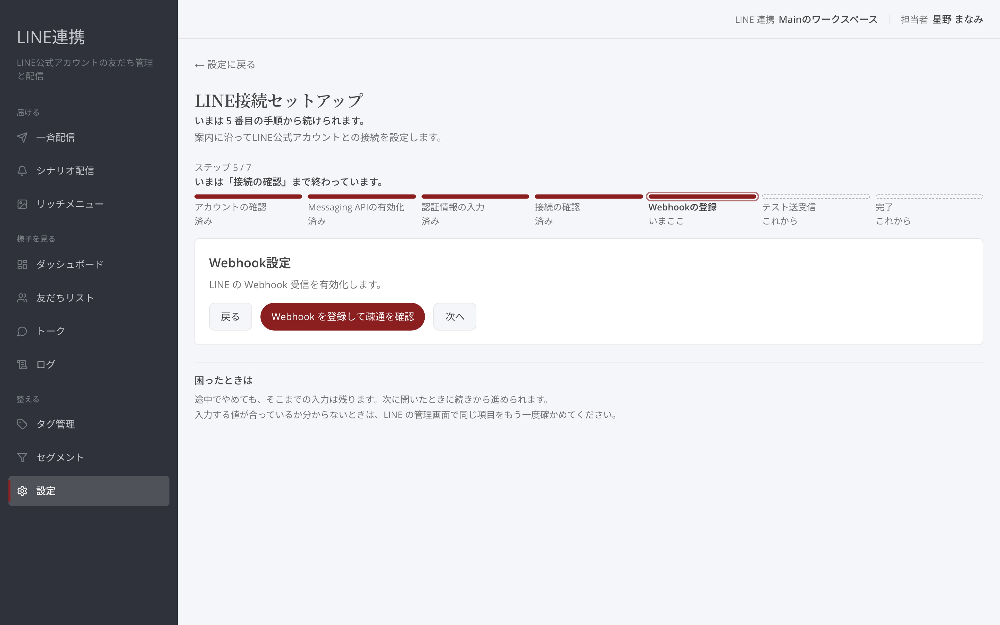
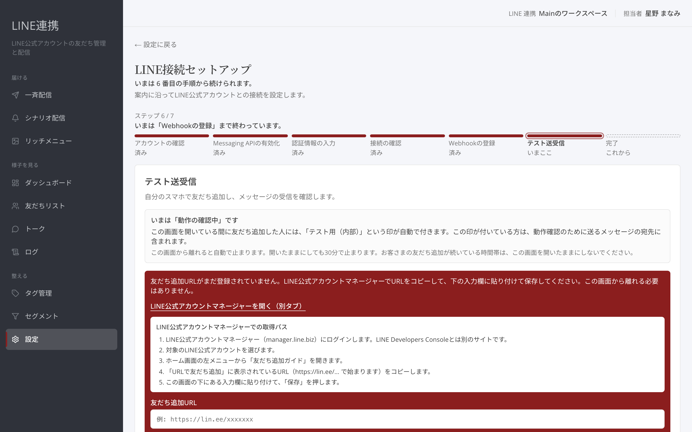
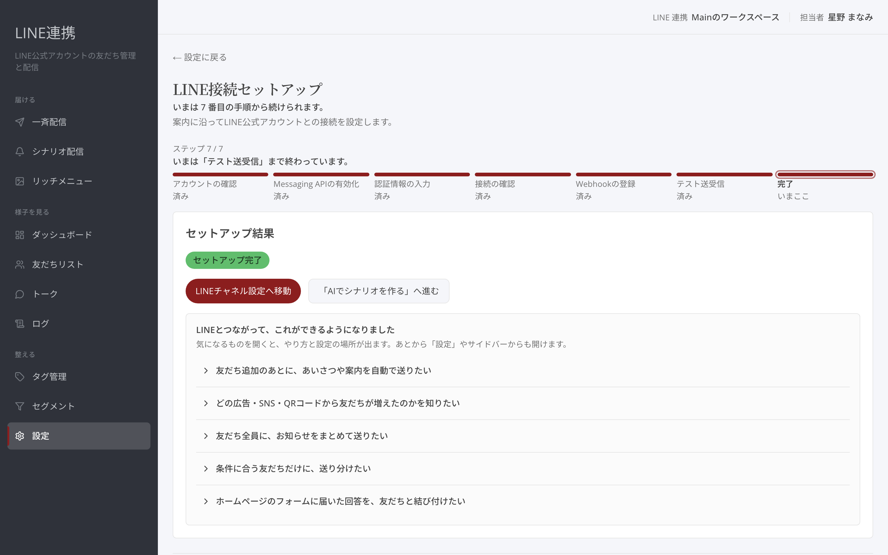
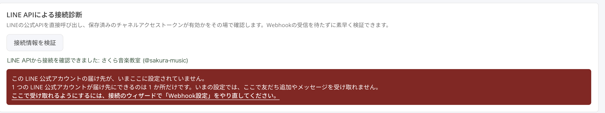

# 初期設定 — LINE接続ウィザード

## これは何のための機能？

「**LINE接続セットアップ**」は、案内に沿ってLINE公式アカウントとの接続を設定する画面です。途中で止まった場合も「**セットアップの続きから再開する**」から続けられます。画面の「**セットアップの進み具合**」では、各手順が「**済み**」「**いまここ**」「**これから**」のどれかで表示されます。

<figure><figcaption>いま進めている手順と、次の手順を確認します</figcaption></figure>

## 7つの手順を進める

### 1. LINE公式アカウントの確認

「**LINE公式アカウントの確認**」で「**持っている**」または「**持っていない**」を選びます。持っていない場合は「**LINE公式アカウントの開設手順を見る**」を開きます。新しいアカウントは、LINE Developers ConsoleではなくLINE公式アカウントマネージャーから作成してください。

### 2. Messaging APIの有効化

LINE公式アカウントマネージャーで「**Messaging APIを利用する**」を有効にします。画面の「**LINE公式アカウントマネージャーを開く（別タブ）**」から移動し、完了したら「**次へ**」を押します。

<figure><figcaption>LINE公式アカウントマネージャーでの操作を見ながら進めます</figcaption></figure>

### 3. 認証情報の入力

LINE Developers Consoleから認証情報を取得して入力し、「**保存して接続確認へ**」を押します。保存したシークレットは再表示できません。入力を保存せずに離れると、シークレットとトークンは後から見返せないため、入れ直しになります。

<figure><figcaption>LINE Developers Consoleで確認した情報を入力します</figcaption></figure>


**接続を入れ替えるとき:** 「**いまの接続を置き換えます**」と表示されたら、入力したチャネルで動くようになります。別のチャネルの情報を入れると、いまの接続は使われなくなります。友だちへの送信はこの操作では起きません。


### 4. 接続確認

「**接続確認**」で「**接続情報を検証**」を押します。保存したチャネルアクセストークンでLINEに問い合わせ、その場で有効かを確かめます。確認できるとLINE公式アカウントの名前が表示されます。

戻ってきたときは「**接続の確認はすでに済んでいます**」と表示され、そのまま「**次へ**」で進めます。認証情報を入れ替えたときだけ「**もう一度確認する**」を押してください。

### 5. Webhook設定

「**Webhook設定**」で「**Webhook を登録して疎通を確認**」を押します。LINE Developers Consoleの「**Webhookの利用**」をONにしてから、必要に応じて「**Webhook 疎通を確認**」を押してください。設定が済むまでは次へ進めません。

<figure><figcaption>Webhookの登録と疎通確認を完了してから次へ進みます</figcaption></figure>

### 6. テスト送受信

「**テスト送受信**」では、自分のスマホで友だち追加し、メッセージの受信を確認します。「**友だち追加URL**」を保存し、QRコードで友だち追加します。スマホから短いメッセージを1通送り、「**トーク受信箱を開く**」で届いたかを見て、「**テスト完了（受信を確認した）**」を押します。

<figure><figcaption>自分のスマホから送ったメッセージが受信箱に届くか確認します</figcaption></figure>

### 7. セットアップ結果

最後に「**セットアップ結果**」で「**セットアップ完了**」を確認します。「**LINEチャネル設定へ移動**」や、次に進む場所を開けます。

<figure><figcaption>接続後にできることを確認します</figcaption></figure>

## よくある質問・つまずき

### 保存した認証情報を確認したいです

保存したシークレットは再表示できません。入力内容を手元で安全に管理してください。

### Webhookの手順で次へ進めません

先に「**Webhook を登録して疎通を確認**」を押し、LINE Developers Consoleで「**Webhookの利用**」をONにしてください。

### 「届け先が、いまここに設定されていません」と表示されます

同じLINE公式アカウントを、別のウェブサイト・ファネルでも接続したときに出ます。

1つのLINE公式アカウントが友だち追加やメッセージを届けられるのは**1か所だけ**です。あとから設定した方に切り替わるため、先に設定していた方では受け取れなくなります。**接続そのものは有効なまま**なので、「**接続情報を検証**」は成功します。受け取りだけが止まっている状態です。

<figure><figcaption>接続は確認できても、届け先が別の場所に設定されている状態です</figcaption></figure>

**ここで受け取りたい場合**は、表示されているリンクから「**Webhook設定**」をやり直してください。接続済みでもこの手順だけをやり直せます。


**やり直すと、もう一方では受け取れなくなります。** 届け先は1か所だけなので、どちらで受け取るかを決めてから操作してください。両方で受け取ることはできません。それぞれのウェブサイト・ファネルで別々にLINE公式アカウントを使い分けてください。


### 同じLINE公式アカウントを複数のウェブサイトで使えますか

**使えません。** 1つのLINE公式アカウントがつながれるのは1か所だけです。ウェブサイト・ファネルごとに別のLINE公式アカウントをご用意ください。

見た目の上では複数の場所で「接続済み」と表示されることがありますが、実際に友だち追加やメッセージを受け取れるのは最後に設定した1か所だけです。受け取れていない方には「**届け先が、いまここに設定されていません**」と表示されます。

---

<!-- cta:opusbooster -->

**自分の場合はどう使えばいいか**

[LINE連携の全体像](https://opusbooster.com/line)を見る。設計から相談したい方は[15分の無料相談](https://opusbooster.com/consultation)、まず触ってみたい方は[14日間の無料トライアル](https://opusbooster.com/register)（クレジットカード不要）から。

