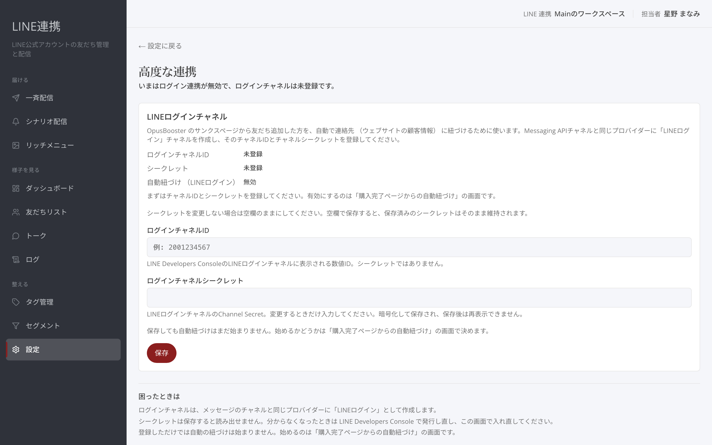
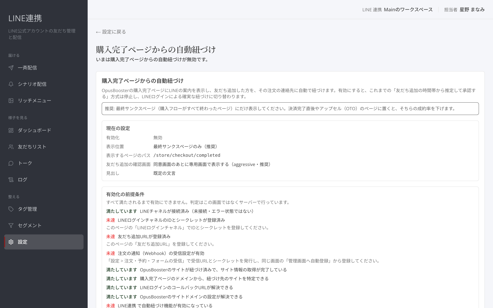
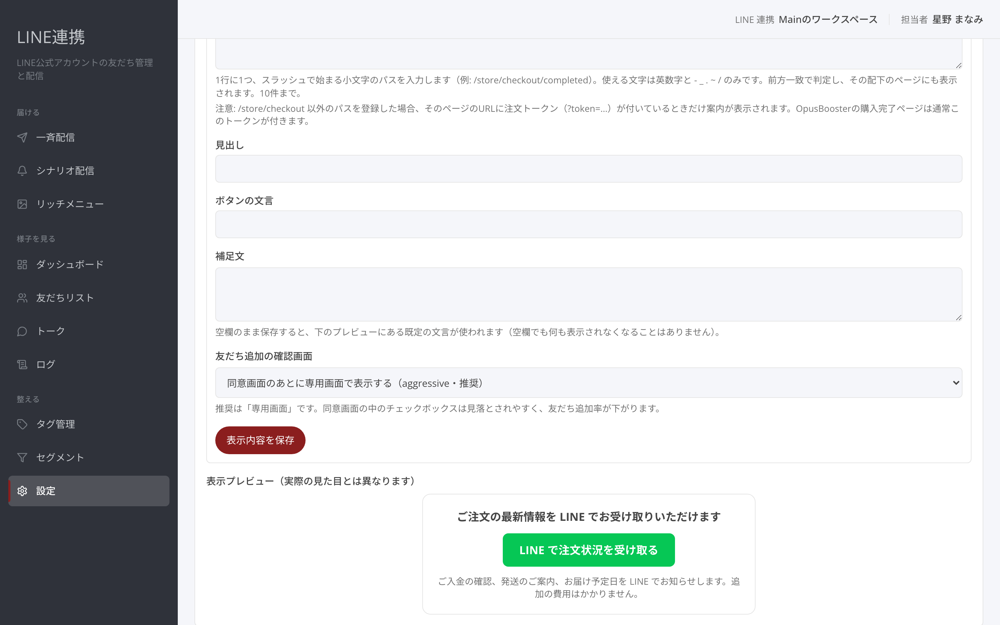

# 高度な紐づけ・購入連携

## これは何のための機能？

「高度な連携」は、LINEログインチャネルを登録してログイン連携の状態を見る画面です。「購入完了ページからの自動紐づけ」は、購入完了ページにLINEの案内を出し、友だち追加した方をその注文に紐づける設定です。

## LINEログインを登録するまでの流れ

### 1. 「高度な連携」を開きます

画面上部に、ログイン連携が有効か無効か、ログインチャネルが登録済みか未登録かが表示されます。

<figure><figcaption>ログイン連携の現在の状態を確認します</figcaption></figure>

### 2. 「チャネルID」と「チャネルシークレット」を入力して保存します

画面にある入力の案内に従って登録します。シークレットの現在値は画面に再表示されません。


保存していない変更があります。入力を残すには、画面の「**保存**」を選んでください。


## 購入完了ページからの自動紐づけを有効にするまでの流れ

### 1. 「購入完了ページからの自動紐づけ」を開きます

画面には現在の状態、配置、表示対象パス、案内の設定が表示されます。前提条件チェックリストも確認してください。

<figure><figcaption>購入完了ページからの自動紐づけを確認します</figcaption></figure>

### 2. 前提条件を満たし、「有効にする」を選びます

前提が揃っていないときは有効にできません。必要に応じてサイト情報を再同期し、画面の案内に従ってください。

### 3. 配置・表示対象・文言を保存します

設定後はプレビューで案内文を確認できます。自動紐づけが有効な間に前提が崩れた場合、画面の警告を確認してください。

<figure><figcaption>購入完了ページに出す案内を確認します</figcaption></figure>


購入完了ページからの自動紐づけが無効なら、購入完了ページの案内による紐づけは行われません。


### よくある質問・つまずき

#### 有効にする操作ができません

前提条件チェックリストと、ログインチャネルの登録状態を確認してください。

#### 保存した内容が反映されません

画面に「保存していない変更があります」と出ていないか確認し、「**保存**」を選びます。

