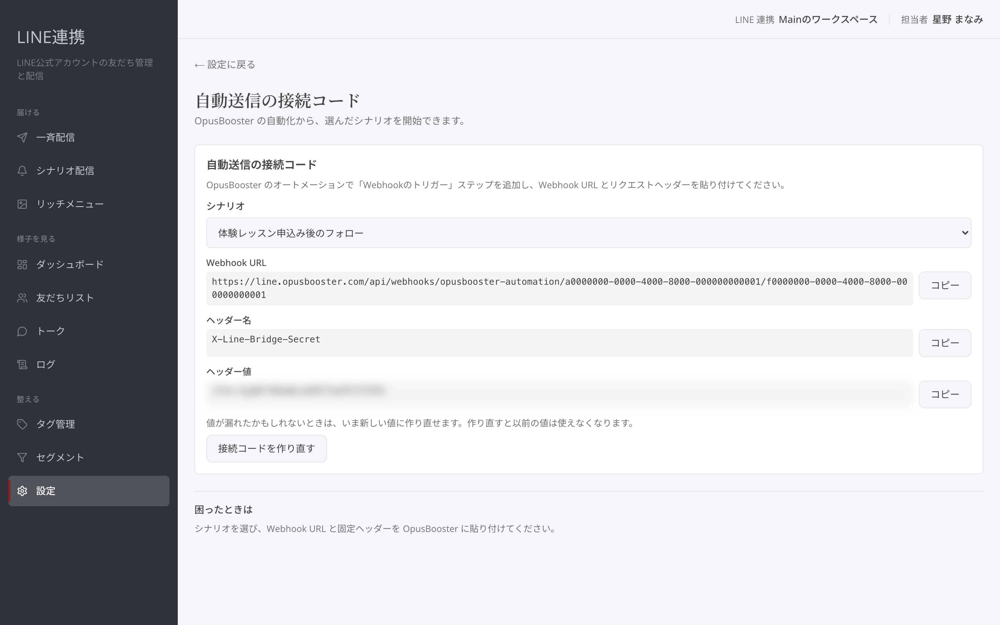

# オートメーションから LINE シナリオを送る

## これは何のための機能？

OpusBooster の「メッセージ & ワークフロー」のオートメーションに「Webhookのトリガー」ステップを追加すると、そのオートメーションに入った連絡先を、LINE 連携の**シナリオ配信**に登録できます。たとえば「特定のタグが付いたらメールを送り、あわせて LINE のシナリオも開始する」といった流れを、1 つのオートメーションで組めます。

## 設定するまでの流れ

### 1. 「自動送信の接続コード」を開きます

LINE 連携の「設定」→「注文・予約・フォームの受信」→「自動送信の接続コード」を開きます。画面には「シナリオ」「Webhook URL」「ヘッダー名」「ヘッダー値」が表示されます。

<figure><figcaption>シナリオを選ぶと、そのシナリオ専用の Webhook URL が表示されます</figcaption></figure>

### 2. 開始したいシナリオを選び、3 つの値をコピーします

「シナリオ」で開始したいシナリオを選ぶと、**そのシナリオ専用の Webhook URL** に切り替わります。「Webhook URL」「ヘッダー名」「ヘッダー値」をそれぞれ「コピー」で控えてください。


選べるのは **On （有効） になっているシナリオ**だけです。開始トリガーが「未設定（下書き用）」のシナリオは On にできないため、オートメーション専用のシナリオを作るときは、開始トリガーを「タグ追加」にして、**どこからも付かない専用のタグ** （例: 「オートメーション起動用」） を指定しておくのがおすすめです。こうすると勝手に始まることがなく、オートメーションからだけ開始されます。


### 3. オートメーションに「Webhookのトリガー」を追加します

OpusBooster の「メッセージ & ワークフロー」でオートメーションを開き、アクションに「**Webhookのトリガー**」を追加します。設定欄に次のとおり貼り付けてください。

* **リンク先 URL** — コピーした「Webhook URL」
* **リクエストヘッダー** — 名前にコピーした「ヘッダー名」、値にコピーした「ヘッダー値」

保存すれば設定は完了です。オートメーションがこのステップに到達するたびに、その連絡先が選んだシナリオに登録され、シナリオのステップどおりに LINE が届きます。


ヘッダー値は合言葉の役割です。オートメーション以外の場所に貼らないでください。漏れたかもしれないときは「接続コードを作り直す」で新しい値にできます （作り直したら、オートメーション側のヘッダー値も貼り替えてください）。


### 4. テストして確かめます

テスト用の連絡先でオートメーションを 1 回動かし、LINE が届くか確認してください。2 つのシナリオを使い分けたいときは、シナリオごとに Webhook URL が違うので、オートメーションごとに手順 2〜3 を繰り返します （ヘッダー名・ヘッダー値はいつも同じです）。

### よくある質問・つまずき

#### オートメーションは動いたのに LINE が届きません

次の 3 点を確認してください。

1. **シナリオが On になっているか** — Off （一時停止） のシナリオには登録されません。
2. **連絡先が LINE の友だちと紐づいているか** — LINE 連携側でその人が友だちとして登録されている （または購入・フォーム経由で紐づいている） ことが前提です。紐づいていない連絡先はスキップされます。
3. **同じ人に 2 回目を送ろうとしていないか** — シナリオの「再登録」の設定が「再登録しない」の場合、同じ人には 1 回しか送られません。テストを繰り返すときは、シナリオの編集画面で再登録の設定を確認してください。

#### 1 つのオートメーションから複数のシナリオを開始できますか？

できます。「Webhookのトリガー」ステップを複数追加し、それぞれに別のシナリオの Webhook URL を貼ってください。

---

<!-- cta:opusbooster -->

**自分の場合はどう使えばいいか**

[LINE連携の全体像](https://opusbooster.com/line)を見る。設計から相談したい方は[15分の無料相談](https://opusbooster.com/consultation)、まず触ってみたい方は[14日間の無料トライアル](https://opusbooster.com/register)（クレジットカード不要）から。

