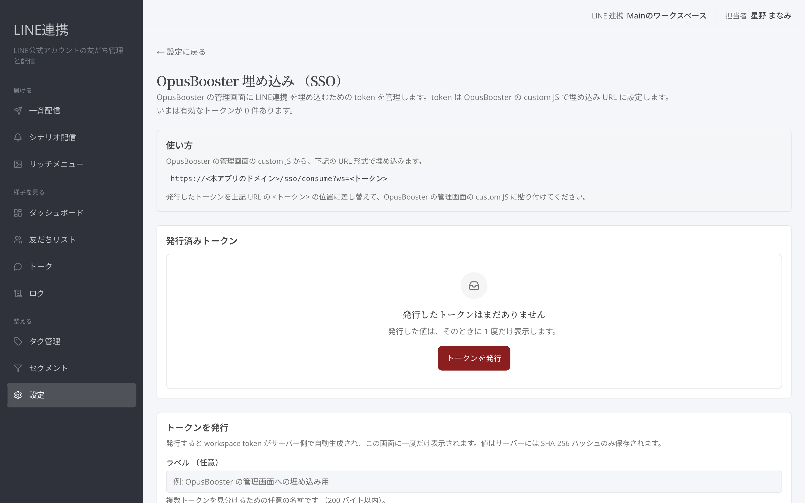
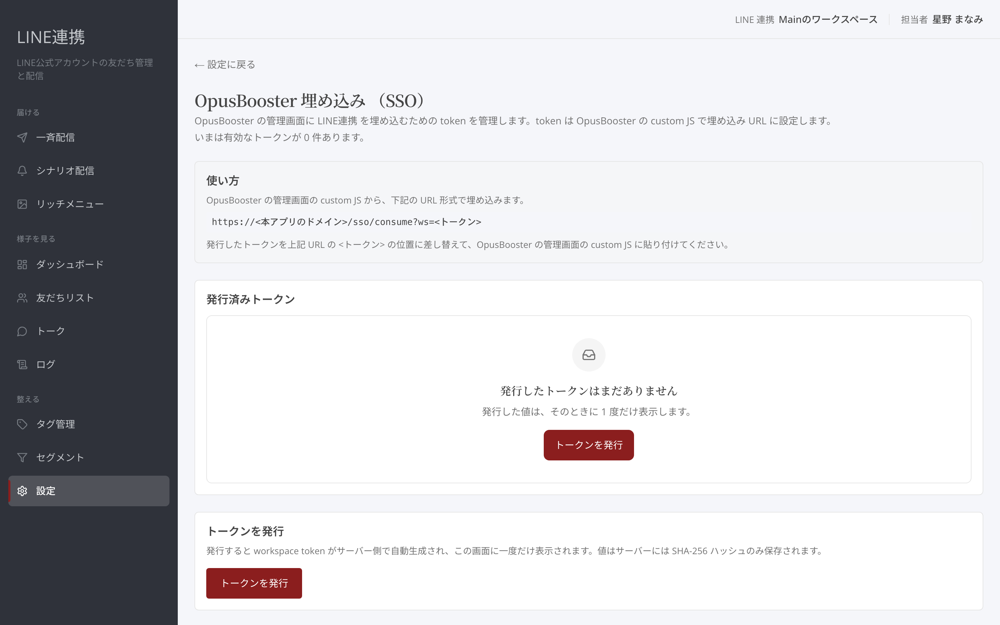
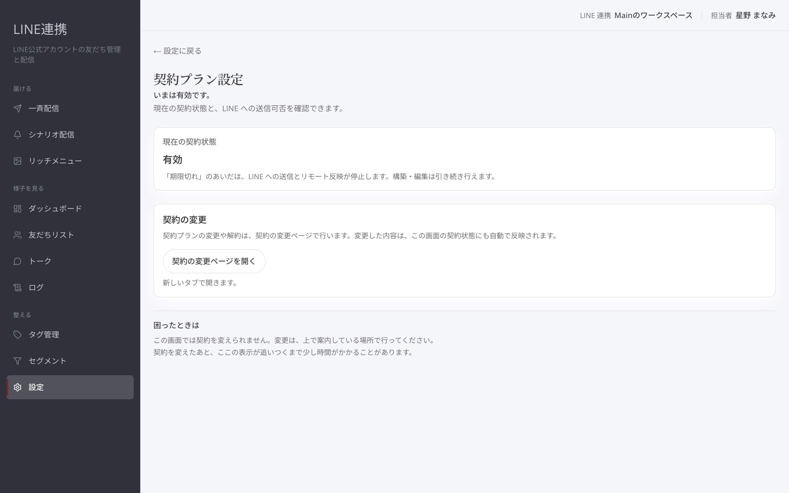

# 埋め込みパーツとご利用状況

## これは何のための機能？

「OpusBooster 埋め込み （SSO）」では、OpusBoosterの管理画面にLINE連携を埋め込むためのトークンを管理します。「契約プラン設定」では、現在の契約状態とLINEへの送信可否を確認します。契約をこの画面で書き換えることはできません。

## 埋め込み用トークンを発行するまでの流れ

### 1. 「OpusBooster 埋め込み （SSO）」を開きます

「発行済みトークン」で、有効なトークンの数と、各トークンの「ラベル」「**作成日**」「**状態**」を確認できます。

<figure><figcaption>発行済みの埋め込みトークンを確認します</figcaption></figure>

### 2. 「トークンを発行」を選びます

必要なら「ラベル （任意）」を入力します。複数の埋め込み先があるとき、ラベルを付けると見分けやすくなります。

### 3. 発行された値を控え、埋め込み先に設定します

発行したトークンは画面に一度だけ表示されます。案内されたURL形式の `<トークン>` の位置に差し替え、OpusBoosterの管理画面のcustom JSに貼り付けます。

<figure><figcaption>発行直後のトークンをコピーします</figcaption></figure>


「トークン （今回のみ表示）」は再表示できません。紛失した場合は新しいトークンを発行し、古いトークンを無効化してください。


## トークンを無効にするまでの流れ

### 1. 一覧から対象のトークンを確認します

状態が「**有効**」のトークンを選びます。

### 2. 「トークンを無効にする」を選び、確認します

無効にすると、そのトークンを使った埋め込みはすぐに開けなくなります。無効化を取り消す操作はありません。

<figure><figcaption>使わないトークンを無効にします</figcaption></figure>

## ご利用状況を確認するまでの流れ

### 1. 「契約プラン設定」を開きます

「現在の契約状態」に「トライアル中」「**有効**」「期限切れ」のいずれかが表示されます。

<figure><figcaption>契約状態とLINEへの送信可否を確認します</figcaption></figure>

### 2. 状態の意味を確認します

「期限切れ」のあいだは、LINEへの送信とリモート反映が停止します。シナリオの共有 URL も発行できず、期限切れの発行元から受け取った共有 URL はインポートできません。構築・編集は引き続き行えます。

### 3. 契約を変える場合は「契約の変更ページを開く」を選びます

契約プランの変更や解約は、契約の変更ページで行います。リンクが表示されない場合は、サイトの管理画面の「設定 → お支払い」で行えます。


契約を変更したあと、契約状態の表示が追いつくまで少し時間がかかることがあります。


### よくある質問・つまずき

#### 埋め込んだ画面が開きません

一覧で、そのトークンが「**有効**」か確認してください。

#### トークンを控え忘れました

再表示はできません。新しいトークンを発行し、古いトークンを無効にしてください。

#### 契約状態をこの画面で変更できますか

できません。「契約の変更ページ」で変更してください。

#### 共有 URL が発行できません／受け取った共有 URL が開けません

発行する側の契約状態が「期限切れ」だと、共有 URL の発行と、その URL からのインポートが止まります。受け取った URL が開けないときは、発行した相手に契約状態を確認してもらってください。インポートする側の契約状態は関係ありません。

---

<!-- cta:opusbooster -->

**自分の場合はどう使えばいいか**

[LINE連携の全体像](https://opusbooster.com/line)を見る。設計から相談したい方は[15分の無料相談](https://opusbooster.com/consultation)、まず触ってみたい方は[14日間の無料トライアル](https://opusbooster.com/register)（クレジットカード不要）から。

