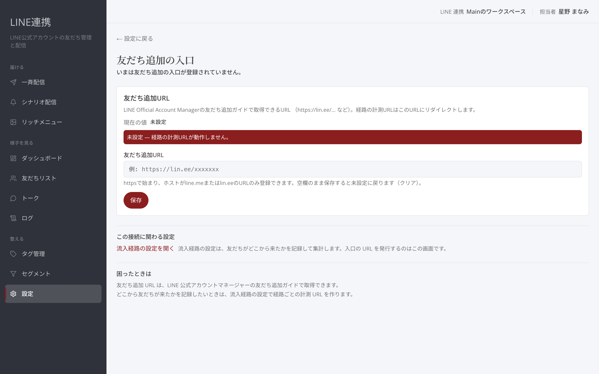
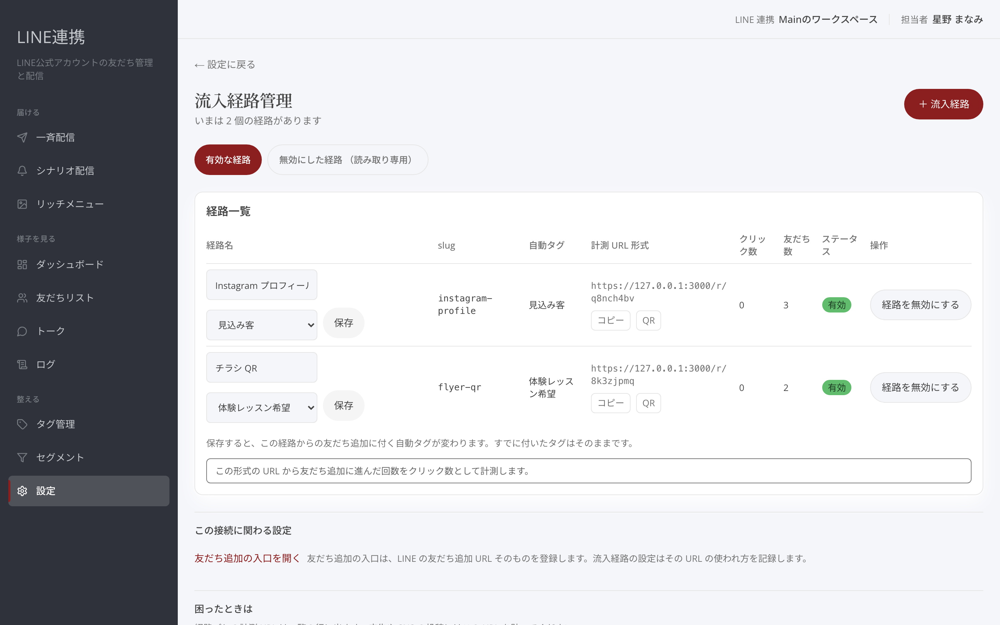

# 友だち追加の入口と経路の計測

## これは何のための機能？

ライブ告知、Instagram、プロフィールなど、どこから友だち追加されたかを記録したいときの設定です。まず「友だち追加の入口」でLINEの友だち追加URLを登録します。次に「**流入経路管理**」で媒体ごとの計測URLを作ります。入口のURLと、流入を記録するURLは別のものです。

## 友だち追加URLを登録するまでの流れ

### 1. 「友だち追加の入口」を開きます

「友だち追加URL」には、LINE Official Account Managerの友だち追加ガイドで取得したURLを使います。現在の値が「**未設定**」の場合、経路の計測URLは動作しません。

<figure><figcaption>友だち追加URLを登録する画面</figcaption></figure>

### 2. URLを入力して「**保存**」を選びます

`https://lin.ee/…` など、httpsで始まりホストがline.meまたはlin.eeのURLだけを登録できます。空欄のまま保存すると未設定に戻ります。


保存していない変更があります。画面を離れる前に「**保存**」を選んでください。


## 流入経路を作るまでの流れ

### 1. 「**流入経路管理**」で「**＋ 流入経路**」を選びます

経路名と、URLに使う「**slug**」を決めます。たとえば、広告ごと・投稿ごとに分けると、あとから見返しやすくなります。識別子は作成後に変更できません。

<figure><figcaption>流入経路を作成する画面</figcaption></figure>

### 2. 必要なら「自動タグ」を選び、「**作成**」を選びます

作成すると、この経路の計測URLがすぐに使えるようになります。計測URLは一覧の行に表示され、「コピー」または「**QR**」から使えます。

### 3. 表示された計測URLを告知先に貼ります

「クリック数」は、この形式のURLから友だち追加に進んだ回数です。「友だち数」は経路ごとの友だち数です。友だちリストでは、追加した方の「**経路**」列にこの経路が表示されます。

<figure><figcaption>経路ごとの計測結果を確認する一覧</figcaption></figure>


経路を無効にすると、以後このURLからのクリックは計測されず、自動タグも付きません。元に戻すことはできませんが、記録済みのクリック数と友だち数は残ります。


### よくある質問・つまずき

#### 計測URLが動きません

「友だち追加URL」が未設定ではないか確認してください。

#### QRコードで配りたいです

経路一覧の「**QR**」を選び、「計測 URL の QR コード」を表示して使えます。

