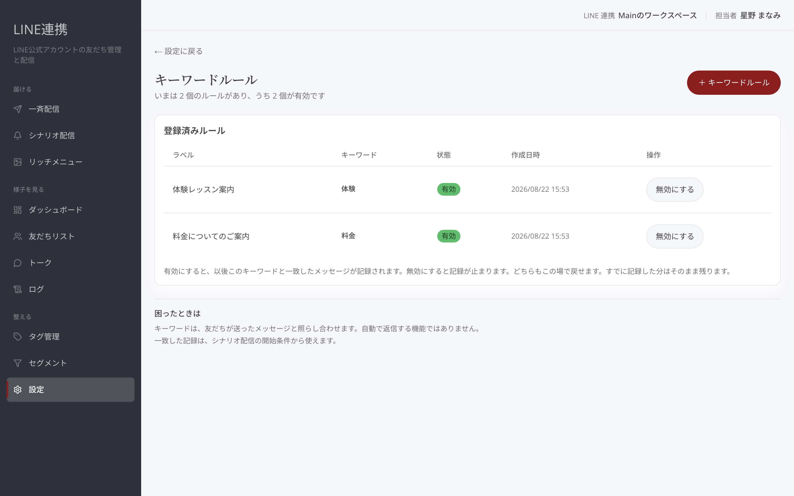

# キーワード応答ルール

## これは何のための機能？

友だちが送ったメッセージを、決めたキーワードと照らし合わせて記録する機能です。たとえば「資料をください」を登録しておくと、その言葉に一致したメッセージをあとから確認できます。一致した記録は、シナリオ配信の開始条件から使えます。


キーワードは自動で返信する機能ではありません。


## ルールを作成するまでの流れ

### 1. 「キーワードルール」で「＋ キーワードルール」を選びます

LINE 公式アカウントとの接続が必要です。未接続の場合は、先に接続を済ませてください。

<figure><figcaption>ルール一覧から新しいルールを追加します</figcaption></figure>

### 2. 「ラベル」と「キーワード」を入力します

ラベルは一覧で見分けるための名前です。キーワードには、友だちのメッセージと照らし合わせたい言葉を入力します。同じキーワードは登録できません。

<figure><figcaption>キーワードルールの作成画面</figcaption></figure>

### 3. 「作成する」を選びます

作成すると、以後このキーワードと一致したメッセージが記録されます。ラベルとキーワードは作成後に変更できません。変えたいときは、いったん無効にして別のルールを作ってください。

## 有効・無効を切り替えるまでの流れ

### 1. 一覧で対象ルールを確認します

一覧ではルールごとの状態を確認できます。「**有効**」なら照合対象です。

<figure><figcaption>ルールの状態を切り替えます</figcaption></figure>

### 2. 「有効にする」または「無効にする」を選びます

有効にすると以後の一致したメッセージが記録され、無効にすると記録が止まります。どちらもこの場で戻せます。すでに記録した分はそのまま残ります。


運用担当の権限では閲覧のみです。編集には管理者以上の権限が必要です。


### よくある質問・つまずき

#### 作成ボタンが表示されません

閲覧のみの権限では作成できません。管理者またはオーナーに確認してください。

#### 言葉を変えたいです

既存のラベルとキーワードは変更できません。無効にして、別のルールを作成してください。

