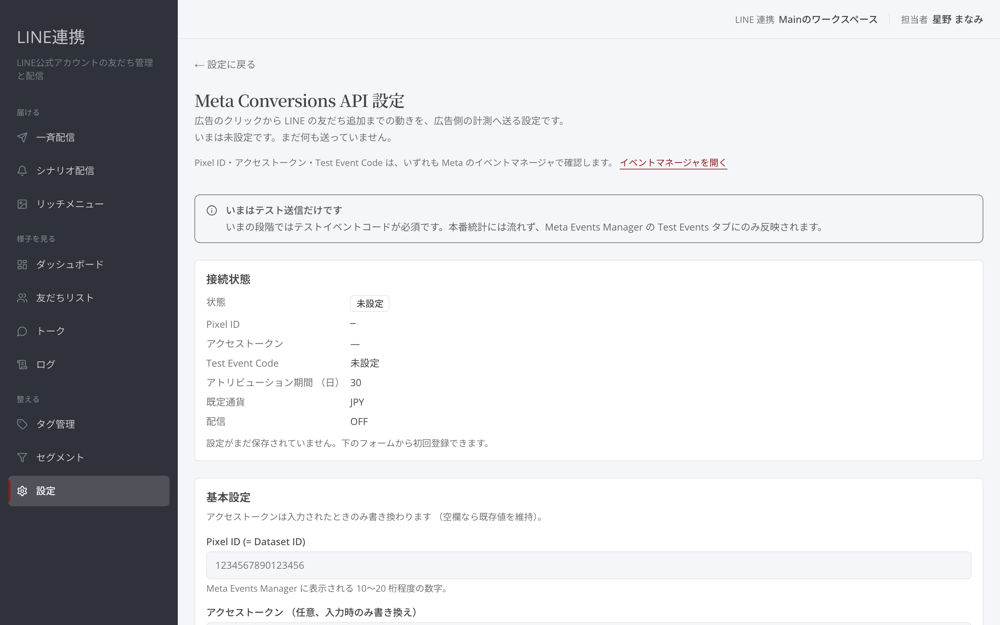

# Meta 広告連携 (CAPI)

## これは何のための機能？

「**Meta Conversions API 設定**」では、設定したイベントを広告側の計測へ送るための設定を行います。「配信」がONならイベントを送ります。OFFではテスト用のイベントコードだけを送ります。未設定ではまだ何も送っていません。

## 基本設定を保存するまでの流れ

### 1. 「**基本設定**」を開きます

「**Pixel ID (= Dataset ID)**」「アクセストークン」「**Test Event Code**」「アトリビューション期間 （日）」「既定通貨」を確認します。

<figure><figcaption>Meta Conversions API の基本設定を入力します</figcaption></figure>

### 2. 必要な項目を入力し、「設定を保存」を選びます

Pixel IDはMeta Events Managerに表示される値です。アクセストークンは「入力時のみ書き換え」です。アトリビューション期間は1〜90日、既定は30日です。


アクセストークンの現在値は画面に再表示されません。更新が必要なときは「アクセストークンのローテート」から新しい値を入力します。


### 3. 「配信を ON にする」を選びます

送信には必要な基本設定が揃っている必要があります。「**接続状態**」で「有効 （送信中）」と表示されるか確認してください。

<figure><figcaption>設定を保存したあとに配信をONにします</figcaption></figure>

## イベント対応表を作るまでの流れ

### 1. 「イベント対応表」で「**＋ 対応表**」を選びます

対応表は、どのイベントをどのMetaイベント名で送るかを決めます。たとえば「LINE 友だち追加」「フォーム送信」「**予約作成**」「**購入確定**」が一覧にあります。

<figure><figcaption>送信するイベントの対応表を確認します</figcaption></figure>

### 2. 「社内イベント」「Meta イベント名」「**優先度**」を選びます

優先度は0〜10000の整数で、小さいほど優先されます。作成後は一覧で「**有効**」か「**無効**」かを確認し、必要に応じて切り替えます。


優先度が上の行がある対応表は「送信されません」と表示されます。重複した設定を作ったときは、この表示を確認してください。


### よくある質問・つまずき

#### 配信をONにできません

Pixel ID、アクセストークン、Test Event Codeの設定を確認してください。

#### トークンを消したいです

「アクセストークンのクリア」から操作できます。クリア後はアクセストークンが必要な送信を確認してください。

