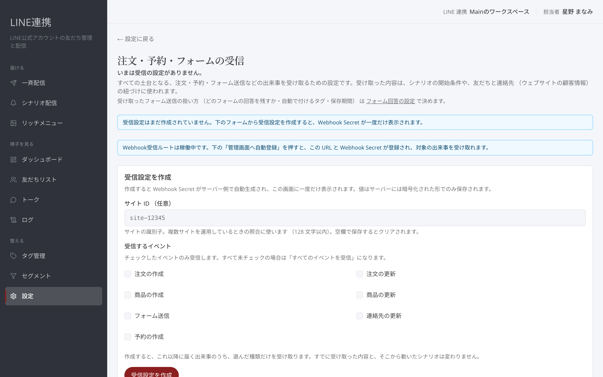
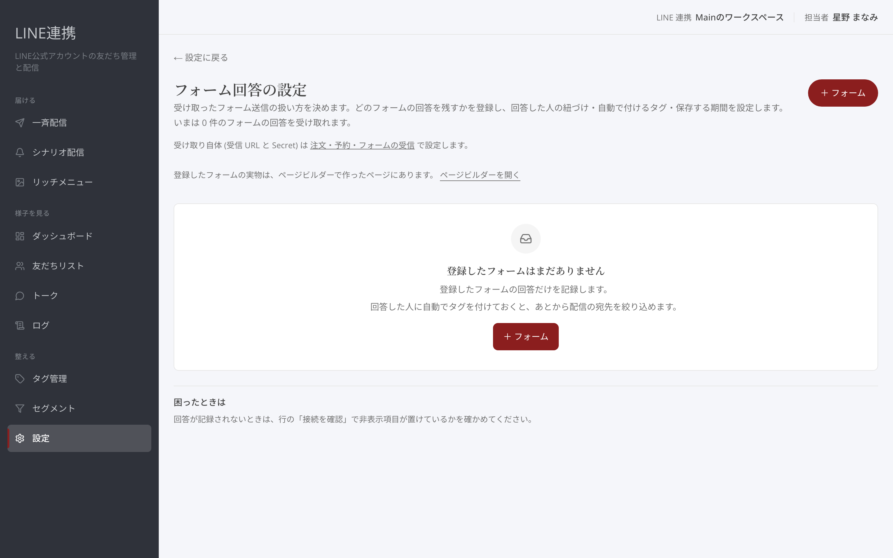

# 注文・予約・フォームの受信 — イベント連動とフォーム連携

## これは何のための機能？

「注文・予約・フォームの受信」は、注文の作成・更新、フォーム送信、予約の作成などを受け取るための設定です。受け取ったイベントは、シナリオのきっかけとして使えます。「フォーム回答の設定」では、どのフォームの回答を残すか、回答者の紐づけ、自動で付けるタグ、保存する期間を決めます。

## 受信設定を作成するまでの流れ

### 1. 「注文・予約・フォームの受信」を開きます

最初に「受信設定を作成」を選びます。作成後は「受信ステータス」で「**有効 （受信準備完了）**」または「**無効 （受信停止）**」を確認できます。

<figure><figcaption>注文・予約・フォームの受信を準備します</figcaption></figure>

### 2. 「受信するイベント」を選び、「受信設定を保存」を選びます

画面には「注文の作成」「注文の更新」「フォーム送信」「予約の作成」などが表示されます。必要なイベントを選んで保存してください。

### 3. 「受信を有効にする」を選びます

「受信スイッチ」で受信を有効・無効にできます。Webhook URLは設定画面に表示されます。

<figure><figcaption>受信の状態を確認して有効にします</figcaption></figure>


Webhook Secretは「今回のみ表示」です。再表示できないため、表示されたときに控えてください。


## フォーム回答を登録するまでの流れ

### 1. 「フォーム回答の設定」で「＋ フォーム」を選びます

一覧では「表示名」「フォーム名」「フォームページ」「自動で付けるタグ」「**回答数**」を確認できます。フォームの実物は、ページビルダーで作ったページにあります。

<figure><figcaption>フォーム回答の設定を開きます</figcaption></figure>

### 2. フォームの情報を入力します

「表示名」「サイトの識別子」「フォーム名」「フォームページの URL」を入力します。必要なら「自動で付けるタグ」と「回答を保存する日数」を選びます。

### 3. 「接続を確認」で紐づけを確かめます

公開しているフォームページには、スニペットと非表示項目 `lt` が必要です。「接続を確認」で「紐づけ用の項目が見つかりました」と表示されるか確認してください。

<figure><figcaption>フォームと友だちを紐づける項目を確認します</figcaption></figure>


自動で付けるタグは、回答者が友だちと紐づいたときに付きます。


### よくある質問・つまずき

#### 回答が紐づきません

フォームの非表示項目 `lt` を確認してください。見つからない場合は、フォーム編集で「**非表示**」項目を追加し、項目名を `lt` にします。

#### 受信が止まっています

「受信スイッチ」が有効か、「受信ステータス」がどう表示されているかを確認してください。

---

<!-- cta:opusbooster -->

**自分の場合はどう使えばいいか**

[LINE連携の全体像](https://opusbooster.com/line)を見る。設計から相談したい方は[15分の無料相談](https://opusbooster.com/consultation)、まず触ってみたい方は[14日間の無料トライアル](https://opusbooster.com/register)（クレジットカード不要）から。

