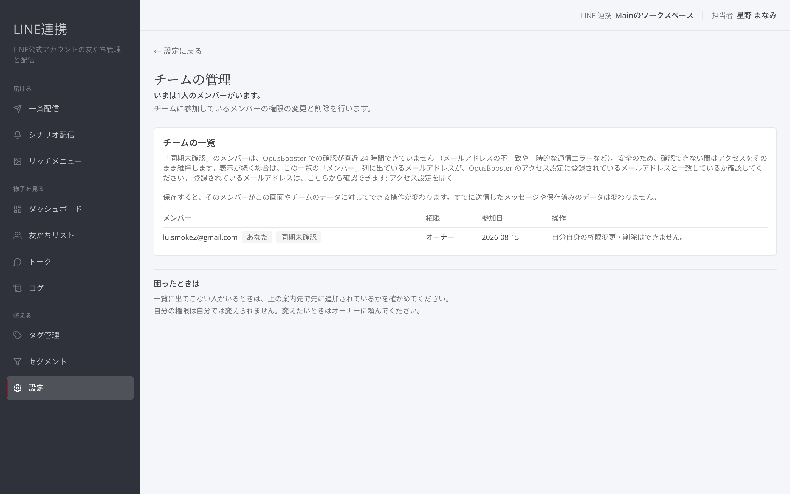

# チーム — 担当者の追加と権限

## これは何のための機能？

「チームの管理」では、チームに参加しているメンバーの権限の変更と削除を行います。権限は「オーナー」「管理者」「**運用担当**」「閲覧のみ」です。画面に表示される権限で、この画面やチームのデータに対してできる操作が変わります。


この画面のソースには、メンバーを招待・追加する操作は確認できませんでした。追加が必要な場合は、一覧に出ない人を追加する案内先を画面で確認してください。


## 権限を確認するまでの流れ

### 1. 「チームの管理」を開きます

「チームの一覧」には「メンバー」「**権限**」「**参加日**」が表示されます。運用担当以上は閲覧できます。

<figure><figcaption>現在のチームと権限を確認します</figcaption></figure>

### 2. 自分と他のメンバーの状態を確認します

自分の行には「あなた」と表示されます。自分自身の権限変更・削除はできません。最後のオーナーは権限変更と削除ができません。

メールアドレスが表示されない場合は、権限による非表示のことがあります。「参加待ち」は、まだ参加が完了していない状態です。まず一覧の状態を確認してから、変更する担当者を決めてください。

## 権限を変更するまでの流れ

### 1. 対象メンバーの「**権限**」を選びます

権限の変更はオーナーのみが行えます。管理者はメンバーの削除のみ行えます。

### 2. 「**適用**」を選びます

保存すると、そのメンバーがこの画面やチームのデータに対してできる操作が変わります。すでに送信したメッセージや保存済みのデータは変わりません。

<figure><figcaption>メンバーの権限を変更します</figcaption></figure>

### 3. 必要な場合だけ「**削除**」を選びます

削除すると、そのメンバーはチームのデータにアクセスできなくなります。この画面から元に戻すことはできません。


「OpusBooster で未許可」と表示されるメンバーは、LINE連携を開けません。復帰は「アクセス設定」で行い、反映は1時間ごとの同期です。


### よくある質問・つまずき

#### 権限を変更できません

権限の変更はオーナーのみ可能です。自分の権限は自分では変えられません。

#### メンバーが一覧にいません

画面上の案内先で、先に追加されているかを確認してください。
