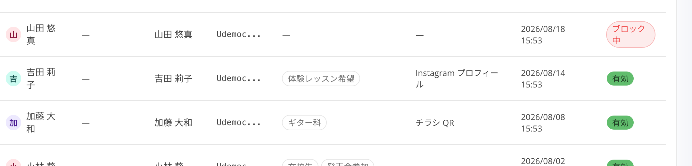
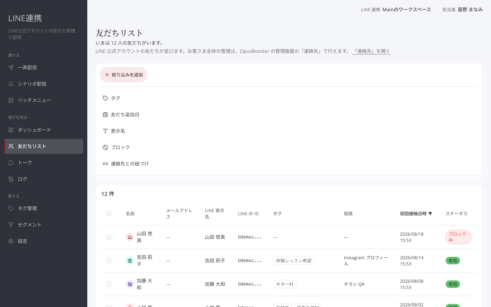
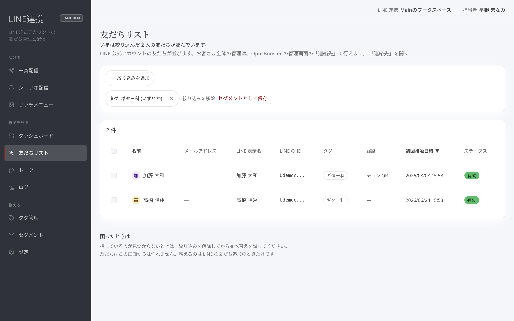

# 友だちリストと絞り込み

## これは何のための機能？

「**友だちリスト**」は、LINEで友だちになった方を確認し、必要な方を探すための画面です。友だちはこの画面から作れず、LINEの友だち追加によって増えます。新曲の案内前に対象を見たり、問い合わせをくれた方を探したりするときに使います。

<figure><figcaption>まず一覧で友だちを確認します</figcaption></figure>

## 一覧の列を確認する

一覧には、友だちの情報とLINEでの状況が並びます。画面に表示される列見出しを見ながら、名前・タグ・友だち追加に関する情報などを確認してください。見つけたい人がいるときは、いきなり多くの条件を付けず、まず一覧を確認してから絞り込みます。

一覧に人が見つからないときは、画面下の案内どおり「**絞り込みを解除**」してから並び替えを試します。絞り込みなしで友だちがいない場合と、条件に合う人がいない場合は意味が違うため、先に条件が残っていないかを確かめてください。

<figure><figcaption>表の見出しに沿って、表示中の情報を読み取ります</figcaption></figure>

## 条件を追加する

「**＋ 絞り込みを追加**」を押すと、条件の種類を選べます。選んだ種類により、入力欄や選択肢が変わります。タグで探すときは「**タグ**」、友だちになった時期で探すときは「**友だち追加日**」、名前の一部で探すときは「**名前**」を選びます。「**ブロック**」や「**連携済み**」も条件として選べます。

<figure><figcaption>タグ、友だち追加日、名前などから条件を選びます</figcaption></figure>

タグは選んだタグを条件にします。友だち追加日は表示された演算子と日数または日付を指定します。名前は探したい文字を入力します。条件を適用すると、選んだ条件はチップとして表示されます。チップ本体を押すと編集でき、×を押すとその条件だけ外せます。複数の条件があるときは、チップの間に「**かつ**」と表示されます。

<figure><figcaption>条件を見直し、不要なものだけ外せます</figcaption></figure>


**探す順番:** 最初は「**＋ 絞り込みを追加**」で1つだけ条件を入れ、結果を見てから次の条件を加えてください。条件が増えるほど、一覧に出る人は絞られます。


## よくある質問・つまずき

### 友だちを手で追加できますか？

できません。友だちはLINEの友だち追加によって増えます。

### 条件を1つだけ外したいです

条件チップの×を押すと、その条件だけ外せます。

### 探している人がいません

「**絞り込みを解除**」してから、一覧や並び替えを確認してください。
