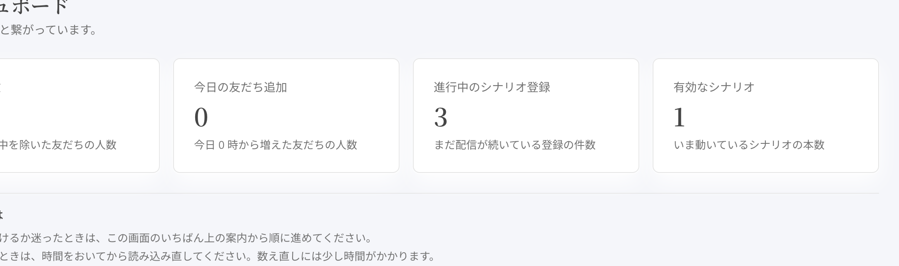
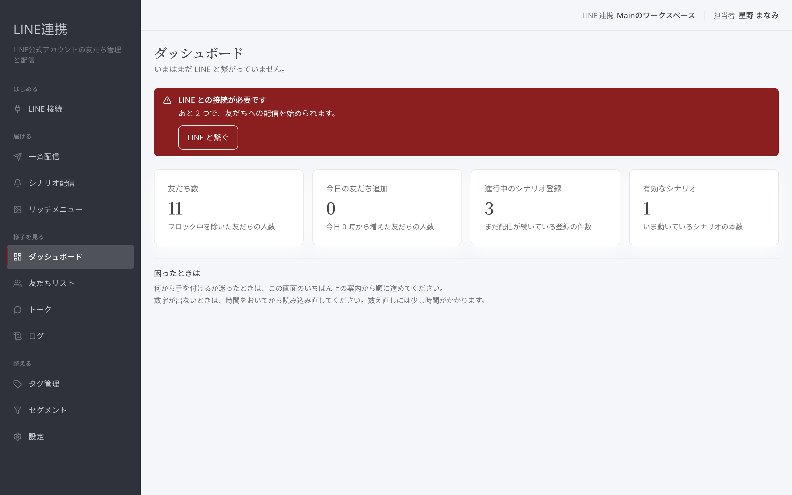

# ダッシュボードの見方

## これは何のための機能？

「**ダッシュボード**」は、LINE連携で次に確認したいことを見つける入口です。日々の状態では4つの数字が表示され、それぞれを押すと内容の一覧へ移動できます。ライブ告知や新作のお知らせのあと、まず全体を確かめたいときに開いてください。

<figure><figcaption>数字を押すと、詳しい一覧を開けます</figcaption></figure>

## 4つの数字を読む

「**友だち数**」は、ブロック中を除いた友だちの人数です。友だちの全体像を確かめたいときに押すと「**友だちリスト**」へ進みます。「**今日の友だち追加**」は、今日0時から増えた友だちの人数です。告知のあとにどれくらい友だちが増えたかを、日ごとの目安として確かめられます。

「**進行中のシナリオ登録**」は、まだ配信が続いている登録の件数です。「**有効なシナリオ**」は、いま動いているシナリオの本数です。どちらも「**シナリオ配信**」の一覧へ進む入口です。数字を見て気になったら、カードを押して中身を確認してください。

<figure><figcaption>友だちに関する数字から一覧へ進みます</figcaption></figure>

数字が表示されないときも、すぐに0件とは限りません。画面下の案内どおり、時間をおいてから読み込み直してください。数え直しには少し時間がかかります。

## 最初の設定が残っているとき

接続がまだ済んでいない場合は「**LINE との接続が必要です**」と表示されます。「**接続を確認する**」または表示された案内から、設定を進めてください。接続できない場合は「**LINE と接続できません**」と表示され、配信と友だちの取り込みは止まっています。接続の状態画面で原因を確かめます。

<figure><figcaption>表示された案内から接続の設定を進めます</figcaption></figure>


**数字の使い方:** 数字は結果を眺めるだけでなく、気になる項目の一覧へ進むための入口です。まずカードを押して、該当する友だちやシナリオを確認してください。


## 困ったときは

友だちが増えない理由を見たいときは「**友だちリスト**」へ、返信を確かめたいときは「**トーク**」へ進みます。届かないなど記録を確認したいときは「**ログ**」を開きます。ダッシュボード上の数字だけでは原因を示さないため、数字から行き先を選んで確認するのが近道です。

## よくある質問・つまずき

### 数字が空です

時間をおいてから読み込み直してください。数え直しには少し時間がかかります。

### 友だち数を押すと何が開きますか？

「**友だちリスト**」が開き、友だちの一覧を確認できます。

### 接続できない案内が出ています

「**接続を確認する**」を押し、接続の状態画面で原因を確かめてください。

---

<!-- cta:opusbooster -->

**自分の場合はどう使えばいいか**

[LINE連携の全体像](https://opusbooster.com/line)を見る。設計から相談したい方は[15分の無料相談](https://opusbooster.com/consultation)、まず触ってみたい方は[14日間の無料トライアル](https://opusbooster.com/register)（クレジットカード不要）から。

