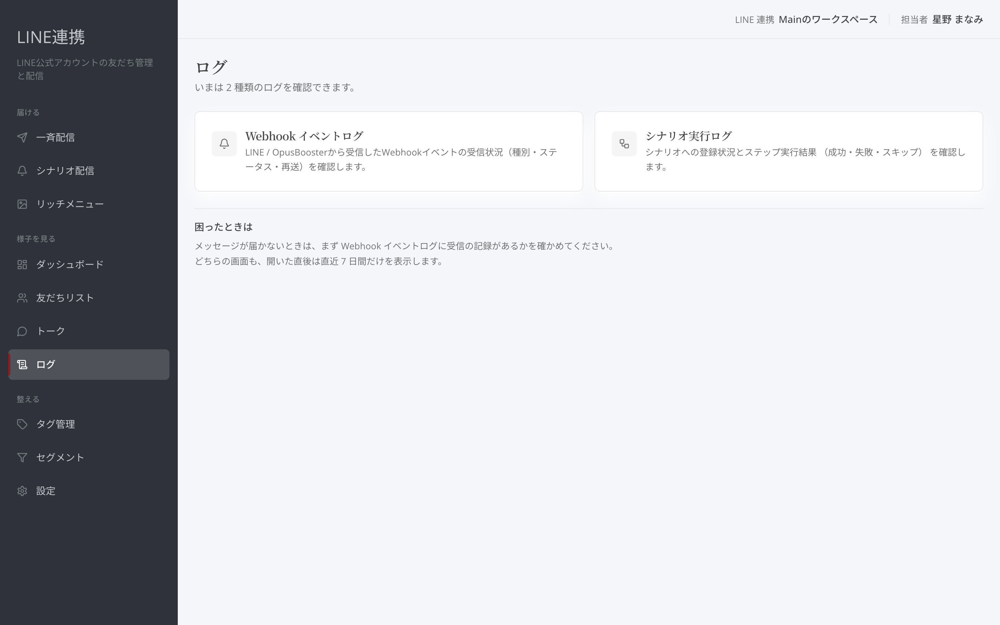
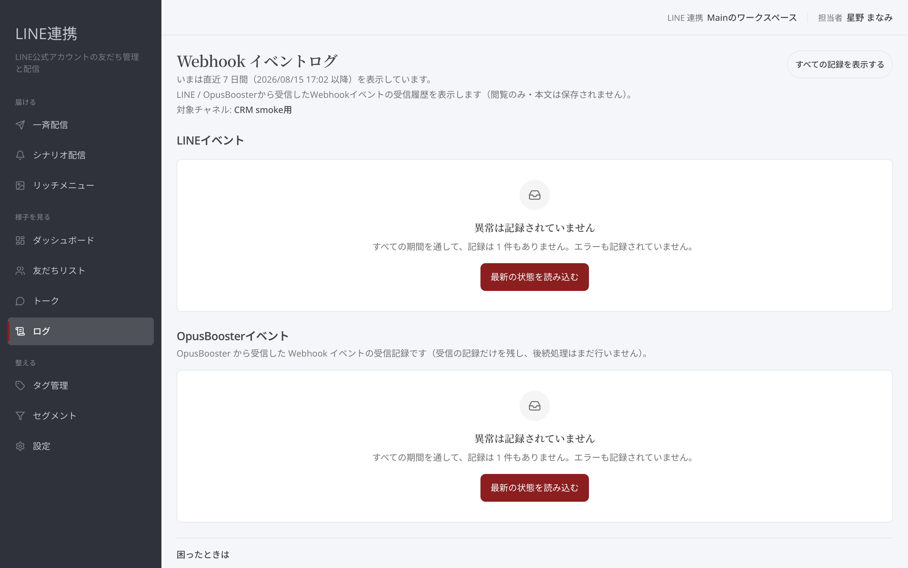
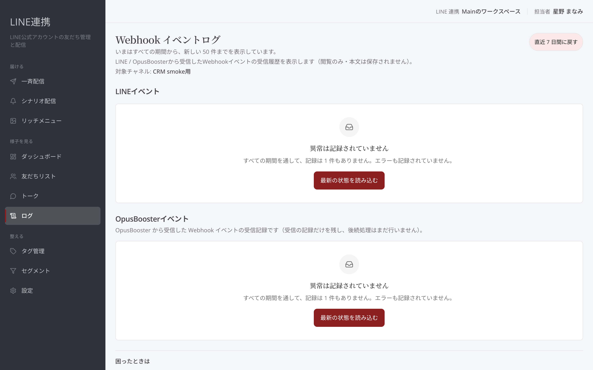

# ログの見方 — 配信の記録

## これは何のための機能？

「**ログ**」は、LINE連携で起きた記録を確認する場所です。画面には「**Webhook イベントログ**」と「**シナリオ実行ログ**」の2種類があり、いまは2種類のログを確認できます。メッセージが届かないなど、日常の画面だけでは分からないときに開きます。

<figure><figcaption>確かめたい記録の種類を選びます</figcaption></figure>

## 受信の記録を開く

「**Webhook イベントログ**」は、LINE / OpusBoosterから受信したWebhookイベントの受信履歴を表示します。カードには、受信状況の「種別・ステータス・再送」を確認できると表示されます。メッセージが届かないときは、まずこの画面に受信の記録があるかを確かめてください。

<figure><figcaption>受信日時、イベント種別、ステータス、再送を確認します</figcaption></figure>

一覧には「**受信日時**」「**イベント種別**」「**ステータス**」「**再送**」などが表示されます。LINEイベントには「**受信済み**」「**処理済み**」「**スキップ**」「**重複**」などの状態が表示されます。表示中の行を見て、いつ、どの種類の記録が残っているかを確認してください。

## 期間を切り替える

ログを開いた直後は直近の期間だけを表示します。画面の期間切替を押すと「**すべての記録を表示する**」へ切り替えられます。全期間を見ているときは、表示を絞る導線が出ます。切り替えているのは表示する期間だけで、記録はこの画面からは消せません。

<figure><figcaption>必要に応じて表示する期間を広げます</figcaption></figure>


**確認の順番:** まず直近の記録を見て、必要なときだけ「**すべての記録を表示する**」を使ってください。期間を切り替えても記録は消えません。


読み込めないときは「**読み込めませんでした**」と表示されます。空の一覧と同じ意味ではないため、画面の案内からもう一度開いてください。

## よくある質問・つまずき

### ログを開いたら何を見ればよいですか？

メッセージが届かないときは、まず「**Webhook イベントログ**」に受信の記録があるかを確かめます。

### 期間を広げると記録が消えますか？

消えません。切り替わるのは表示する期間だけです。

### 読み込めませんでしたと出ます

空の記録とは別の状態です。画面の案内からもう一度開いてください。
