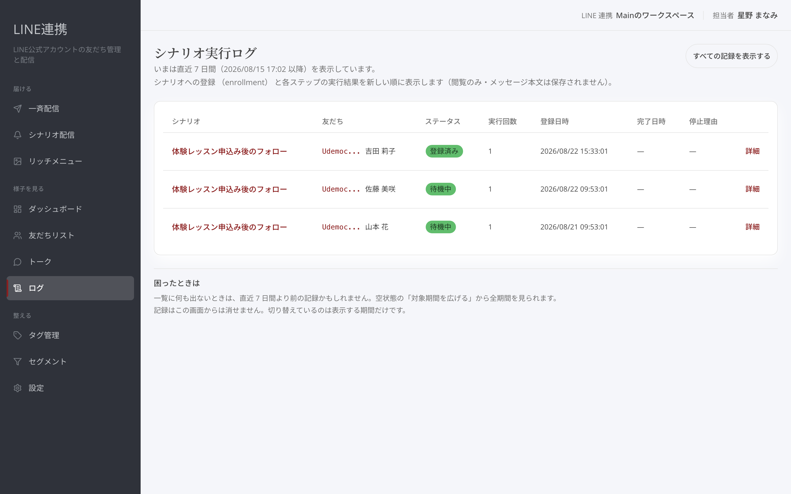
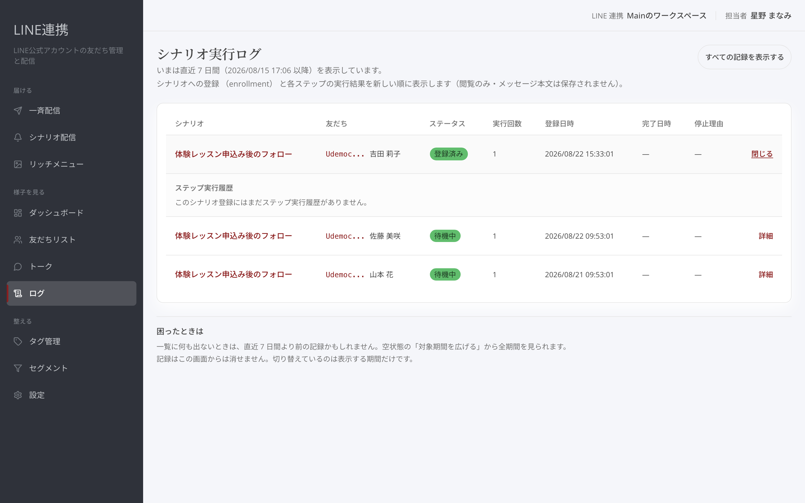
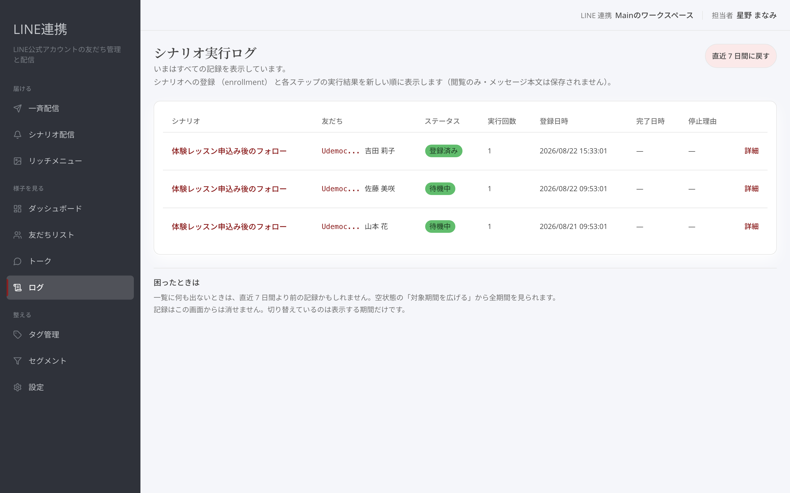

# ログの見方 — シナリオの進行記録

## これは何のための機能？

「**シナリオ実行ログ**」は、どの友だちがどのシナリオに登録され、どこまで進んだかを確認する画面です。「**ログ**」から「**シナリオ実行ログ**」を開きます。シナリオへの登録状況とステップ実行結果を新しい順に表示する、閲覧のための記録です。

<figure><figcaption>シナリオの進行を確認したいときに開きます</figcaption></figure>

## 一覧で進み具合を確認する

一覧には「**シナリオ**」「**友だち**」「**ステータス**」「**実行回数**」「**登録日時**」「**完了日時**」「**停止理由**」が並びます。友だちの名前とシナリオ名を見て、誰がどの案内を進めているかを確かめてください。

ステータスには「**登録済み**」「**実行中**」「**待機中**」「**完了**」「**停止**」「**失敗**」が表示されます。「**待機中**」は次の実行を待っている状態です。「**完了**」ならその登録の進行は終わっています。「**停止**」や「**失敗**」なら、停止理由や詳細を確認します。

停止理由が「**目的を達成して停止**」の場合は、不具合ではありません。シナリオに決めた「**目標**」に当てはまったため、その方への配信を途中で終えた状態です。買ってくださった方に案内を送り続けないための仕組みで、シナリオ自体は On のまま動いています。何を目標にしているかは、シナリオの「**設定**」の「**目標**」で確認できます。

<figure><figcaption>登録ごとの現在の状態と日時を確認します</figcaption></figure>

## 詳細でステップを追う

気になる行の「**詳細**」を押すと「**ステップ実行履歴**」が開きます。ここでは「**ステップ**」「**ステータス**」「**開始日時**」「**終了日時**」「**エラー**」「**再試行回数**」を確認できます。終えたら「**閉じる**」で一覧へ戻せます。

<figure><figcaption>どのステップが成功・失敗・スキップしたかを確認します</figcaption></figure>

ステップの状態は「**待機中**」「**実行中**」「**成功**」「**失敗**」「**スキップ**」です。「**失敗**」なら同じ行の「**エラー**」を確認します。たとえば「**送信に失敗**」など、画面に表示された内容を手がかりに、該当する設定や対象を見直してください。履歴を読み込めない場合は「**ステップ実行履歴を読み込めませんでした。詳細をいったん閉じて、開き直してください。**」と表示されます。


**見る順番:** まず一覧の「**ステータス**」と「**停止理由**」を確認し、気になる登録だけ「**詳細**」を開くと、必要な記録を追いやすくなります。


## 期間を広げる

開いた直後は直近の記録を表示します。古い記録も見たい場合は「**すべての記録を表示する**」を押します。全期間を見ているときには、直近の表示へ戻す導線が出ます。期間の切替は表示だけを変えるもので、記録はこの画面から消せません。

<figure><figcaption>必要な場合だけ全期間の記録へ広げます</figcaption></figure>

読み込めないときは「**読み込めませんでした**」と表示されます。空の一覧と同じ意味ではありません。「**最新の状態を読み込む**」を押して、もう一度確認してください。

## よくある質問・つまずき

### どこまで進んだかはどこで分かりますか？

一覧の「**ステータス**」を見て、必要な行の「**詳細**」から「**ステップ実行履歴**」を開きます。

### 失敗の理由はどこで見ますか？

「**詳細**」を開き、該当ステップの「**エラー**」を確認します。

### 古い記録を見たいです

「**すべての記録を表示する**」を押して表示期間を広げてください。

---

<!-- cta:opusbooster -->

**自分の場合はどう使えばいいか**

[LINE連携の全体像](https://opusbooster.com/line)を見る。設計から相談したい方は[15分の無料相談](https://opusbooster.com/consultation)、まず触ってみたい方は[14日間の無料トライアル](https://opusbooster.com/register)（クレジットカード不要）から。

