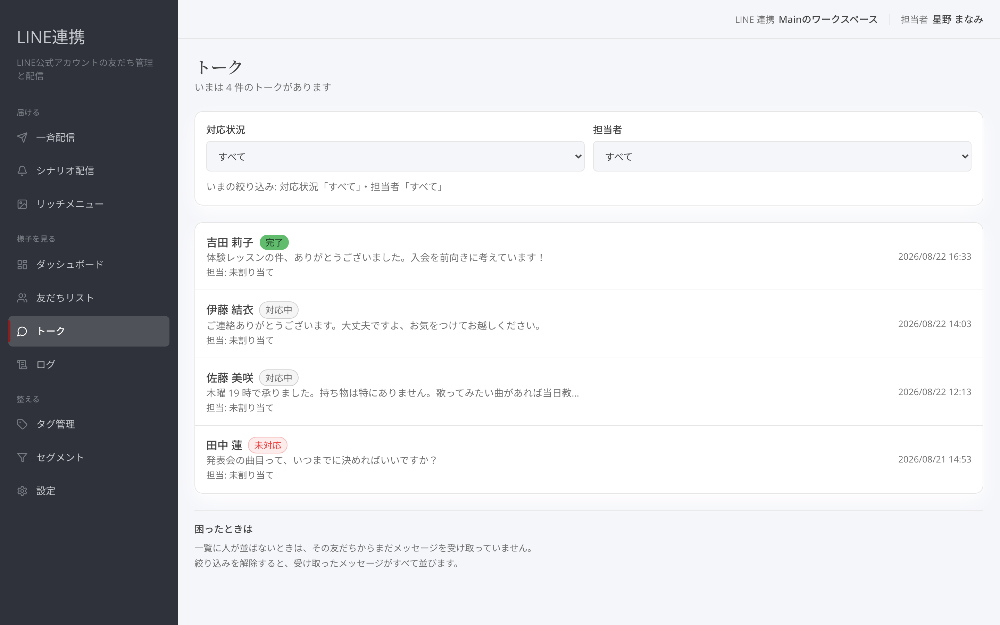
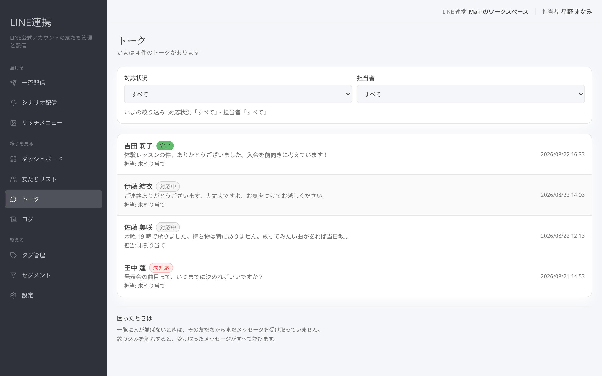
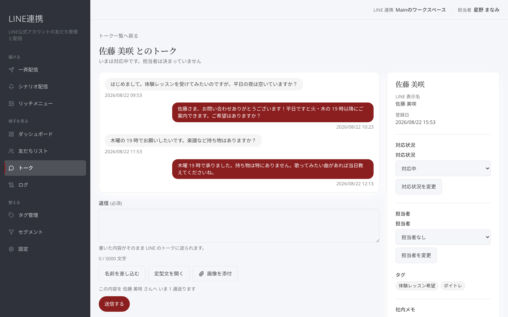

# トークで返信する

## これは何のための機能？

「**トーク**」は、友だちから受け取ったメッセージを確認し、1通ずつ返信するための画面です。一覧に人が並ばないときは、その友だちからまだメッセージを受け取っていません。新しい反応や問い合わせに答えたいときは、まず「**トーク**」を開いてください。

<figure><figcaption>受け取ったメッセージのある友だちを一覧で確認します</figcaption></figure>

## 会話を開く

一覧から友だちを選ぶと、個別のトークが開きます。必要に応じて「**対応状況**」と「**担当者**」で絞り込めます。「**未対応**」はまだ手を付けていない会話、「**対応中**」は進めている会話、「**完了**」は対応を終えた会話として表示されます。「**未割り当て**」で、担当者が決まっていない会話を探すこともできます。

<figure><figcaption>未対応の会話や担当者が未割り当ての会話を探します</figcaption></figure>

絞り込み後に表示が少なすぎるときは「**絞り込みを解除する**」を押してください。受け取ったメッセージがすべて並びます。個別画面から一覧へ戻るときは「**トーク一覧へ戻る**」を使います。

## 返信を送る

個別トークの「**返信**」欄に文章を書き、「**送信する**」を押します。書いた内容がそのままLINEのトークに送られます。送る前に「**送信される文面**」を確認できます。「**名前を差し込む**」を押すと、友だちの名前の差し込みを入れられます。

<figure><figcaption>文面を確認してから友だちへ返信します</figcaption></figure>

画像を送る場合は「**画像を添付**」を使います。JPEGまたはPNGの画像を選べます。返信は1通ずつ送られ、送信を押したあとは取り消せません。書きかけの返信があるまま画面を離れると、入力した内容は失われます。


**送信前の確認:** 「**送信する**」を押したあとは取り消せません。内容と宛先の会話を確認してから送信してください。


## 対応状況と担当者を更新する

右側の「**友だちの情報**」で「**対応状況**」を選び、「**対応状況を変更**」を押します。対応を始めるときは「**対応中**」、終えたときは「**完了**」にすると、一覧で追いやすくなります。「**担当者**」を選び「**担当者を変更**」を押すと、誰が見る会話かを明確にできます。

<figure><figcaption>会話の進み具合と担当者を更新します</figcaption></figure>

## よくある質問・つまずき

### 一覧が空です

その友だちからまだメッセージを受け取っていない可能性があります。必要なら「**絞り込みを解除する**」を押してください。

### 送信した返信を取り消せますか？

できません。送信前に「**送信される文面**」を確認してください。

### 担当者がいない会話を探したいです

「**担当者**」の絞り込みで「**未割り当て**」を選びます。
