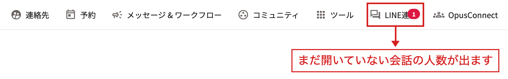
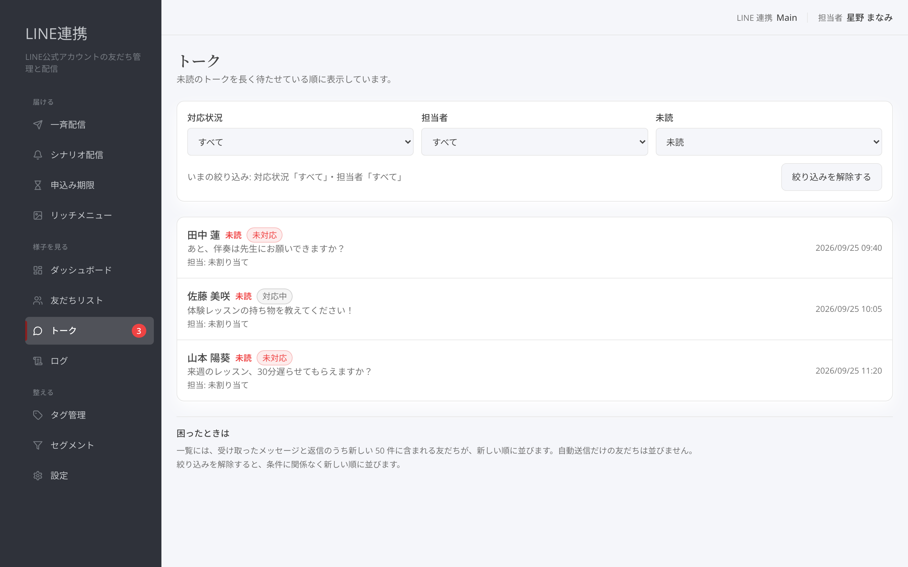

# トークで返信する

## これは何のための機能？

「**トーク**」は、友だちから受け取ったメッセージを確認し、1通ずつ返信するための画面です。一覧に人が並ばないときは、その友だちからまだメッセージを受け取っていません。新しい反応や問い合わせに答えたいときは、まず「**トーク**」を開いてください。

<figure><figcaption>受け取ったメッセージのある友だちを一覧で確認します</figcaption></figure>

## 未読を確かめる

友だちから新しいメッセージが届くと、まだ誰も開いていない会話の人数が、赤い数字で出ます。

* OpusBoosterの上部ナビメニューにある「**LINE連携**」アイコン
* LINE連携の左側のナビにある「**トーク**」

数字は、未読のメッセージがある友だちの人数です。同じ友だちから何通届いても「1」と数えます。100人以上のときは「99+」と出ます。メッセージが届くと、画面を開き直さなくても数字が変わります。

<figure><figcaption>上部ナビの「LINE連携」アイコンに、まだ開いていない会話の人数が出ます</figcaption></figure>

### 未読の友だちを探す

一覧では、まだ開いていない会話の友だちの名前の横に「**未読**」と出ます。絞り込みの「**未読**」で「**未読**」を選ぶと、未読の友だちだけが並びます。この一覧は、長く待たせている順（未読になったのが早い順）に50人ずつ並び、続きは「**次の 50 件を表示**」で見られます。

未読だけを並べている間に未読が変わると、「**新しい未読があります — 最初から表示**」が出ます。押すと、いまの状態で最初から並び直します。

<figure><figcaption>「未読」で絞り込むと、長く待たせている順に並びます</figcaption></figure>

### 既読になるタイミング

個別のトークを開くと、そのとき画面に出たメッセージが既読になります。チームのメンバーの誰かが開けば、全員の数字が減ります。閲覧だけの権限のメンバーが開いた場合も既読になります。

未読が200通を超える会話は、古い未読から200通ずつ表示されます。そのときは「古い未読から 200 件を表示しています。続きは開き直すと表示されます。」と出るので、もう一度開くと続きが表示され、既読が進みます。


**未読として数えるもの:** 友だちから届いたメッセージだけです。シナリオや一斉配信などの自動送信、こちらからの返信では未読になりません。友だち解除（ブロック）された友だちは数えません。


## 会話を開く

一覧から友だちを選ぶと、個別のトークが開きます。必要に応じて「**対応状況**」と「**担当者**」で絞り込めます。「**未対応**」はまだ手を付けていない会話、「**対応中**」は進めている会話、「**完了**」は対応を終えた会話として表示されます。「**未割り当て**」で、担当者が決まっていない会話を探すこともできます。

<figure><figcaption>未対応の会話や担当者が未割り当ての会話を探します</figcaption></figure>

絞り込み後に表示が少なすぎるときは「**絞り込みを解除する**」を押してください。受け取ったメッセージがすべて並びます。個別画面から一覧へ戻るときは「**トーク一覧へ戻る**」を使います。

## 返信を送る

個別トークの「**返信**」欄に文章を書き、「**送信する**」を押します。書いた内容がそのままLINEのトークに送られます。送る前に「**送信される文面**」を確認できます。「**名前を差し込む**」を押すと、友だちの名前の差し込みを入れられます。

<figure><figcaption>文面を確認してから友だちへ返信します</figcaption></figure>

画像を送る場合は「**画像を添付**」を使います。JPEGまたはPNGの画像を選べます。返信は1通ずつ送られ、送信を押したあとは取り消せません。書きかけの返信があるまま画面を離れると、入力した内容は失われます。


**送信前の確認:** 「**送信する**」を押したあとは取り消せません。内容と宛先の会話を確認してから送信してください。


## 対応状況と担当者を更新する

右側の「**友だちの情報**」で「**対応状況**」を選び、「**対応状況を変更**」を押します。対応を始めるときは「**対応中**」、終えたときは「**完了**」にすると、一覧で追いやすくなります。「**担当者**」を選び「**担当者を変更**」を押すと、誰が見る会話かを明確にできます。

<figure><figcaption>会話の進み具合と担当者を更新します</figcaption></figure>

## よくある質問・つまずき

### 一覧が空です

その友だちからまだメッセージを受け取っていない可能性があります。必要なら「**絞り込みを解除する**」を押してください。

### 送信した返信を取り消せますか？

できません。送信前に「**送信される文面**」を確認してください。

### 担当者がいない会話を探したいです

「**担当者**」の絞り込みで「**未割り当て**」を選びます。

### 赤い数字が消えません

未読の友だちの会話を開くと消えます。どの友だちが未読かは、絞り込みの「**未読**」で確かめられます。返信を送っただけでは既読になりません。

### 上部ナビの「LINE連携」アイコンに数字が出ません

次のようなときは、上部ナビには数字が出ません。LINE連携の左側のナビの「**トーク**」では確かめられます。

* このブラウザで、まだLINE連携にログインしていない
* OpusBoosterとは別のメールアドレスで、LINE連携のメンバーに招待されている
* サイトを選ぶ前の画面など、サイトの情報がない画面を開いている
* LINE連携のご契約が切れている

### 以前に届いたメッセージが未読になりません

未読の数は、2026年9月25日以降に届いたメッセージから数えています。それより前に届いたメッセージは、未読として数えません。

---

<!-- cta:opusbooster -->

**自分の場合はどう使えばいいか**

[LINE連携の全体像](https://opusbooster.com/line)を見る。設計から相談したい方は[15分の無料相談](https://opusbooster.com/consultation)、まず触ってみたい方は[14日間の無料トライアル](https://opusbooster.com/register)（クレジットカード不要）から。

