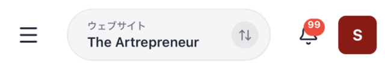
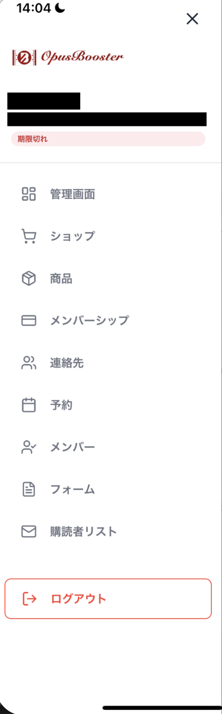
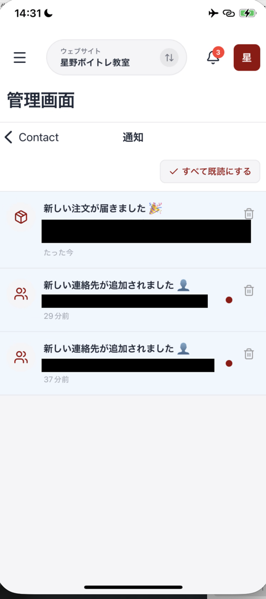

# OpusBoosterモバイルアプリについて

OpusBoosterモバイルアプリは、OpusBoosterを契約している事業者本人が、自分のサイトの状況をスマホから確認するための公式アプリです。予約・購入・問い合わせを、外出先でも確認できます。

アプリはiOSとAndroidで利用できます。この記事では、どの画面でも使う共通の操作を説明します。

## 上部バーの見方

どの画面にも、上部に共通のバーが表示されます。メニューを開く、確認するサイトを変える、通知を見るといった操作はここから行います。

| 位置 | 表示 | できること |
| :--- | :--- | :--- |
| 左 | ハンバーガーメニュー | メニューを開く |
| 中央 | **ウェブサイト** とサイト名 | 確認するサイトを切り替える |
| 右 | 通知ベル | 通知一覧を開く |
| 右端 | プロフィールアイコン | 設定やプロジェクト情報を確認する |

<figure><figcaption>どの画面でも、上部にこのバーが表示されます</figcaption></figure>

## メニューから画面を開く

左上のハンバーガーメニューを押すと、画面の一覧が開きます。最上部にはOpusBoosterロゴ、ユーザー名、メールアドレスと、ご契約の状態が表示されます。ご契約中なら緑色の **アクティブ**、期限が過ぎていれば赤色の **期限切れ** のように、状態によって表示が変わります。

<figure><figcaption>メニューから、それぞれの画面へ移動します</figcaption></figure>

メニューには、次の画面があります。**予約** には未対応件数、**フォーム** には未読件数が表示されることがあります。

| メニュー項目 | 確認できること |
| :--- | :--- |
| **管理画面** | 売上高、受注、連絡先、最近の注文 |
| **ショップ** | 売上と注文の状況 |
| **商品** | 商品の一覧と管理 |
| **メンバーシップ** | 継続課金の商品と収益 |
| **連絡先** | 連絡先の一覧と追加 |
| **予約** | 予約の一覧 |
| **メンバー** | コミュニティのメンバー |
| **フォーム** | フォームの受信内容 |
| **購読者リスト** | メールの購読者リスト |

メニューの最下部には赤字の **ログアウト** があります。

## 確認するサイトを切り替える

複数のサイトを運営している場合は、上部中央のサイト名を押します。サイト一覧が出るので、確認したいサイトを選びます。

切り替えた後は、すべての画面が選んだサイトのデータになります。数値や一覧を見る前に、サイト名が合っているか確認してください。

## 通知を確認する

通知ベルを押すと、通知一覧が開きます。通知には、新しい予約、連絡先の追加、フォーム送信、デイリーレポートが表示されます。

各通知には未読を示す点、届いてからの時間、削除用のゴミ箱アイコンがあります。まとめて確認済みにするときは、**すべて既読にする** を押します。

<figure><figcaption>通知には、注文や連絡先の追加が届きます</figcaption></figure>

通知は、押すとその内容の画面へ移動します。**新しい注文が届きました** を押すと、その注文の詳細が開き、入金や発送の状態をその場で変えられます。

## プロフィールと設定を開く

右端のプロフィールアイコンを押すと、画面下からプロフィールのシートが開きます。アバター、氏名、メールアドレス、ID、アクティブ状態を確認できます。

ここでは、**言語設定** と **通知設定** を開けます。プロジェクト名とプロジェクトIDは、プロジェクト情報として表示され、読み取り専用です。

## データが出ないときは画面を引っ張って更新する

ショップなどの一覧画面では、画面を開いただけではデータが表示されず、「〇〇が見つかりません」と出ることがあります。データが無いと判断する前に、画面を下に引っ張ってから離してください。

この操作をプルリフレッシュといいます。ショップ、商品、メンバーシップ、連絡先、予約、メンバー、フォーム、購読者リストの一覧画面で使えます。

引っ張って更新しても表示が変わらないときは、通信環境をご確認ください。電波の弱い場所や、接続が不安定なWi-Fiでは、データを読み込めずに一覧が空のまま表示されることがあります。Wi-Fiを切ってモバイル通信で開き直すと、表示されることがあります。

## まとめ

- 上部バーから、メニュー、サイト切り替え、通知、プロフィールを開けます
- 複数サイトを運営している場合は、確認したいサイトへ切り替えてから見ます
- 通知ベルでは予約、連絡先、フォーム送信などの通知を確認できます
- 一覧にデータが出ないときは、画面を下に引っ張って離し、更新します

## 関連記事

* [管理画面（ホーム）の見方](home-dashboard.md)
* [ショップで売上と注文を見る](shop.md)
* [商品を追加・管理する](products.md)
* [メンバーシップ（継続課金）を確認する](memberships.md)
