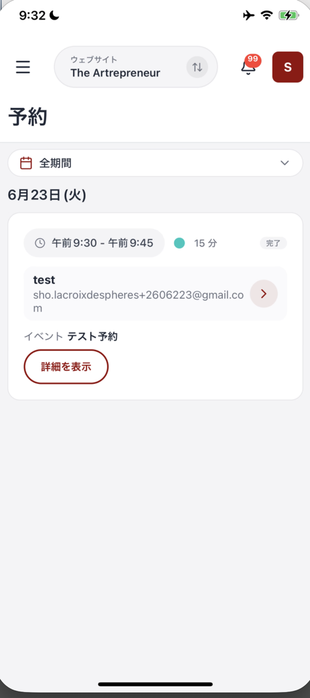

# 予約を確認する

予約画面では、入った予約を日付ごとに確認できます。日時や予約者、予約されたサービスを、スマホから見られます。

## 予約画面を開く

メニューを開き、**予約** を押します。メニューの **予約** には、未対応の予約件数がバッジで表示されます。

画面上部の **全期間** を使うと、確認する期間を選べます。予約は日付ごとにまとまって表示されます。

画面を開いても予約が表示されず、「予約が見つかりません」と出ることがあります。その場合は、画面を下に引っ張ってから離し、読み込み直してください。

## 予約カードの見方

各予約はカードで表示されます。カードには次の内容があります。

| 表示 | 確認できること |
| :--- | :--- |
| 時間帯 | 予約の開始時刻と終了時刻 |
| 所要時間 | 予約にかかる時間 |
| ステータス | 予約の状態。例: **完了** |
| 予約者 | 予約した人の名前とメールアドレス |
| イベント | 予約されたサービス名 |

カード右端には **>** が表示されます。カード内の **詳細を表示** を押すと、予約の詳細を確認できます。

<figure><figcaption>予約は日付ごとにまとまって表示されます</figcaption></figure>

## 複数のサイトを運営しているとき

上部中央のサイト名を押すと、確認するウェブサイトを切り替えられます。切り替えた後は、そのサイトの予約が表示されます。

## まとめ

- メニューの **予約** から予約一覧を開く
- **全期間** で確認する期間を選ぶ
- 予約カードで日時、予約者、サービス名を確認する
- 表示されないときは、画面を下に引っ張って読み込み直す

## 関連記事

* [管理画面（ホーム）の見方](home-dashboard.md)
* [連絡先を確認・追加する](contacts.md)
* [コミュニティのメンバーを確認する](members.md)
