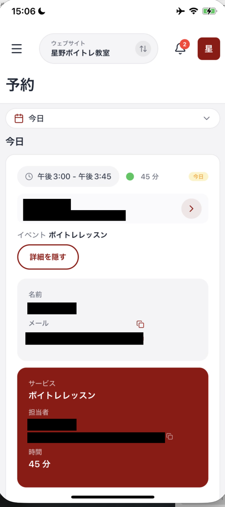

# 予約を確認する

予約画面では、入った予約を日付ごとに確認できます。日時や予約者、予約されたサービスを、スマホから見られます。

## 予約画面を開く

メニューを開き、**予約** を押します。メニューの **予約** には、未対応の予約件数がバッジで表示されます。

画面上部の日付のボタンを押すと、確認する期間を選べます。予約は日付ごとにまとまって表示されます。

| 期間 | いつの予約を見るか |
| :--- | :--- |
| **今日** | 今日の予約だけ |
| **今後** | これから先の予約 |
| **過去7日間** / **過去30日間** | 直近に終わった予約 |
| **カスタム** | 日付を自分で指定する |
| **全期間** | すべての予約 |

その日の動きを確認したいときは **今日**、この先の予定を見たいときは **今後** が便利です。

「予約が見つかりません」と出るときは、まず画面を下に引っ張ってから離し、読み込み直してください。それでも変わらないときは、**選んでいる期間を変えてみてください。** 期間の指定によっては、対象の予約が範囲から外れていることがあります。

## 予約カードの見方

各予約はカードで表示されます。カードには次の内容があります。

| 表示 | 確認できること |
| :--- | :--- |
| 時間帯 | 予約の開始時刻と終了時刻 |
| 所要時間 | 予約にかかる時間 |
| 日付の目印 | その予約がいつのものか。例: **今日** |
| 予約者 | 予約した人の名前とメールアドレス |
| イベント | 予約されたサービス名 |

<figure><figcaption>予約は日付ごとにまとまって表示されます</figcaption></figure>

予約者の行の右端にある **>** を押すと、その人の連絡先に移動します。

## 詳細をひらいて中身を見る

カード内の **詳細を表示** を押すと、**そのカードが下に広がります。** 別の画面には移動しません。閉じるときは、同じ場所の **詳細を隠す** を押します。

<figure><figcaption>詳細を表示を押すと、カードがその場で広がります</figcaption></figure>

広がった部分では、次の内容を確認できます。

| 区分 | 確認できること |
| :--- | :--- |
| 上段 | 予約した人の **名前** と **メール** |
| 下段（色の付いたカード） | **サービス**、**担当者**、**時間** |

メールの右にあるアイコンを押すと、そのメールアドレスをコピーできます。担当者のメールアドレスも同じようにコピーできます。

出先で「誰が、いつ、どのメニューで、何分の予定か」を確認したいときは、ここだけ見れば足ります。

## 複数のサイトを運営しているとき

上部中央のサイト名を押すと、確認するウェブサイトを切り替えられます。切り替えた後は、そのサイトの予約が表示されます。

## まとめ

- メニューの **予約** から予約一覧を開く
- 上部の日付のボタンで、**今日** や **今後** など見たい期間を選ぶ
- 予約カードで日時、予約者、サービス名を確認する
- **詳細を表示** を押すと、カードがその場で広がり、担当者と時間まで確認できる
- メールアドレスは、右のアイコンからコピーできる
- 表示されないときは、画面を下に引っ張って読み込み直す

## 関連記事

* [管理画面（ホーム）の見方](home-dashboard.md)
* [連絡先を確認・追加する](contacts.md)
* [コミュニティのメンバーを確認する](members.md)
