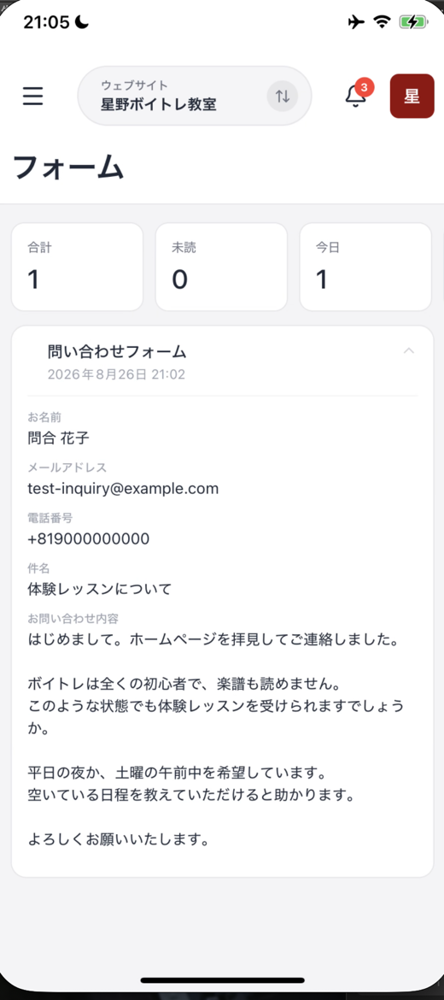
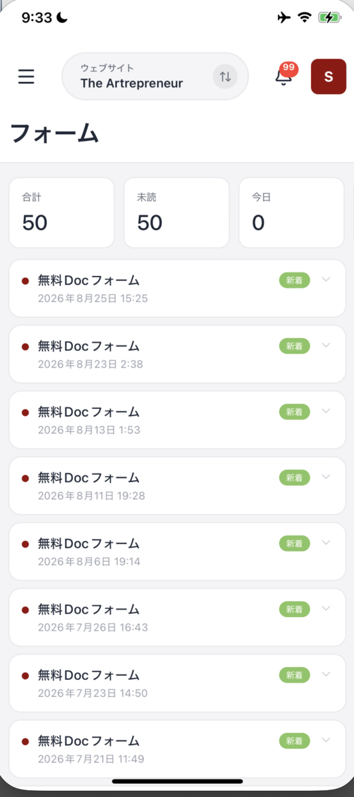
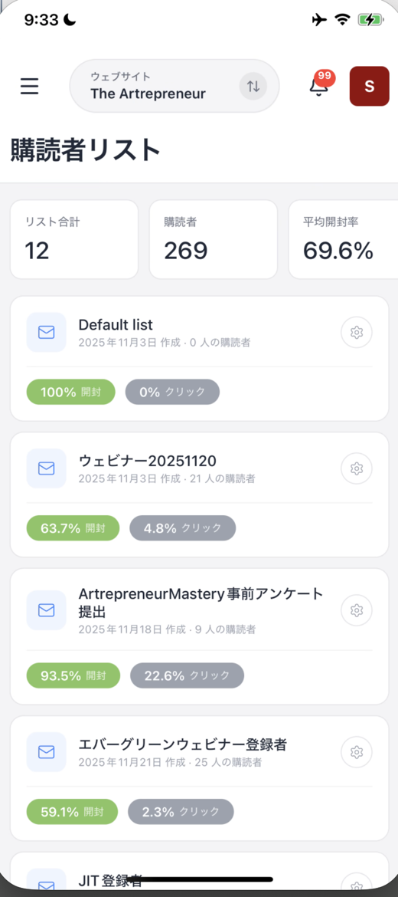

# フォームの受信と購読者リストを確認する

フォーム画面では、届いた送信内容の一覧を確認できます。購読者リスト画面では、メール配信に使うリストと人数、反応の割合を確認できます。

## フォームの受信を確認する

メニューを開き、**フォーム** を押します。メニューの **フォーム** には未読件数が表示され、99件を超えると **99+** と表示されます。

画面上部の数字で、届いた送信内容の状況を確認できます。

| 表示 | 意味 |
| :--- | :--- |
| **合計** | 受信した送信の合計数 |
| **未読** | まだ読んでいない送信の数 |
| **今日** | 今日受信した送信の数 |

送信一覧の各行には、未読を示す赤いドット、フォーム名、送信日時が表示されます。新しく届いた送信には **新着** のバッジと、右側に展開用の記号が表示されます。

### 送信された内容を読む

行の右側にある記号を押すと、**その下に送信内容がすべて開きます。** 別の画面には移動しません。

<figure><figcaption>お客様が入力した内容が、そのまま読めます</figcaption></figure>

お客様が入力した項目が、**すべてそのまま表示されます。** 長い問い合わせ文でも途中で切れることはなく、改行もそのまま残ります。外出先でも、内容を読んでから折り返しの判断ができます。

電話番号は、国際表記に変換されて表示されることがあります。たとえば `090-0000-0000` と入力された番号は、`+819000000000` のように表示されます。

開いた時点で、その送信は既読になります。**未読** の数字が減り、通知一覧の赤い印も消えます。

### フォームが送信されると、連絡先も増えます

フォームが1件送信されると、通知は **2つ** 届きます。

| 通知 | 意味 |
| :--- | :--- |
| **フォームが送信されました** | 問い合わせの内容が届いた |
| **新しい連絡先が追加されました** | 送信した人が連絡先に登録された |

問い合わせをくれた人は、**自動で連絡先に追加されます。** あとから連絡先の画面でタグを付けたり、メールを送ったりできます。

**フォームが送信されました** の通知を押すと、このフォームの画面に移動します。

<figure><figcaption>届いた送信は、新しいものから順に並びます</figcaption></figure>

送信が表示されず、「フォームが見つかりません」と出ることがあります。その場合は、画面を下に引っ張ってから離し、読み込み直してください。

## 購読者リストを確認する

メニューを開き、**購読者リスト** を押します。画面上部では、リスト全体の状況を3つの数字で確認できます。

| 表示 | 意味 |
| :--- | :--- |
| **リスト合計** | 作成されているリストの数 |
| **購読者** | リストにいる購読者の数 |
| **平均開封率** | メールが開かれた割合の平均 |

各リストの行には、リスト名、作成日、購読者数が表示されます。あわせて **開封率** とクリック率のバッジ、右端に歯車の設定アイコンがあります。

<figure><figcaption>リストごとに、購読者数と反応の割合を確認できます</figcaption></figure>

一覧が表示されず、「購読者リストが見つかりません」と出ることがあります。その場合は、画面を下に引っ張ってから離し、読み込み直してください。

## 複数のサイトを運営しているとき

上部中央のサイト名を押すと、確認するウェブサイトを切り替えられます。切り替えた後は、そのサイトのフォームと購読者リストが表示されます。

## まとめ

- **フォーム** で受信数、未読数、今日の受信数を確認する
- 行の右側の記号を押すと、**送信内容が全文そのまま読める**
- 開くと既読になり、**未読** の数字と通知の赤い印が消える
- フォームが届くと、送信した人は**自動で連絡先に追加される**
- **購読者リスト** でリスト数、購読者数、平均開封率を確認する
- 表示されないときは、画面を下に引っ張って読み込み直す

## 関連記事

* [連絡先を確認・追加する](contacts.md)
* [管理画面（ホーム）の見方](home-dashboard.md)
* [OpusBoosterモバイルアプリについて](README.md)
