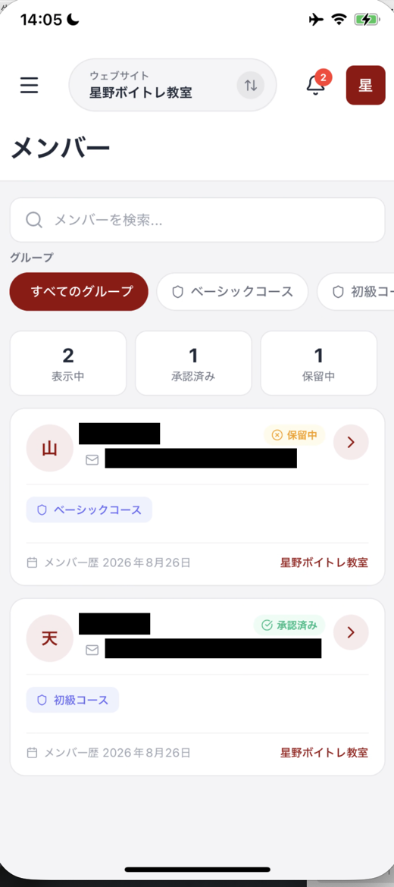
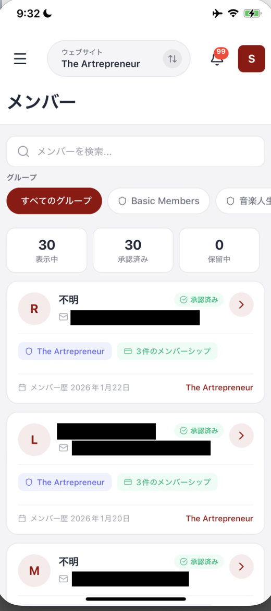

# コミュニティのメンバーを確認する

メンバー画面では、コミュニティにいるメンバーの人数と一覧を確認できます。グループごとに表示を絞り込むこともできます。

## メンバー画面を開く

メニューを開き、**メンバー** を押します。画面上部には **メンバーを検索...** の検索窓があります。

一覧が表示されず、「メンバーが見つかりません」と出ることがあります。その場合は、画面を下に引っ張ってから離し、読み込み直してください。

## 数字の見方

画面には3つの数字が表示されます。それぞれ、今見ている一覧とコミュニティの状況を示します。

| 表示 | 意味 |
| :--- | :--- |
| **表示中** | 今の条件で一覧に表示されている人数 |
| **承認済み** | 承認済みのメンバー数 |
| **保留中** | 保留中のメンバー数 |

## グループで絞り込む

数値カードの近くに、**グループ** の条件が並びます。**すべてのグループ** を押すと全体を確認でき、各メンバーシップグループ名を押すと、そのグループに絞り込めます。

確認したいコミュニティを選んでから、一覧を見てください。

## 一覧で確認できること

メンバーの各行には、次の情報が表示されます。名前が未設定のときは、**不明** と表示されます。

| 表示 | 確認できること |
| :--- | :--- |
| アバターと名前 | メンバーの見分け |
| **承認済み** | メンバーの表示状態 |
| メールアドレス | 連絡先のメールアドレス |
| 所属サイト | メンバーが属するサイト |
| **N件のメンバーシップ** | 関連するメンバーシップの件数 |
| **メンバー歴 YYYY年M月D日** | メンバーになった日 |

行を押すと、**連絡先** の詳細画面が開きます。連絡先の詳しい情報は、その画面で確認できます。

<figure><figcaption>承認待ちの人には、オレンジ色の保留中が付きます</figcaption></figure>

## 承認はパソコンの管理画面から行います

**保留中** の人をアプリから承認することはできません。承認と却下は、パソコンの管理画面で行ってください。

アプリでできるのは、**承認待ちの人が何人いるかを外出先で把握するところまで** です。保留中の行を押しても、承認のボタンは出ず、その人の連絡先の詳細が開きます。

保留中の数が増えていたら、パソコンの管理画面で対応する、という使い方になります。

<figure><figcaption>メンバーの一覧。この画像では、メールアドレスと名前を伏せています</figcaption></figure>

## まとめ

- メニューの **メンバー** から一覧を開く
- **表示中**、**承認済み**、**保留中** の数字で人数を確認する
- **グループ** で確認したいコミュニティに絞り込む
- メンバーの行を押すと、**連絡先** の詳細画面が開く
- **承認と却下はアプリではできません。** パソコンの管理画面で行います

## 関連記事

* [連絡先を確認・追加する](contacts.md)
* [メンバーシップ（継続課金）を確認する](memberships.md)
* [OpusBoosterモバイルアプリについて](README.md)
