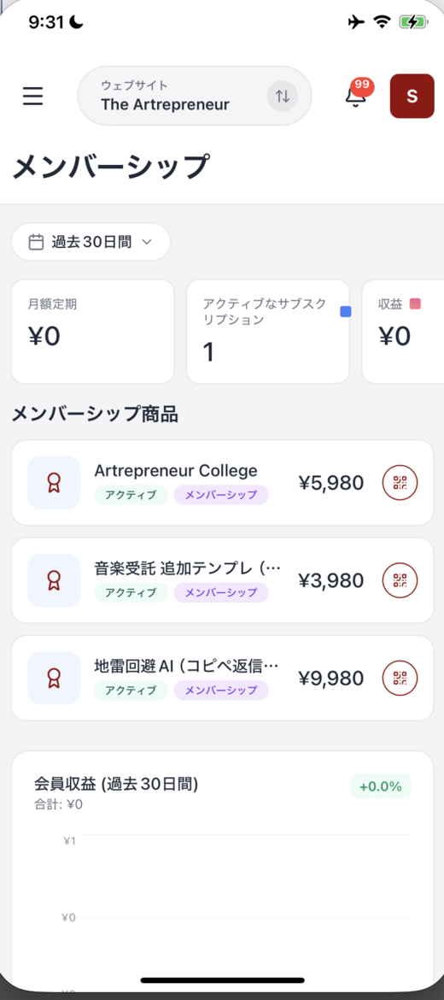

# メンバーシップ（継続課金）を確認する

OpusBoosterユーザー向け公式アプリでは、継続課金の会員向け商品の状況を確認できます。数字やグラフは、画面上部の **過去30日間** の期間で表示されます。

## メンバーシップ画面を開く

左上の三本線を押してメニューを開き、**メンバーシップ** を選びます。複数のサイトを運営している場合は、画面上部中央のサイト名を押して、確認したいサイトへ切り替えます。

画面を開いても一覧が表示されず、「メンバーシップが見つかりません」と出ることがあります。そのときは画面を下に引っ張って離し、一覧を読み込みます。

## 数字とグラフを見る

画面上部には、継続課金の状況を示す3つの数字があります。

| 表示 | 意味 |
| :--- | :--- |
| **月額定期** | 月ごとの定期収益です。 |
| **アクティブなサブスクリプション** | 現在利用中の継続課金の数です。 |
| **収益** | 期間内の収益です。 |

<figure><figcaption>メンバーシップ商品には、継続課金の商品が並びます</figcaption></figure>

下の **会員収益（過去30日間）** では、合計と増減率、収益のグラフを確認できます。データの反映には、最大2時間かかる場合があります。

## メンバーシップ商品を確認する

**メンバーシップ商品** には、継続課金の商品が一覧で表示されます。各行には、商品名、**アクティブ** の表示、**メンバーシップ** の種類、価格、共有アイコンがあります。

ここに並ぶのは、商品画面で商品タイプを **メンバーシップ** にして作成した商品です。新しい継続課金の商品を追加する操作は、商品画面で行います。

## まとめ

* **メンバーシップ** では、過去30日間の継続課金の状況を確認できます
* **月額定期**、**アクティブなサブスクリプション**、**収益** の数字を見ます
* **メンバーシップ商品** には、継続課金の商品が並びます
* 数字やグラフの反映には、最大2時間かかる場合があります

## 関連記事

* [商品を追加・管理する](products.md)
* [ショップで売上と注文を見る](shop.md)
