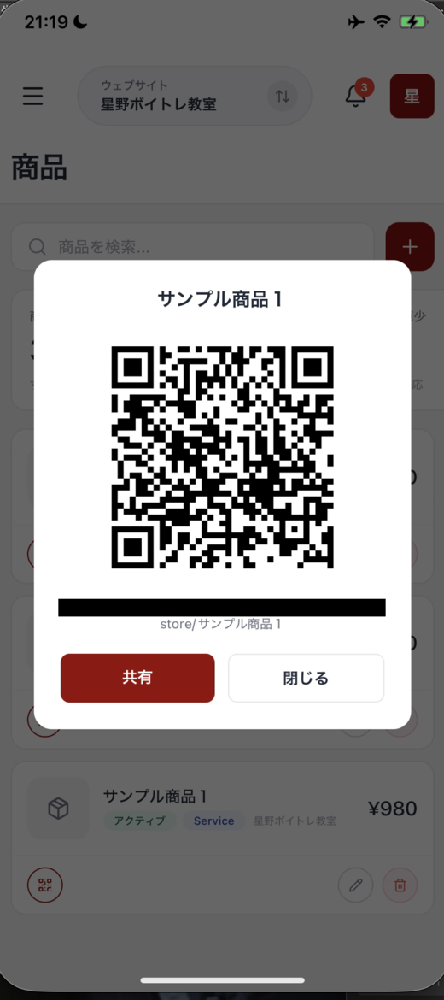
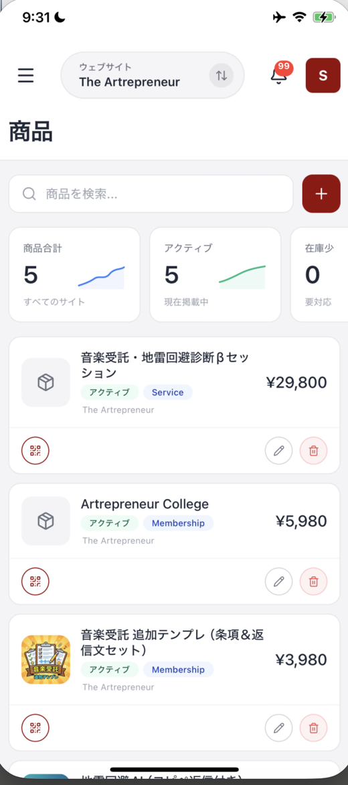

# 商品を追加・管理する

OpusBoosterユーザー向け公式アプリでは、商品の掲載状況や価格をスマホで確認できます。新しい商品を作る操作も、この画面から行えます。

## 商品画面を開く

左上の三本線を押してメニューを開き、**商品** を選びます。複数のサイトを運営している場合は、画面上部中央のサイト名を押して、確認したいサイトに切り替えてください。

画面を開いても商品が表示されず、「商品が見つかりません」と出ることがあります。そのときは画面を下に引っ張って離し、一覧を読み込みます。

## 一覧と数字の見方

上部の **商品を検索...** では、商品を探せます。右側の赤い **+** は、新しい商品を追加する入口です。

画面には、次の3つの数字が表示されます。

| 表示 | 意味 |
| :--- | :--- |
| **商品合計** | すべてのサイトにある商品の合計です。小さな推移グラフも表示されます。 |
| **アクティブ** | 現在掲載中の商品数です。 |
| **在庫少** | 在庫について対応が必要な商品数です。 |

商品ごとに、画像、商品名、掲載状況、種類、所属サイト、価格が並びます。画像が未設定の商品には、箱のアイコンが表示されます。

各商品の下には、共有、編集、削除のアイコンがあります。必要な操作のアイコンを押して進みます。

## その場でQRコードを見せて、購入ページへ案内する

商品の下にある **共有** のアイコンを押すと、**その商品の購入ページのQRコードが表示されます。**

<figure><figcaption>共有のアイコンから、その商品のQRコードを出せます</figcaption></figure>

目の前のお客様に**スマホの画面を見せて、読み取ってもらうだけ**で、購入ページを開いてもらえます。URLを口で伝えたり、あとからメールを送ったりする必要がありません。

こんな場面で使えます。

| 場面 | 使い方 |
| :--- | :--- |
| レッスンや施術のあと | 次回の回数券をその場で案内する |
| イベントや出店 | 会場で商品ページを読み取ってもらう |
| 対面の相談 | 話に出た講座を、その場で見てもらう |

### QRの代わりにリンクを送る

QRコードの下にある **共有** を押すと、スマホの共有メニューが開きます。**LINE、メール、メッセージなど、普段お使いの方法でリンクを送れます。** URLをコピーすることもできます。

その場にいない相手には、こちらを使ってください。

<figure><figcaption>商品ごとに、掲載状況、種類、所属サイト、価格が並びます</figcaption></figure>

## 新しい商品を作る

右上の **+** を押すと、**新しい商品** のフォームが開きます。最初に、商品を追加する **ウェブサイト** をタブから選びます。

次に **商品タイプ** を選びます。何を売るかに合わせて、次のように選んでください。

| 商品タイプ | 選ぶ目安 |
| :--- | :--- |
| **物理** | 梱包して発送する商品を売るときです。 |
| **デジタル** | ダウンロードして受け取る商品を売るときです。 |
| **サービス** | 作業や施術など、役務を提供するときです。 |
| **メンバーシップ** | 継続課金の会員向け商品を作るときです。 |

**商品タイトル** は必須です。商品の説明は **説明** に入力します。

**URLスラッグ** は、商品ページのURLに使う文字です。空欄なら、商品タイトルから自動で作られます。

顧客から商品を見えない状態にしたいときは、**非表示** をオンにします。これは「顧客から商品を非表示にする」ための切り替えです。

## バリアントと価格を入力する

フォーム下部の **バリアント1** に、商品の情報を入力します。入力できる項目は、SKU、**価格**、在庫数です。

SKUは、商品を区別するための番号や記号です。**価格** は必須なので、忘れずに入力してください。

色やサイズなどで複数の種類を用意する場合は、**+ バリアントを追加** を押します。必要な数だけバリアントを追加できます。

入力を終えたら **商品を作成** を押します。作成をやめる場合は、**キャンセル** を押します。

## メンバーシップ商品とのつながり

継続課金の会員向け商品は、商品タイプで **メンバーシップ** を選んで作ります。作成したメンバーシップ商品は、メンバーシップ画面の **メンバーシップ商品** に並びます。

継続課金の商品や会員収益を確認したいときは、次の記事もご覧ください。

## まとめ

* **商品** では、商品の掲載状況、種類、所属サイト、価格を確認できます
* **共有** のアイコンから、その商品の購入ページのQRコードを出せます
* 目の前のお客様には画面を見せ、離れた相手にはリンクを送れます
* 新規作成は右上の **+** から始めます
* 商品タイプは、発送するモノ、ダウンロード商品、サービス、継続課金で選び分けます
* **商品タイトル** と **価格** は必須です

## 関連記事

* [メンバーシップ（継続課金）を確認する](memberships.md)
* [ショップで売上と注文を見る](shop.md)
