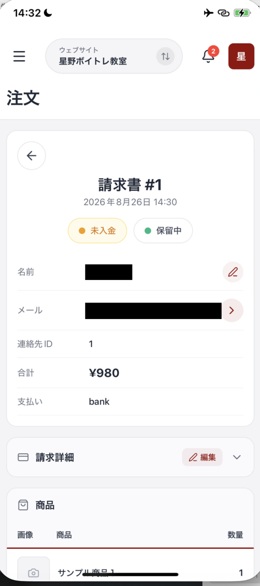
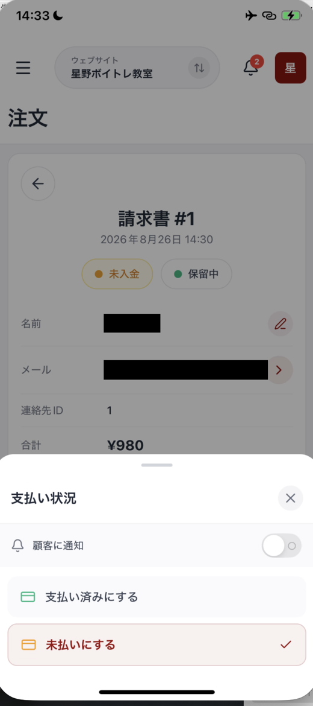
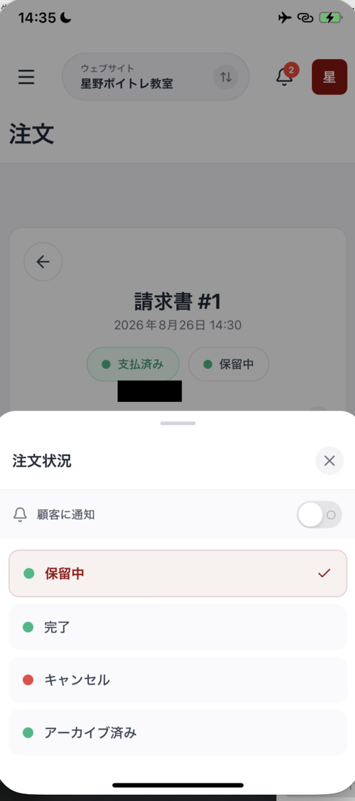
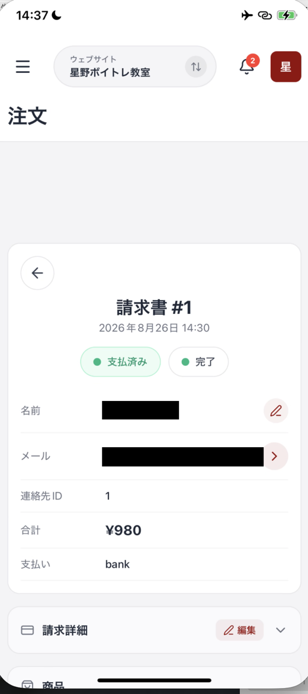

# ショップで売上と注文を見る

**ショップ** では、売上と注文の状況を期間ごとに確認できます。メニューから **ショップ** を押して開きます。

画面上部の **全期間** を押すと、確認する期間を選べます。まず期間を選んでから、数値やグラフを見ます。

## 4つの数値カードを見る

期間を選ぶと、4つの数値カードにその期間の状況が表示されます。それぞれの意味は次のとおりです。

| カード | 確認できること |
| :--- | :--- |
| **セールス** | 期間内の売上合計 |
| **受注** | 注文の件数 |
| **平均注文額** | 1件あたりの平均金額 |
| **未払い注文** | 未払いの注文数と、全体に占める割合 |

<figure><figcaption>期間を選ぶと、4つのカードとチャートがその期間の内容になります</figcaption></figure>

## 売上高の動きを見る

**売上高（全期間）** では、選んだ期間の合計金額を確認できます。前の期間との増減率もバッジで表示されます。

グラフは月ごとの棒グラフと折れ線です。売上がどの月に動いたかを確認できます。

## 会員収益を確認する

**会員収益** では、継続課金による収益を確認できます。平均定期収益のバッジと、会員収益の合計、増減率が表示されます。

会員収益のチャートでは、期間内の動きを確認できます。メンバーシップの詳しい状況は、**メンバーシップ** の画面で確認します。

## 注文を開いて中身を確認する

注文の一覧から注文を選ぶと、その注文の詳細が開きます。通知から開くこともできます。通知ベルの **新しい注文が届きました** を押すと、その注文の詳細に移動します。

詳細では、請求書の番号と日時、注文者、金額、支払い方法を確認できます。銀行振込の注文なら、支払い方法に **bank** と表示されます。

<figure><figcaption>請求書番号の下に、2つのバッジが並びます</figcaption></figure>

請求書番号の下に、**バッジが2つ並んでいます**。左が入金の状態、右が注文の進み具合です。役割が違うので、分けて考えてください。

| バッジ | 表すもの |
| :--- | :--- |
| 左（**未入金** / **支払済み**） | お金を受け取ったかどうか |
| 右（**保留中** / **完了** など） | 注文の対応が済んだかどうか |

## 入金があったら支払済みにする

銀行振込のように、あとから入金される支払い方法では、入金を確認した時点で自分で **支払済み** に変えます。

左のバッジを押すと、**支払い状況** が開きます。

<figure><figcaption>顧客に知らせるかどうかを選んでから、状態を選びます</figcaption></figure>

**支払い済みにする** を押すと、バッジが **支払済み** に変わります。間違えたときは、同じ画面の **未払いにする** で戻せます。

上にある **顧客に通知** をオンにすると、この変更をお客様にも知らせます。**先にトグルを決めてから**、状態を押してください。

## 注文の対応が済んだら完了にする

発送や提供が終わったら、右のバッジで注文の状態を変えます。押すと **注文状況** が開き、4つから選べます。

<figure><figcaption>注文の進み具合は、この4つから選びます</figcaption></figure>

| 状態 | 使う場面 |
| :--- | :--- |
| **保留中** | まだ対応が終わっていない |
| **完了** | 発送や提供が終わった |
| **キャンセル** | 注文を取り消した |
| **アーカイブ済み** | 対応が終わり、一覧から整理したい |

こちらにも **顧客に通知** のトグルがあります。

入金と対応の両方が済むと、バッジが2つとも緑になります。ここまでの操作は、すべてスマホだけで行えます。

<figure><figcaption>入金と対応の両方が済んだ状態</figcaption></figure>

## 数字を見るときの注意

アプリのデータは、反映まで最大2時間かかる場合があります。直前の注文がすぐに数字へ出ないときは、時間をおいて確認してください。

確認するサイトを切り替えると、ショップの数値も選んだサイトのデータになります。上部中央のサイト名を確認してから見ます。

## まとめ

- **全期間** から、売上と注文を確認する期間を選べます
- 数値カードで、売上、受注、平均注文額、未払い注文を確認できます
- 注文の詳細では、**左のバッジが入金の状態**、**右のバッジが対応の進み具合** です
- 銀行振込の入金を確認したら、左のバッジから **支払い済みにする** を押します
- 発送や提供が終わったら、右のバッジから **完了** を選びます
- どちらの画面にも **顧客に通知** があり、お客様に知らせるかを選べます
- データの反映には最大2時間かかる場合があります

## 関連記事

* [OpusBoosterモバイルアプリについて](README.md)
* [管理画面（ホーム）の見方](home-dashboard.md)
* [メンバーシップ（継続課金）を確認する](memberships.md)
