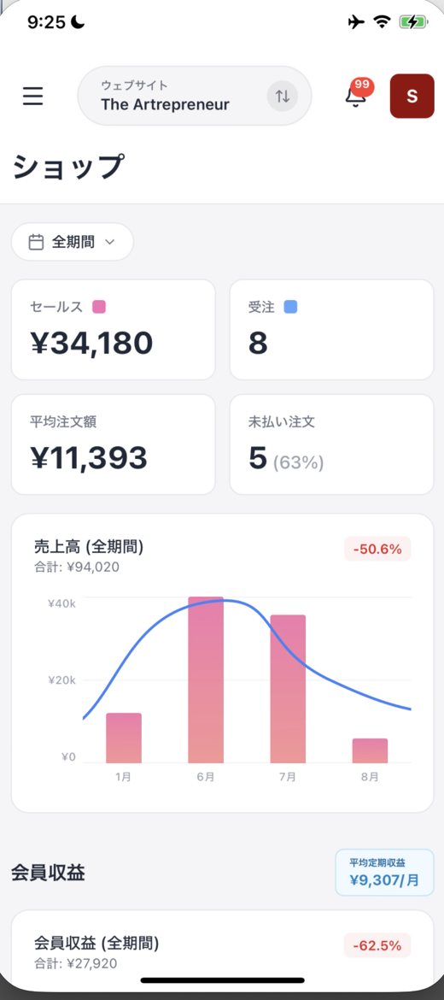

# ショップで売上と注文を見る

**ショップ** では、売上と注文の状況を期間ごとに確認できます。メニューから **ショップ** を押して開きます。

画面上部の **全期間** を押すと、確認する期間を選べます。まず期間を選んでから、数値やグラフを見ます。

## 4つの数値カードを見る

期間を選ぶと、4つの数値カードにその期間の状況が表示されます。それぞれの意味は次のとおりです。

| カード | 確認できること |
| :--- | :--- |
| **セールス** | 期間内の売上合計 |
| **受注** | 注文の件数 |
| **平均注文額** | 1件あたりの平均金額 |
| **未払い注文** | 未払いの注文数と、全体に占める割合 |

<figure><figcaption>期間を選ぶと、4つのカードとチャートがその期間の内容になります</figcaption></figure>

## 売上高の動きを見る

**売上高（全期間）** では、選んだ期間の合計金額を確認できます。前の期間との増減率もバッジで表示されます。

グラフは月ごとの棒グラフと折れ線です。売上がどの月に動いたかを確認できます。

## 会員収益を確認する

**会員収益** では、継続課金による収益を確認できます。平均定期収益のバッジと、会員収益の合計、増減率が表示されます。

会員収益のチャートでは、期間内の動きを確認できます。メンバーシップの詳しい状況は、**メンバーシップ** の画面で確認します。

## 数字を見るときの注意

アプリのデータは、反映まで最大2時間かかる場合があります。直前の注文がすぐに数字へ出ないときは、時間をおいて確認してください。

確認するサイトを切り替えると、ショップの数値も選んだサイトのデータになります。上部中央のサイト名を確認してから見ます。

## まとめ

- **全期間** から、売上と注文を確認する期間を選べます
- 数値カードで、売上、受注、平均注文額、未払い注文を確認できます
- **売上高（全期間）** で、月ごとの売上の動きを確認できます
- **会員収益** で、継続課金による収益を確認できます
- データの反映には最大2時間かかる場合があります

## 関連記事

* [OpusBoosterモバイルアプリについて](README.md)
* [管理画面（ホーム）の見方](home-dashboard.md)
* [メンバーシップ（継続課金）を確認する](memberships.md)
