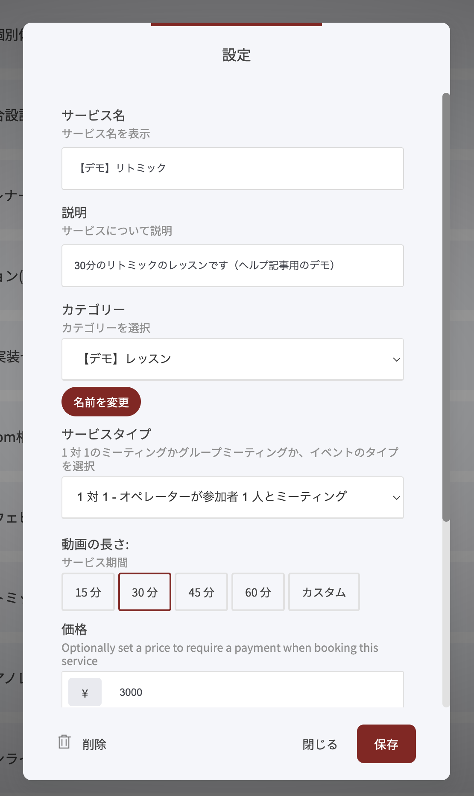
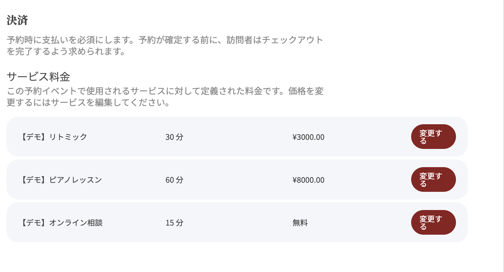
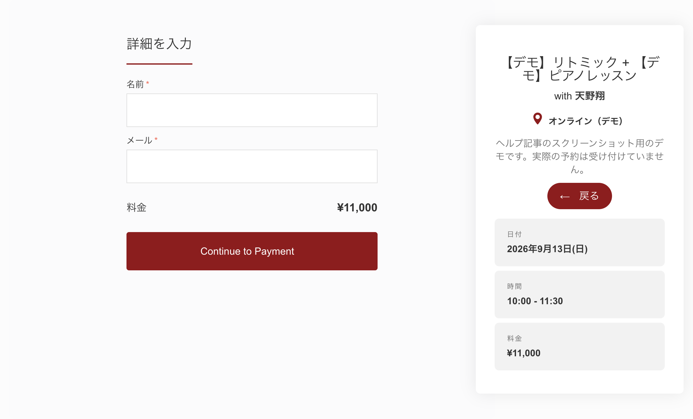
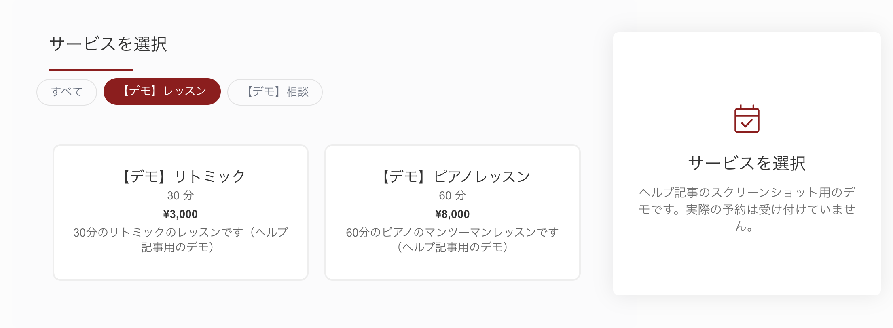
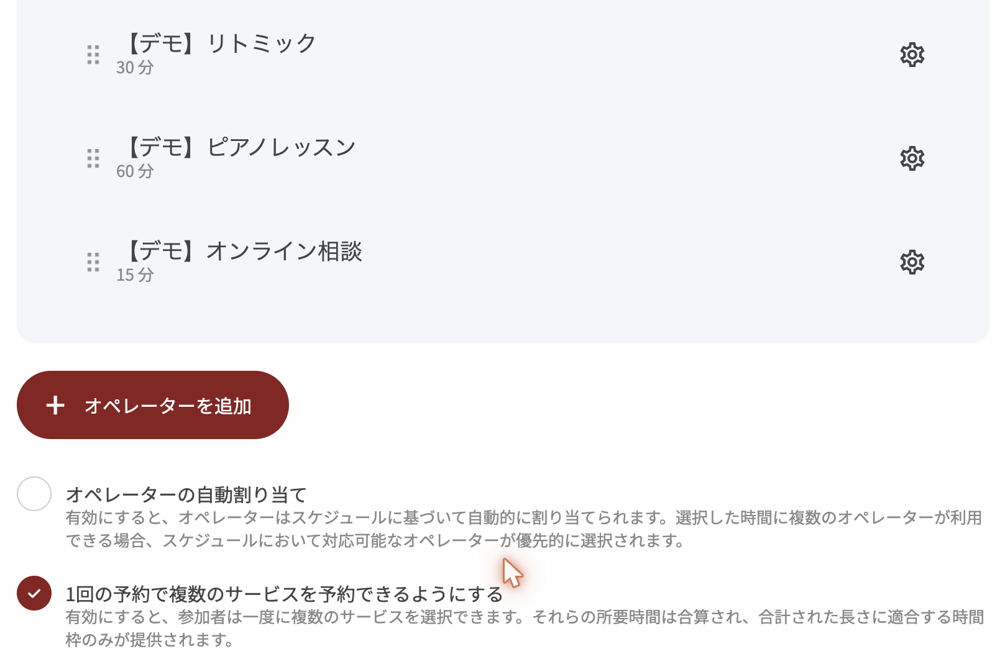
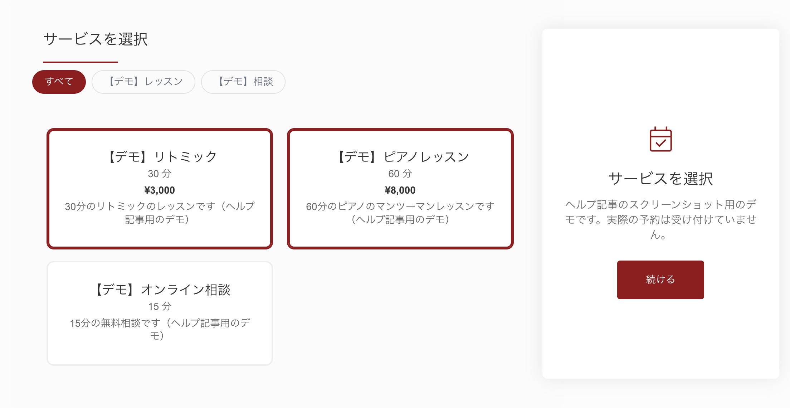
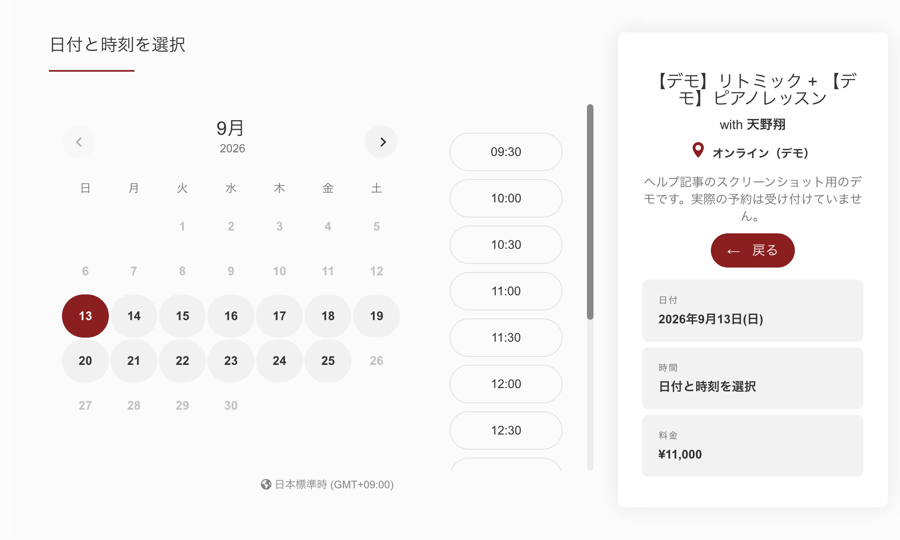
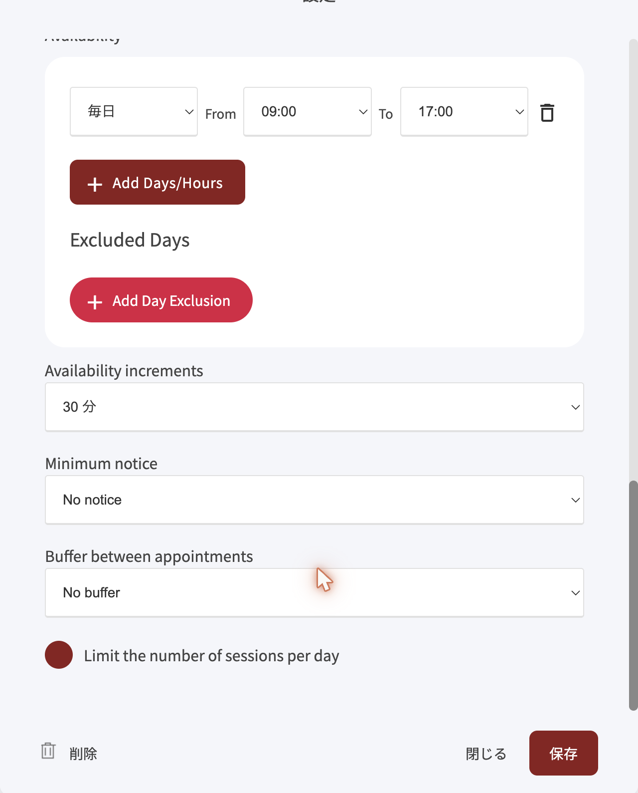
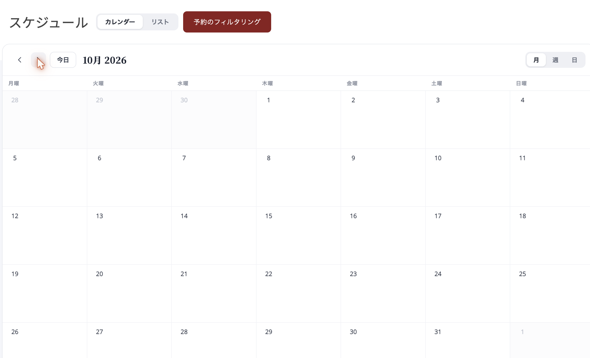

# 予約時の決済・複数サービス・カテゴリー

2026年9月のアップデートで、予約機能に次の設定が加わりました。

* サービスに価格を付けて、予約と一緒に支払いを受け付ける
* サービスをカテゴリーで分けて、予約ページで絞り込めるようにする
* 1回の予約で、複数のサービスをまとめて選べるようにする
* オペレーター（担当者）ごとに、受付時間を決めておく
* 予約状況をカレンダーで見る

予約イベント・オペレーター・サービスの基本的な作り方は、[スケジュール予約の設定](schedule-booking.md)を先にご覧ください。

## サービスに価格を設定する

サービスに価格を入れておくと、予約した人はその場で支払いまで進みます。支払いが終わるまで、予約は確定しません。

1. **予約** → **サービス** を開きます
2. 価格を付けたいサービスの **設定** を押します（新しく作る場合は **新しいサービスを作成** を押します）
3. **価格** の欄に金額を入れて、**保存** を押します

<figure><figcaption>
価格を空欄にしたサービスは無料になります
</figcaption></figure>


所要時間を選ぶ項目は、画面上では **動画の長さ** と表示されています（2026年9月時点）。15分・30分・45分・60分・カスタムから選ぶ、サービスの所要時間の設定です。


設定した価格は、予約イベントの編集画面の **決済** でも一覧で確認できます。ここでは価格を変えられないので、変更するときはサービスの設定を開いてください。

<figure><figcaption>
予約イベントの「決済」には、このイベントで使うサービスの料金が並びます
</figcaption></figure>

予約ページでは、サービスの下に価格が表示されます。日時と名前・メールを入れたあと、**Continue to Payment** から支払いに進みます。

<figure><figcaption>
予約する人が見る画面。右側に日時と料金がまとまって表示されます
</figcaption></figure>

## サービスをカテゴリーで分ける

サービスが多いときは、カテゴリーを付けておくと、予約する人が種類ごとに絞り込めます。

1. サービスの **設定** を開きます
2. **カテゴリー** の選択欄から **+ 新しく追加する** を選びます
3. カテゴリー名を入れて **保存** を押します
4. サービスの設定画面に戻ったら、もう一度 **保存** を押します

2つ目以降のサービスは、作ったカテゴリーを選択欄から選ぶだけです。カテゴリー名は **名前を変更** から直せます。

予約ページの上には **すべて** とカテゴリー名が並び、押すとそのカテゴリーのサービスだけが表示されます。

<figure><figcaption></figcaption></figure>

## サービスの並び順を変える

予約イベントの編集画面で **オペレーターとサービス** を開きます。サービス名の左にある **⋮⋮** をドラッグすると、順番を入れ替えられます。入れ替えたら **変更内容を保存** を押してください。

## 1回の予約で複数のサービスを選べるようにする

「ピアノレッスンのあとにリトミックも受けたい」「英会話とフランス語会話を続けて受けたい」のように、同じ日にいくつかのサービスをまとめて予約してもらう設定です。

1. 予約イベントの編集画面で **オペレーターとサービス** を開きます
2. **1回の予約で複数のサービスを予約できるようにする** をオンにします
3. **変更内容を保存** を押します

<figure><figcaption></figcaption></figure>

オンにすると、選んだサービスの所要時間と料金が合計されます。たとえば、30分・3,000円のリトミックと、60分・8,000円のピアノレッスンを選ぶと、90分・11,000円の予約になります。時間の候補も、合計した長さが入る枠だけが表示されます。

<figure><figcaption>
選んだサービスには枠が付き、「続ける」で日時の選択に進みます
</figcaption></figure>

<figure><figcaption></figcaption></figure>


この設定がオフのときは、予約する人はサービスを1つだけ選びます。


## オペレーターごとに受付時間を決める

同じオペレーターを複数の予約イベントで使う場合、オペレーター側に受付時間を決めておけば、イベントごとに同じ設定を繰り返さずに済みます。

1. **予約** → **オペレーター** で、オペレーターの **設定** を開きます
2. **Availability** の **Set a default availability for this operator** をオンにします
3. 曜日と時間を設定して、**保存** を押します

<figure><figcaption></figcaption></figure>

この画面は、2026年9月時点では英語で表示されます。それぞれの意味は次のとおりです。

| 画面の表記 | 意味 |
| --- | --- |
| Add Days/Hours | 受付する曜日と時間帯を追加する |
| Add Day Exclusion | 受付しない日（休みの日など）を追加する |
| Availability increments | 予約の開始時刻を何分刻みで出すか |
| Minimum notice | 直前の予約を受け付けない時間（例：48時間前まで） |
| Buffer between appointments | 予約と予約のあいだに空ける時間 |
| Limit the number of sessions per day | 1日に受ける予約の上限 |

予約イベントの **利用期間** では、どちらの受付時間を使うかを選べます。

* **Overwrite the operator's availability for this event** がオフ：オペレーターに設定した受付時間を使います
* オン：この予約イベントだけの受付時間を設定できます

## 予約をカレンダーで見る

**予約** → **スケジュール** を開くと、入っている予約をカレンダーで確認できます。

* 右上の **月**・**週**・**日** で表示を切り替えます
* 上の **カレンダー** と **リスト** で、これまでの一覧表示にも戻せます
* **予約のフィルタリング** で、表示する予約を絞り込めます

<figure><figcaption></figcaption></figure>

## オンラインミーティングのURLについて

2026年9月時点では、ZoomのURLを予約ごとに自動で発行する機能はありません。予約イベントの **予約について** にある **場所** の欄に、ZoomやGoogle MeetのURLを入れておくと、予約した人への案内に記載されます。

---

<!-- cta:opusbooster -->

**自分の場合はどう使えばいいか**

[OpusBoosterの機能全体](https://opusbooster.com/features)を見る。設計から相談したい方は[15分の無料相談](https://opusbooster.com/consultation)、まず触ってみたい方は[14日間の無料トライアル](https://opusbooster.com/register)（クレジットカード不要）から。

