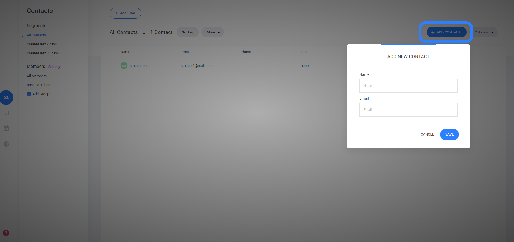

# 顧客情報を手動で追加する方法

連絡先エリアに手動で顧客情報を追加する必要がある場合は、ダッシュボードの右上にあ&#x308B;**「連絡先を追加」**&#x3092;選択します。

名前とメールアドレスを追加します。&#x20;

顧客情報が連絡先エリアに追加されると、タグの追加、会員データの割り当てなど、さまざまな操作が可能になります。

---

<!-- cta:opusbooster -->

**自分の場合はどう使えばいいか**

[OpusBoosterの機能全体](https://opusbooster.com/features)を見る。設計から相談したい方は[15分の無料相談](https://opusbooster.com/consultation)、まず触ってみたい方は[14日間の無料トライアル](https://opusbooster.com/register)（クレジットカード不要）から。

