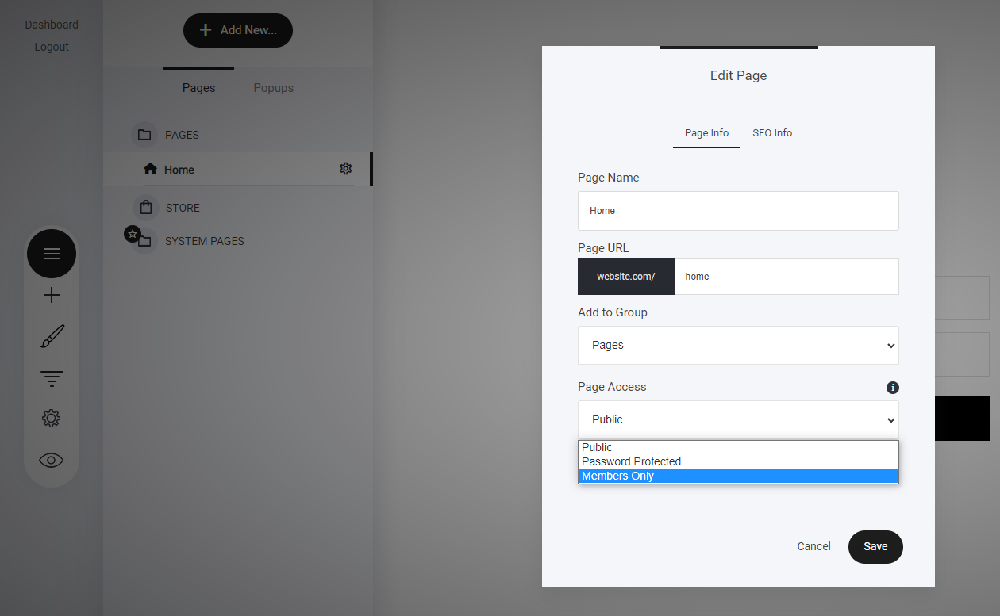

# メンバーシップ限定コンテンツの設定

グループメンバーのみがアクセスできるページを作成するには、ページまたはページが配置されているフォルダに移動します。目的のページを見つけ、**3つのドットアイコン**をクリックしてページ設定にアクセスします。

「ページアクセス」のドロップダウンメニューから「**メンバーのみ**」を選択し、「メンバーグループの選択」をクリックします。次に、ページへのアクセスを許可するグループを選択します。このプロセスは、ファネルステップにも適用されます。

---

<!-- cta:opusbooster -->

**自分の場合はどう使えばいいか**

[OpusBoosterの機能全体](https://opusbooster.com/all-features)を見る。設計から相談したい方は[15分の無料相談](https://opusbooster.com/consultation)、まず触ってみたい方は[14日間の無料トライアル](https://opusbooster.com/register)（クレジットカード不要）から。

