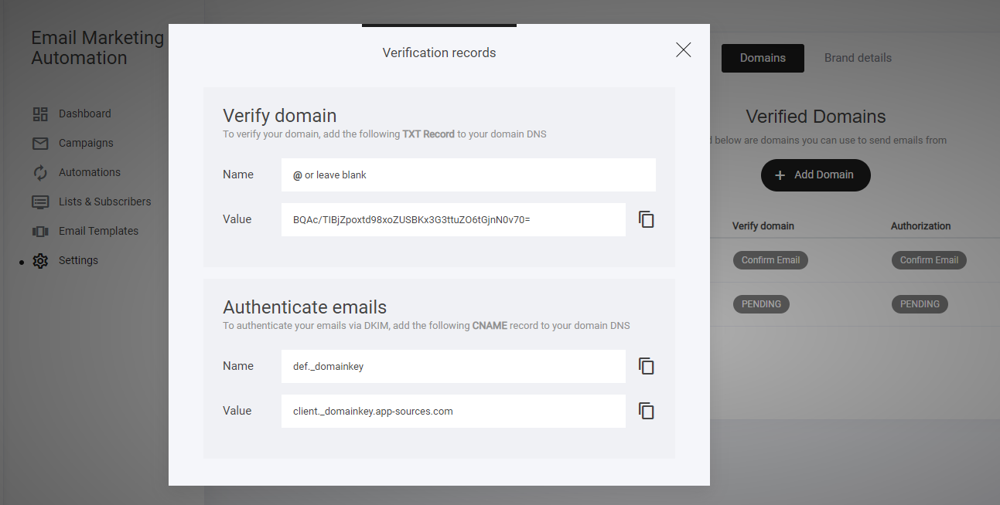
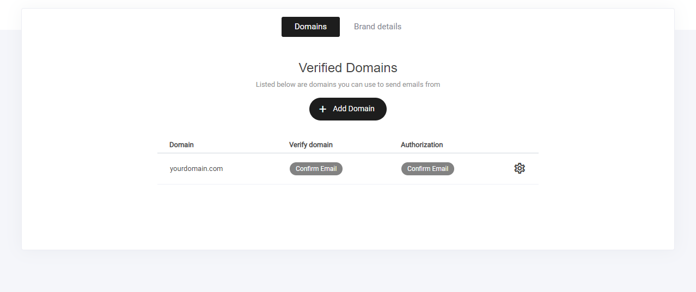
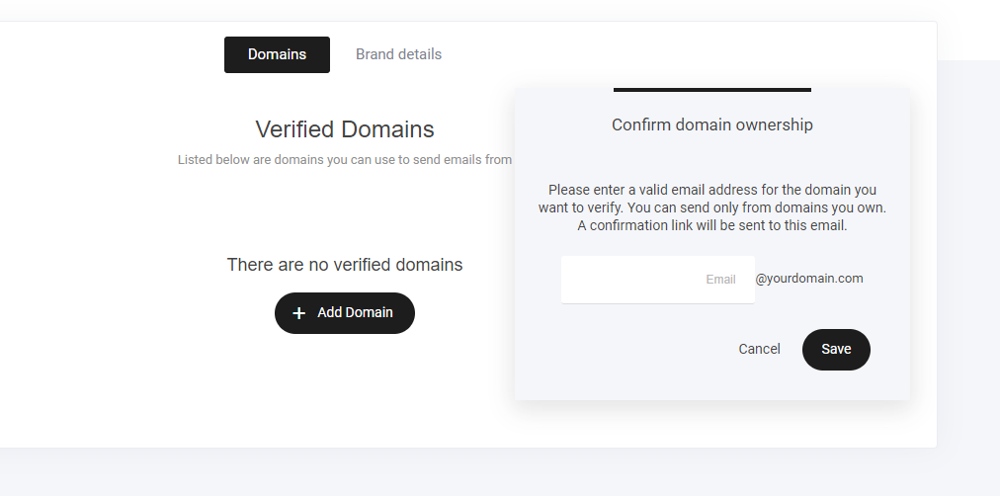

# メールドメインの接続

## この設定は何のため？

OpusBooster から自分のドメイン（例: `piano-school.com`）を差出人にしてメールを送るには、**「このドメインは私のものです」という証明**を一度だけ行います。証明が済むまで、キャンペーンやオートメーションのメールは送れません。

作業は **2行の文字をコピーして、ドメインを管理している会社の画面に貼る**だけです。難しいのは「貼る内容」ではなく「**どの会社の、どの画面に貼るか**」です。この記事はそこを順番に案内します。


**LINE配信だけを使う方は、この設定は後回しで大丈夫です。** LINE連携の配信はメールドメインが未設定でも動きます。メールも送りたくなったときに戻ってきてください。


## 全体の流れ（3ステップ）

1. **OpusBooster で「ドメインの追加」を押し、2つのレコードをコピーする**（この記事）
2. **ドメインを管理している会社の画面に、その2つを貼る**（会社別の記事へ）
3. **OpusBooster に戻って「ステータスを更新」を押し、「確認済み」になるのを待つ**（この記事）

## ステップ 1: OpusBooster で2つのレコードを表示する

「**メール & オートメーション**」→「**設定**」→「**ドメインと送信者**」タブを開き、「**ドメインの追加**」を押して、メールの差出人にしたいドメインを入力します。

<figure><figcaption>
「メール &#x26; オートメーション」→「設定」→「ドメインと送信者」
</figcaption></figure>

すると「**Verification records**（確認用レコード）」の画面が開き、2つのレコードが表示されます。

<figure><figcaption>
上が TXT（ドメインの確認用）、下が CNAME（メールの署名用）。右のコピーボタンで値を写せます
</figcaption></figure>

| | 種類 | 名前（ホスト名） | 値 |
|---|---|---|---|
| ① ドメインの確認 | **TXT** | `@`（空欄でよい会社もあります） | 画面に表示された長い文字列（例: `BQAc/TIBj…=`） |
| ② メールの署名 (DKIM) | **CNAME** | `def._domainkey` | `client._domainkey.app-sources.com` |

**値は必ず画面のコピーボタンで写してください。** 手で打つと1文字の違いで通りません。この画面は閉じても、一覧の歯車マークからいつでも開き直せます。

## ステップ 2: ドメインを管理している会社の画面に貼る

ここが、いちばん止まりやすいところです。**まず、自分のドメインがどの会社で管理されているかを確かめてください。**


[where-is-my-domain.md](email-domain-dns/where-is-my-domain.md)


会社が分かったら、その会社の手順へ進みます。画面の写真つきで、押す場所を順番に説明しています。

| 会社 | 手順 |
|---|---|
| お名前.com | [お名前.com でレコードを追加する](email-domain-dns/onamae.md) |
| エックスサーバー / Xserverドメイン | [エックスサーバーでレコードを追加する](email-domain-dns/xserver.md) |
| ムームードメイン | [ムームードメインでレコードを追加する](email-domain-dns/muumuu.md) |
| さくらインターネット | [さくらインターネットでレコードを追加する](email-domain-dns/sakura.md) |
| バリュードメイン | [バリュードメインでレコードを追加する](email-domain-dns/value-domain.md) |
| Cloudflare | [Cloudflare でレコードを追加する](email-domain-dns/cloudflare.md) |
| Google Domains / Google Workspace で取得（現在は Squarespace） | [Squarespace（旧 Google Domains）でレコードを追加する](email-domain-dns/squarespace.md) |

上の一覧に無い会社の場合は、その会社のヘルプで「**DNSレコードの追加**」または「**TXTレコード / CNAMEレコード**」を探してください。どの会社にも同じ機能があります。見つからないときは、会社のサポートに「TXT と CNAME のレコードを追加したい」と伝えれば案内してもらえます。

## ステップ 3: OpusBooster で「確認済み」になるのを待つ

貼り終えたら OpusBooster の「ドメインと送信者」に戻り、「**ステータスを更新**」を押します。

* **通常は 10〜15 分**で、「Verify domain」と「Authorization」の両方が緑の「**確認済み**」になります。
* 反映には**最長で 48 時間**かかることがあります。すぐに変わらなくても異常ではありません。1時間おいて、もう一度「ステータスを更新」を押してください。
* 一覧の「**Confirm Email**」は、別の意味です（次の節）。

<figure><figcaption>
2つとも緑になれば完了。キャンペーンを送れるようになります
</figcaption></figure>

### 「Confirm Email」と表示されたとき

そのドメインを、すでに OpusBooster の別のウェブサイトやファネルに接続している場合は、レコードの追加ではなく**メールでの確認**になります。ドメインを入力すると有効なメールアドレスを聞かれ、届いた確認リンクを押せば完了です。

<figure><figcaption></figcaption></figure>

### 48 時間たっても「確認済み」にならないとき 

よくある原因は3つだけです。会社の画面でもう一度見てください。

1. **名前（ホスト名）にドメインを二重に入れている** — `def._domainkey.piano-school.com.piano-school.com` のようになっていないか。多くの会社は `def._domainkey` だけを入れると、あとをドメイン名で補ってくれます。
2. **値の前後に余分なスペースや改行が入っている** — コピーボタンで写し直してください。
3. **貼った会社が違う** — ドメインを買った会社と、ドメインを「運用している」会社が別のことがあります（例: お名前.com で買って、エックスサーバーで使っている）。この場合は**運用している会社の画面**に貼ります。→ [どこで管理されているか調べる](email-domain-dns/where-is-my-domain.md)

それでも解決しないときは [よくあるつまずきと解決方法](../../extra/troubleshooting.md#email) を見てください。

## 最後に: 差出人の名前を決める

「確認済み」になったら、同じ画面で次の2つを入れてから、キャンペーンやオートメーションに進んでください。

* **デフォルトの送信者名** — 受け取った人に見える差出人の名前（教室名や自分の名前）
* **デフォルトのシステムメール** — ここに表示されるメールアドレスが正しいか確認

<figure><figcaption></figcaption></figure>

---

<!-- cta:opusbooster -->

**自分の場合はどう使えばいいか**

[OpusBoosterの機能全体](https://opusbooster.com/features)を見る。設計から相談したい方は[15分の無料相談](https://opusbooster.com/consultation)、まず触ってみたい方は[14日間の無料トライアル](https://opusbooster.com/register)（クレジットカード不要）から。

