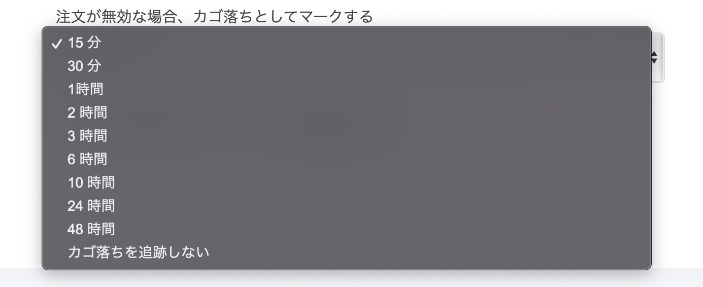
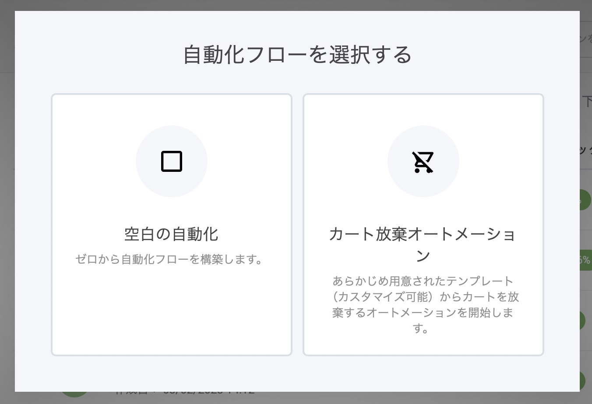
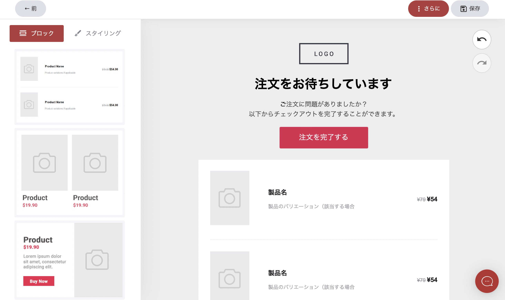
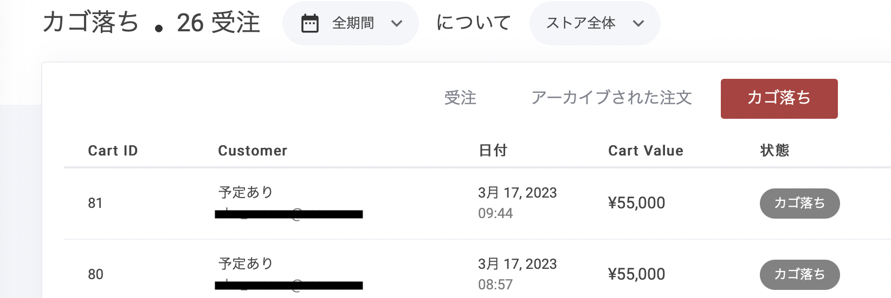

# カゴ落ちの自動化

オンラインストアやセールスファネルで放棄されたカートから潜在的な売上を回収する方法をお探しですか？当社の新しい自動化機能を使えば、放棄された時間を設定し、メールフローを作成し、分析を追跡することが素早く簡単にできます。自動化されたカートフローで、売上を取り戻しましょう！

### カゴ落ちメールの設定

放棄されたカートの自動化を開始するには、「ストア設定」タブに移動します。デフォルトでは、放棄されたカートはアクティブに設定されていますが、オートメーションはオフになっています。ストアのアイテムごとに設定することもできますが、シンプルにするために、すべてのアイテムで同じにしておくこともできます。 設定できる遅延時間があり、顧客がカートを放棄した後、自動化が開始されるまでの時間を決定します。将来的に必要であれば、時間を変更することができます。

<figure><figcaption>
カゴ落ちとしてマークするまでの時間設定
</figcaption></figure>

次のステップは、オートメーションの設定です。すでにビルド済みのテンプレートが設定されています。オートメーションの作成ボタンをクリックすると、このようなポップアップが表示されます。ここで「カート放棄オートメーション」を選択すると、オートメーションフローに入ります。

<figure><figcaption></figcaption></figure>

### メールの作成

左側には、メールのドラッグ＆ドロップ要素が表示されます。半分ほど下にスクロールすると、新しい「カート放棄」要素が表示されます。これをメールにドラッグ＆ドロップすれば完了です！

<figure><figcaption></figcaption></figure>

### 訪問者を正しい場所に誘導

デフォルトでは、このボタンは訪問者をカートに残したアイテムと共にチェックアウトページに戻します。また、セールスファネルを使用している場合、ファネル内のチェックアウトステップに誘導します。これにより、ストアとファネル収益分析タブの両方で購入コンバージョンが登録されます。

### ストアのアナリティクスを見るには

カゴ落ちの分析結果を見ることができる場所は2つあります

・ストアダッシュボードタブ

・注文タブ

下の画像のように、ストアダッシュボードのタブの右側に、「」タブが表示されます。

<figure><figcaption></figcaption></figure>

下は注文タブの表示です。ここでもストア全体または個々のファネルにフィルタリングして、すべての放棄されたカートを表示することができます。

<figure><figcaption></figcaption></figure>

これで、カゴ落ち客の最大68.9%を取り戻す準備が整いました！

