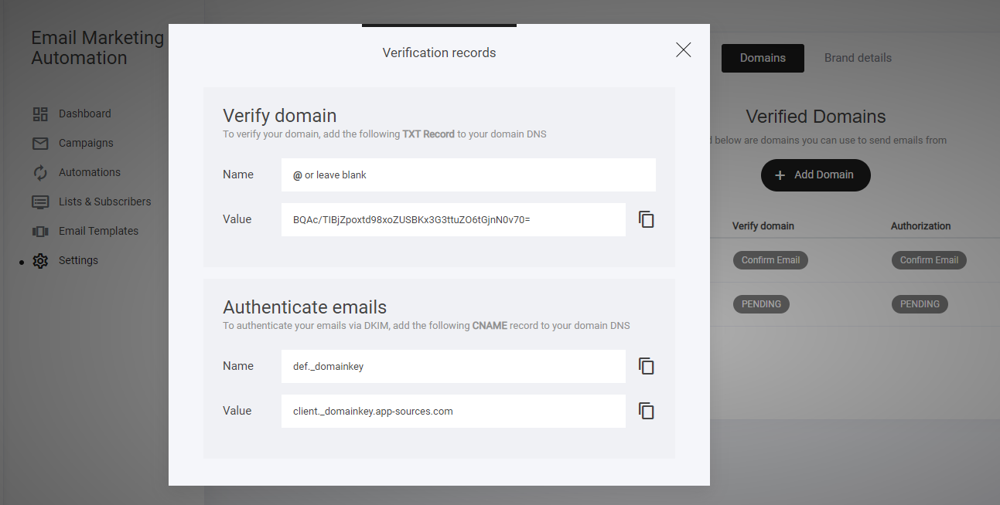
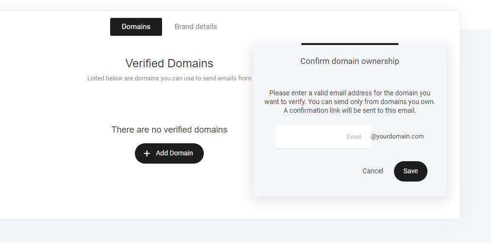
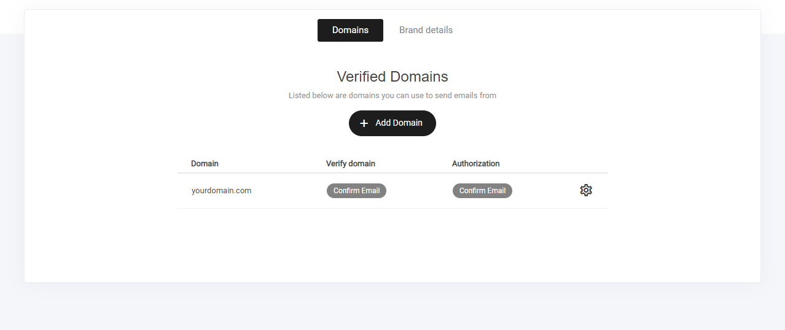

# メールドメインの接続

### ドメイン認証

メール マーケティング セクションでメールの送信を開始するには、まずドメインを接続する必要があります。これは、\[メール&オートメーション] タブ > \[設定] で行うことができます。

「ドメインを追加」ボタンが表示されます。OpusBoosterにドメインを追加した後、提供された**CNAME** レコードと **TXT** レコードを追加するだけです。

ドメインを購入したサービスのドメイン管理ページにアクセスし、DNSレコードのエリアで**CNAME**と**TXT**レコードを追加します。DNSレコードを追加した後、更新されるまでに多少の時間がかかる場合がありますが、心配はいりません。10\~15分後に再度確認すると、ほとんどの場合、緑色の「確認済み」と表示されているはずです。

すでにドメインをOpusBoosterで構築した他のウェブサイトやファネルに接続しており、DNSレコードをお持ちの場合、追加のウェブサイト/ファネルの確認のため、メールのリンクから確認する必要があります。ドメインURLを入力すると、有効なメールアドレスの入力を求められます。完了すると、確認リンクがメールで送信されます。

ドメインが認証されると緑色に変わり、メールキャンペーンの送信を開始できます。

キャンペーンや自動化セクションに進む前に、以下の項目を必ず記入してください。

* **デフォルトの送信者名** > これは、購読者がメールの送信者を確認する際に表示される名前です。
* **デフォルトのシステムメール** > ここに表示されるメールアドレスが正しいことを確認してください。

