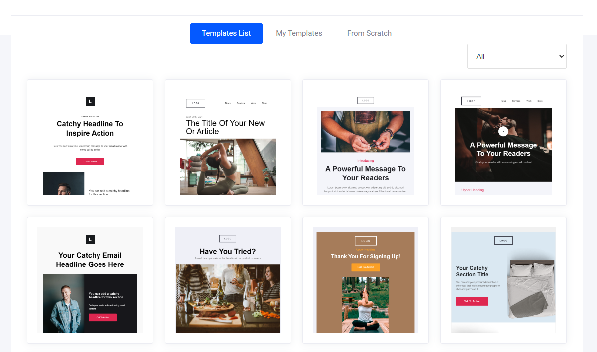
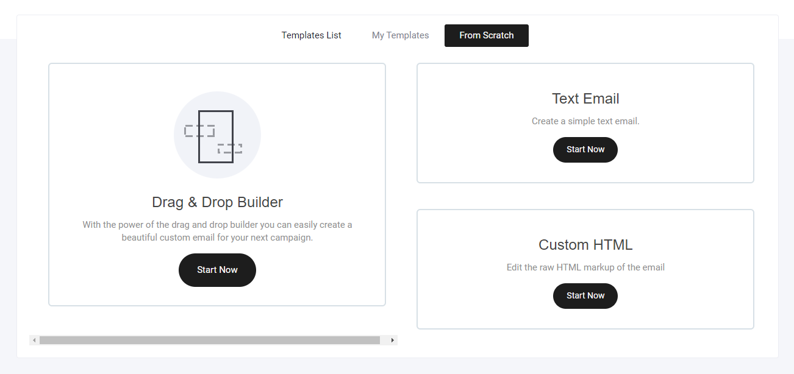
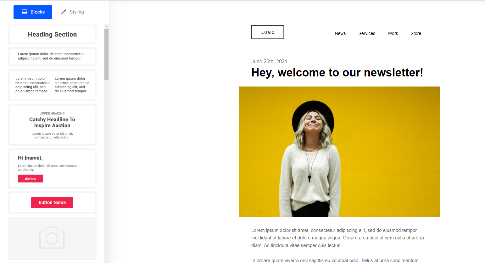
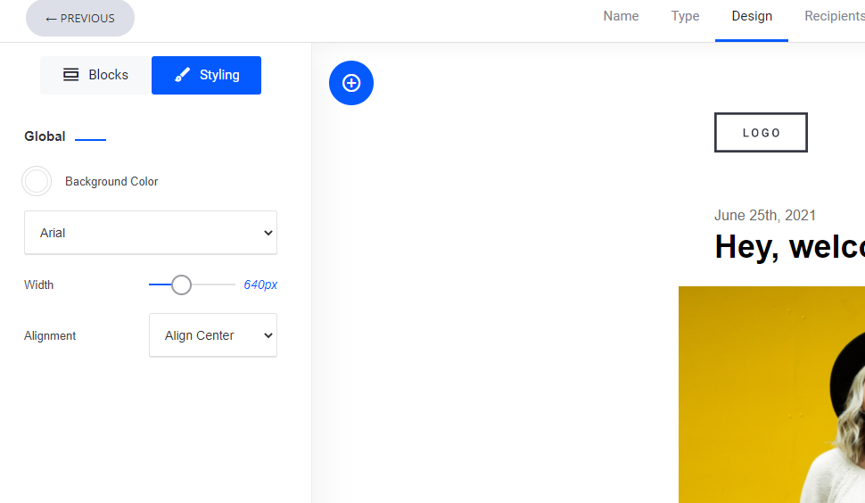
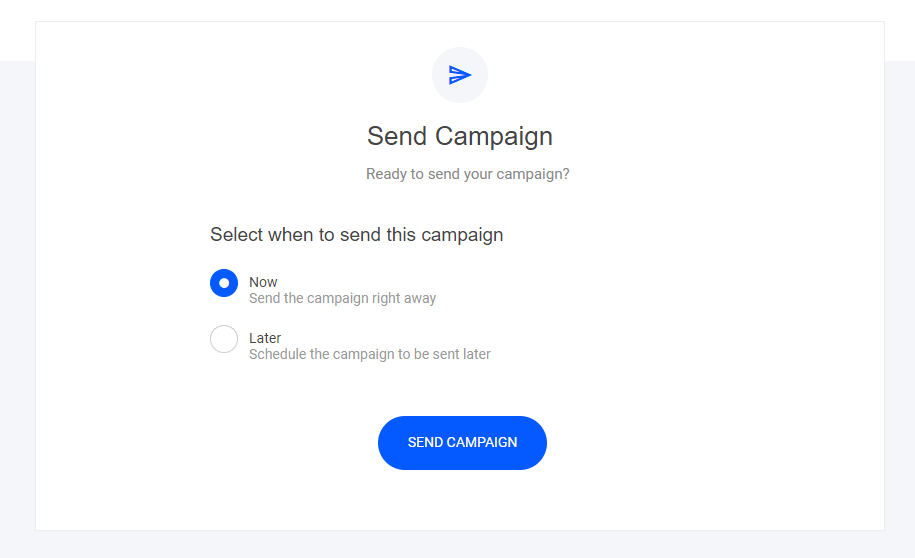

# メールキャンペーン（メルマガ送信）


この記事では、あらかじめ用意されたテンプレートを使用して、購読者のパフォーマンス管理を行うメールキャンペーンの作成方法をご紹介します。


次のメールキャンペーンを3つの簡単なステップで作成し、配信しましょう。

### キャンペーンタブを選択

<figure><figcaption></figcaption></figure>

### キャンペーン名の入力

<figure><figcaption></figcaption></figure>

※これは管理用の名称であり、送信するメールの件名ではありません。

### キャンペーンの種類を選択

<figure><figcaption></figcaption></figure>

### **テンプレートを選択** 


テンプレートを使わず、白紙からメールを作成することもできます


* ドラッグ＆ドロップビルダー
* テキストメール
* カスタムHTMLメール

<figure><figcaption></figcaption></figure>

### **メールテンプレートを編集** 

あらかじめ構築された多数のブロックデザインから選択し、ドラッグして配置するだけです。

### **メールをデザイン** 

背景色を調整して、メールの幅を変更します。

### **メールを送信する対象者を選択** 

メールを送信したい購読者リストや、事前に設定したセグメントを選択し、次へをクリックしてください。

<figure><figcaption></figcaption></figure>

### **キャンペーン設定** 

購読者に確実にメールを開封してもらうために、目を引く件名を付けましょう。CRM プロパティを追加して、件名をパーソナライズすることもできます。

デザインやリンクが正しく機能しているかを確認するためにテストメールを送信する必要がある場合は、ご自身にテストメールを送信してください。

<figure><figcaption></figcaption></figure>

### **送信するタイミングを選択** 

今すぐキャンペーンを送信するか、日時を指定して送信します。

### **成果の確認** 

キャンペーンが購読者に正常に送信されると、メールのパフォーマンスを確認できるようになります。確認したいキャンペーンをクリックするだけです。

<figure><figcaption></figcaption></figure>

このダッシュボードでは、メールキャンペーンのパフォーマンスを分析するために、以下の内容を表示することができます。

* メールの開封
* リンクのクリック
* プレビュー - メールの内容を思い出せるように
* 購読解除した人
* その他...

### 購読者ごとのパフォーマンス

特定の購読者がメール キャンペーンにどのように関与しているかを確認する場合は、CRM/連絡先タブに移動し、購読者を選択してから、以下に強調表示されているようにマーケティングの詳細タブを選択します。

<figure><figcaption></figcaption></figure>
