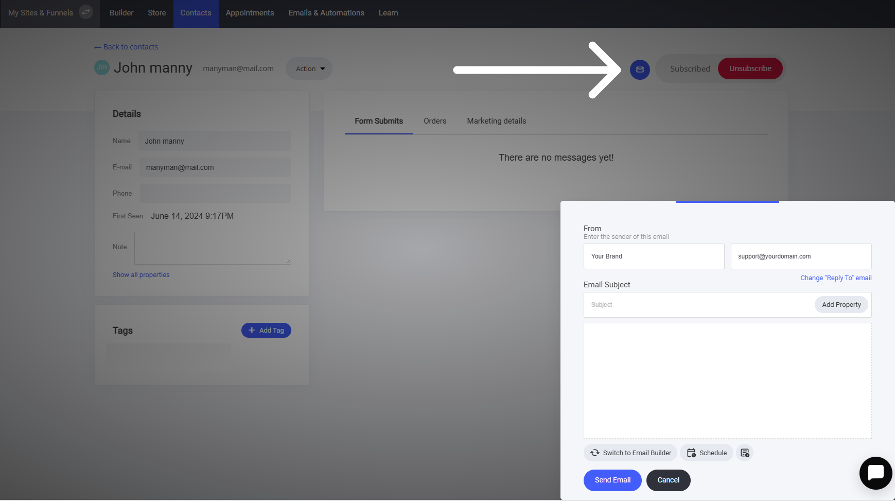
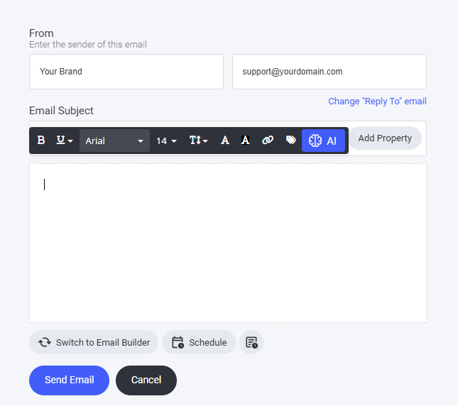

# 個別のメール送信

### CRM 内の連絡先プロファイルから、連絡先に個別の電子メールを作成して送信することができます。


CRM から連絡先に個別のメールを送信できるのは、その連絡先がいずれかのメールリストに登録されている場合のみです。


登録済みのメール連絡先に直接メールを送信するには、まず \[連絡先] タブに移動します。

* メールを送信したい連絡先を検索し、その連絡先のプロフィールを開きます。
* 画面の右上の「メールアイコン」をクリックします。
* 選択すると、新しいウィンドウが右下に表示されます。

個別のEメール設定とオプション

### 個別に送信するメールの作成 

メールを送信するには2つの方法があります。まず、A.I.ライティングアシスタントのサポートを受けながら、ここから直接送信することができます。または、「**メールビルダーに切り替える**」ことで、保存したテンプレートにアクセスし、メールをよりカスタマイズすることができます。

#### **送信スケジュール** 

ここでは2つのオプションが用意されています。「メールを送信」ボタンをクリックしてすぐに電子メールを送信するか、必要な時に指定した日時にメールが送信されるようにスケジュールを設定することができます。これにより、緊急のメッセージをすぐに送信する必要がある場合でも、より適切な時期や戦略的な時期にメールを配信する計画を立てる場合でも、お客様のニーズに最も適した方法でコミュニケーションを管理できる柔軟性が得られます。


スケジュール済みメールのアイコンをクリックすると、その連絡先に対してスケジュール済みの他のメールも確認できます。

