# SMS & WhatsApp


この機能を使用するには、Twilioアカウントの設定が必要です。SMSおよびWhatsAppメッセージを送信するためのTwilio連携の設定方法は、[Twilio連携](../../internal-integrations/twilio.md)のページをご覧ください。


**Twilioアカウントを接続すると**、強力なメッセージング機能が使えるようになります。

**このページで学べる主な内容:**

* **Twilioをプロジェクトに接続する方法** – メッセージングをワークフローにシームレスに統合します。
* **メッセージの送信** – SMSを通じて顧客と直接コミュニケーションを取るための設定です。
* **オートメーションでのメッセージング活用** – やり取りを自動化して、効率とエンゲージメントを高めます。
* **マーケティングでのSMS活用** – SMSがなぜコンバージョンの高いツールなのか、そして効果的な使い方をご紹介します。

リアルタイムのエンゲージメントとスムーズな顧客コミュニケーションを実現する、**多用途なツール**です。

## Twilio連携の設定

ウェブサイトビルダーのダッシュボードで**設定**（歯車アイコン）に移動します。**アプリケーション**を選択し、**アプリケーションを追加**をクリックして、**Twilio連携**タブが表示されるまでスクロールします。

<figure>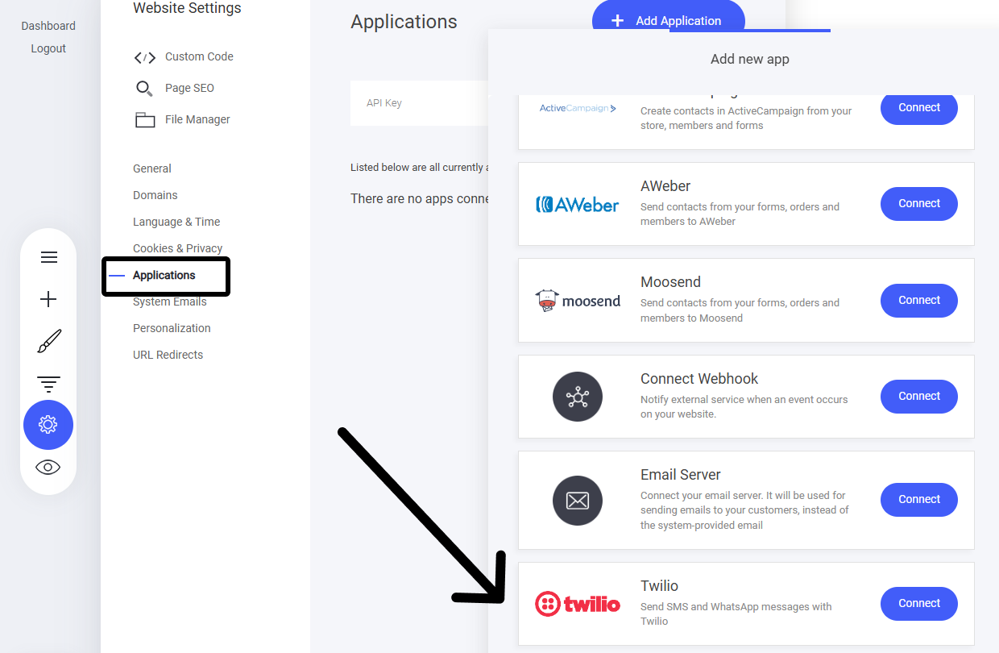<figcaption></figcaption></figure>

### Twilio設定の構成

Twilio接続を設定した際に、Twilioダッシュボード内にいくつかのIDなどが表示されていたことにお気づきかもしれません。これらの認証情報を、Twilioアプリケーションの設定画面に追加する必要があります。

<figure>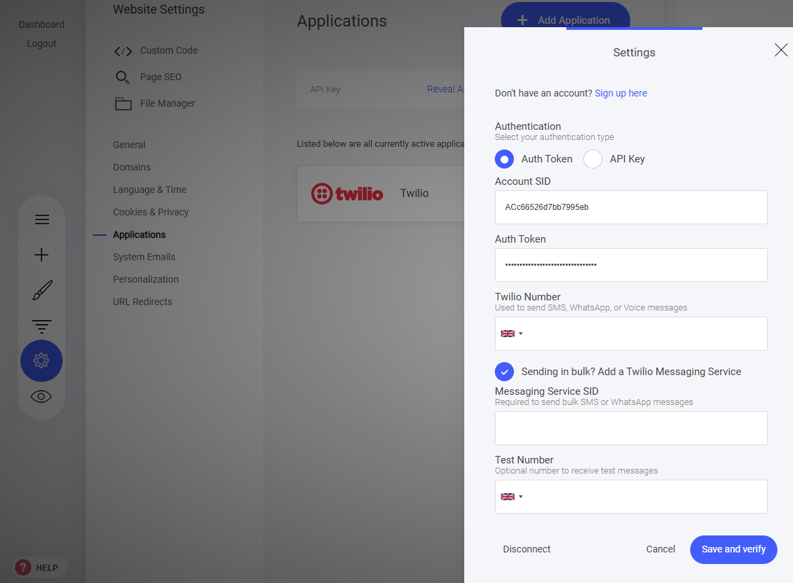<figcaption></figcaption></figure>

必要なTwilioの認証情報は、Twilioダッシュボードで確認できます。次の項目をコピー＆ペーストするだけです。

* アカウントSID
* 認証トークン
* Twilio電話番号

<figure>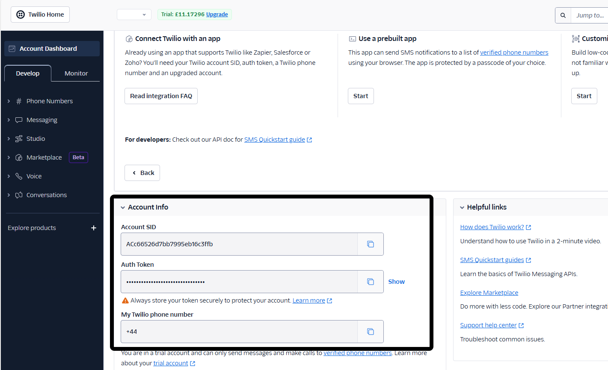<figcaption></figcaption></figure>

### 一括メッセージの送信

大量のSMSやWhatsAppメッセージを送信する場合は、Messaging Services IDを追加する必要があります。

<figure>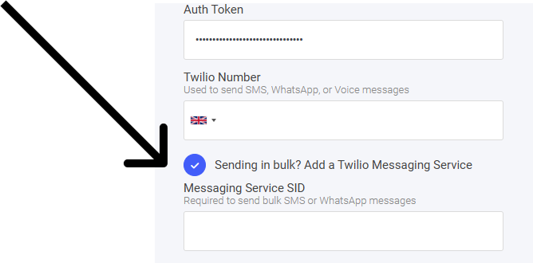<figcaption></figcaption></figure>

Messaging Servicesについて詳しくは、[Twilio連携](../../internal-integrations/twilio.md)のページをご覧ください。

## メッセージの送信

これで設定は完了です。顧客へのメッセージ送信を始めましょう。

### メッセージの送信方法

顧客へのメッセージは、個別に送信することも、キャンペーンやオートメーションフローを通じて一括送信することもできます。

### 個別メッセージング

顧客に個別メッセージを送信する手順は、個別メールの送信とほぼ同じです。まず**連絡先**タブに移動して、メッセージを送りたい顧客を選択します。

<figure>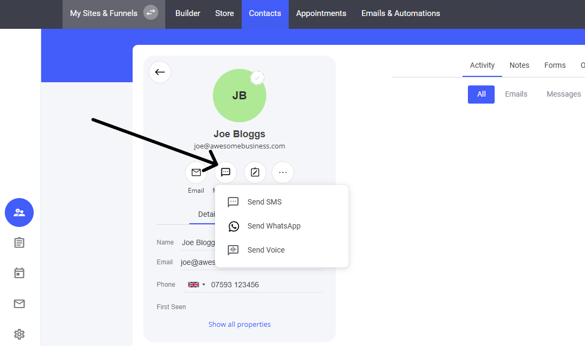<figcaption></figcaption></figure>


注意: メッセージは、メール配信に登録（購読）している顧客にのみ送信できます。


顧客が購読しているかどうかは、プロフィール画像の上部にある小さなチェックアイコンで確認できます。このアイコンが緑色であれば購読中です。必要に応じて、三点メニューをクリックして「**購読**」を選択できます。

メッセージの送信に使用するチャネルを選択してください。

* SMS
* WhatsApp
* 音声

### 個別SMS

SMSとWhatsAppは設定方法こそ似ていますが、メッセージ送信時にはいくつか違いがあります。WhatsAppは、メッセージポリシーに準拠するため、メッセージテンプレートとタグの使用が必須です。まずはSMSメッセージから見ていきましょう。

<figure>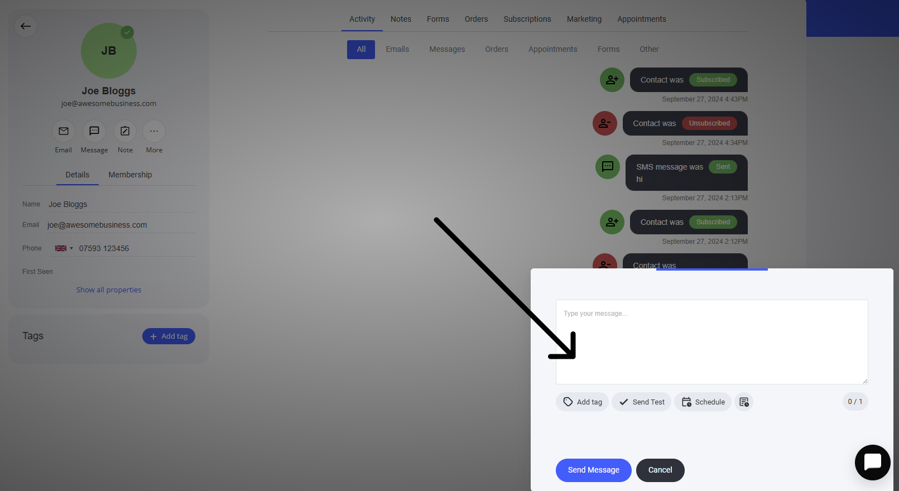<figcaption></figcaption></figure>

SMSを送信する際は、**タグを追加**、**テスト送信**、**スケジュール送信**が利用できます。

**タグを追加**: メッセージを顧客ごとにパーソナライズするのに役立ちます。「タグを追加」ボタンを選択すると新しいウィンドウが表示され、CRMプロパティを使用できます。

<figure>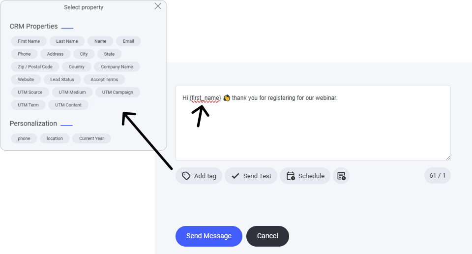<figcaption></figcaption></figure>

### 個別WhatsApp

顧客にWhatsAppメッセージを送信するには、**連絡先**タブに移動して送信先の連絡先を選択します。顧客の個別プロフィールが表示されたら、**メッセージアイコン**をクリックして「**WhatsAppを送信**」を選択します。

<figure>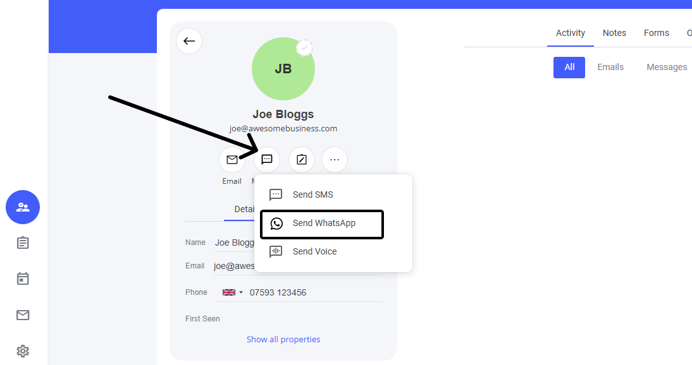<figcaption></figcaption></figure>

SMSと同様に、WhatsAppメッセージでは**添付ファイル（画像ファイル）を送信できます**。また、「**メッセージを承認のために提出**」という新しいボタンが表示されます。メッセージを作成し終えたら、テンプレートとしてWhatsAppに送信して審査を受ける必要があります。審査は通常、数秒で完了します。**注意**: 場合によってはもう少し時間がかかることがあります。これはWhatsApp側の処理のため、当社ではコントロールできません。

<figure>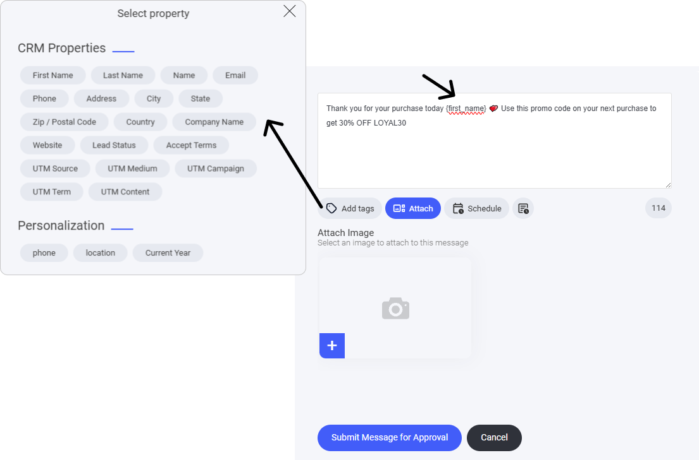<figcaption></figcaption></figure>

「メッセージを承認のために提出」ボタンをクリックすると、新しいウィンドウが表示されます。このウィンドウで、いくつかの項目を入力します。

<figure>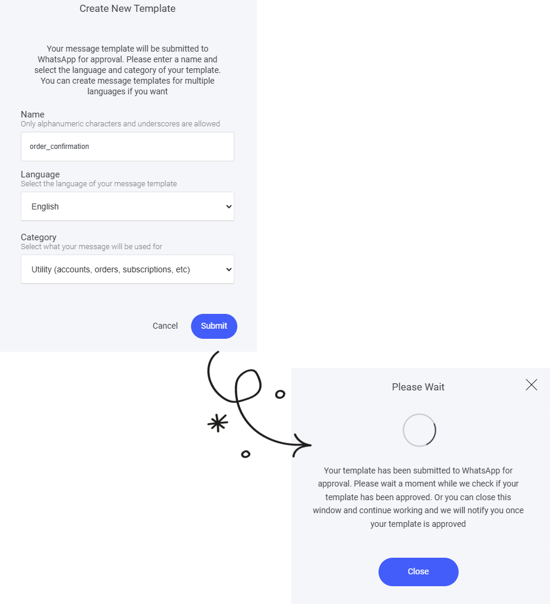<figcaption></figcaption></figure>

* **名前**

  #### 名前の例:

  * `welcome_message`
  * `order_confirmation`
  * `shipping_update`
  * `account_verification`


テンプレートの目的が伝わる程度に説明的で、かつ簡潔な名前を付けましょう。後でテンプレートを使用する際に見つけやすくなります。


* 言語
* カテゴリ

カテゴリには**ユーティリティ**と**マーケティング**の2種類があり、WhatsAppテンプレートで送信するメッセージの種類を分類するためのものです。それぞれ目的が異なるため、メッセージの内容に合わせて正しいカテゴリを選択することが重要です。

#### まとめ

* **ユーティリティ**: 取引やアカウントに関する重要なメッセージに使用します。必要な情報を伝えるためのものです。
* **マーケティング**: 販売促進や顧客エンゲージメントを目的としたプロモーションメッセージに使用します。

適切なカテゴリの選択は、WhatsAppのポリシーに準拠し、メッセージを受信者に確実に届けるために重要です。

### WhatsAppテンプレート

メッセージを送信してテンプレートが承認されると、そのテンプレートを再利用したり、ユーティリティやマーケティングなど別の種類のメッセージ用に新しいテンプレートを作成したりできるようになります。

<figure>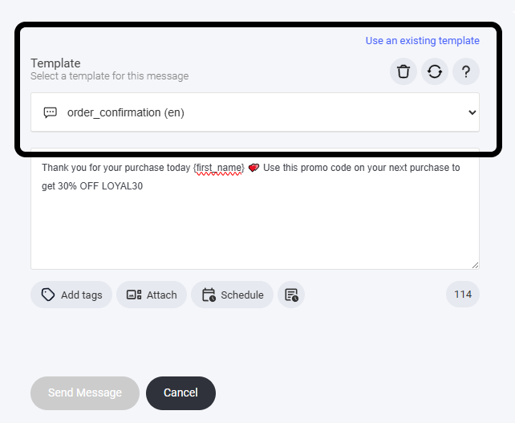<figcaption></figcaption></figure>

**WhatsAppメッセージテンプレートを再利用する**には、「**WhatsAppメッセージを送信**」に移動し、メッセージウィンドウの上部に表示される新しいタブとオプションを確認してください。

## メッセージキャンペーンの送信

個別メッセージだけでなく、[メールキャンペーン](mrukyanpnmerumaga.md)のように、メッセージを大規模に一括配信することもできます。より広いオーディエンスにリーチして、コミュニケーションのインパクトを高めましょう。

### メッセージキャンペーンの設定

**メールと自動化**タブに移動して「**キャンペーン**」を選択し、「新規作成」をクリックします。

<figure>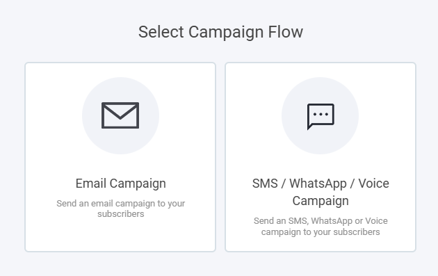<figcaption></figcaption></figure>

次に、キャンペーンの種類を選択します。今回はメールではなくメッセージを送信します。

送信したいチャネル（メッセージの種類）を選択してください。

* SMSキャンペーン
* WhatsAppキャンペーン
* 音声キャンペーン

<figure>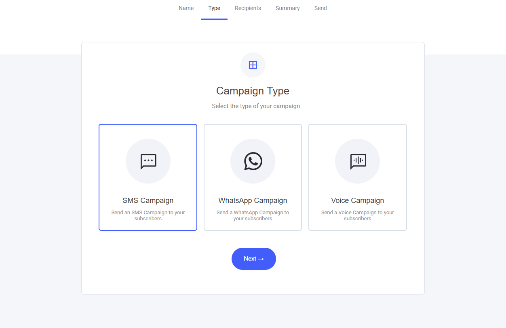<figcaption></figcaption></figure>

選択したら、送信先のリスト（オーディエンス）を選択します。

### メッセージキャンペーンを送信する

一括メッセージキャンペーンの作成手順は、顧客への[個別メッセージ](#個別メッセージング)の設定とまったく同じです。

<figure>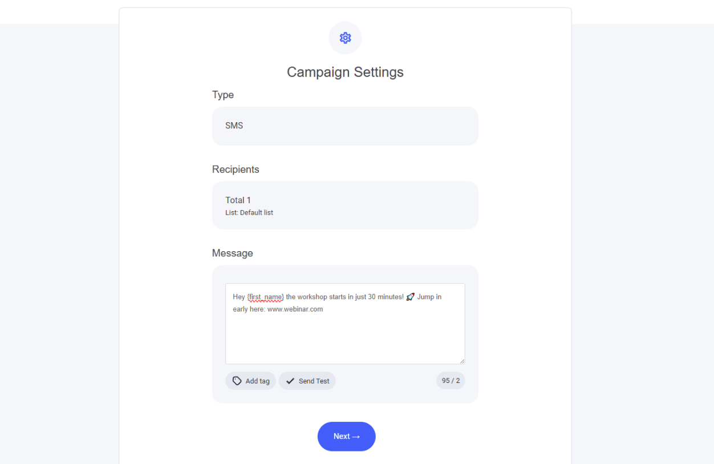<figcaption></figcaption></figure>

選択したオーディエンス（リスト）に送信するメッセージを作成したら、すぐに送信するか、スケジュール送信を設定できます。

<figure>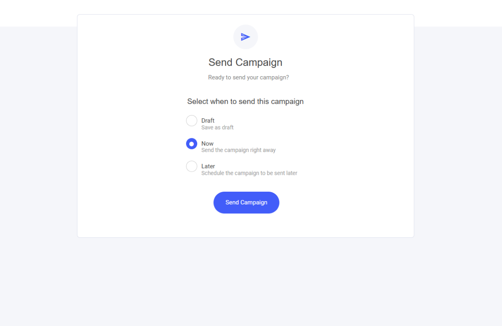<figcaption></figcaption></figure>

## メッセージングオートメーション

[メールオートメーション](automation.md)を作成するのと同じ要領で、SMS、WhatsApp、さらには音声メッセージングをワークフローに追加できます。複数のチャネルでリーチを広げ、オーディエンスと効果的につながりましょう。

<figure>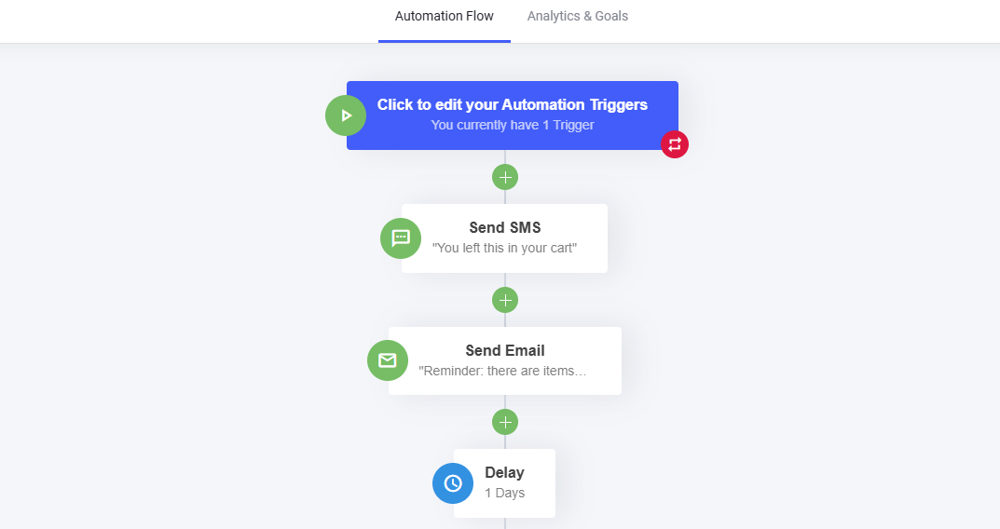<figcaption></figcaption></figure>

### ワークフローにメッセージを追加する

新しいオートメーションフローを作成するか、既存のフローに追加します。メッセージングのコンポーネントは、オートメーションフローの任意の場所に追加できます。

<figure>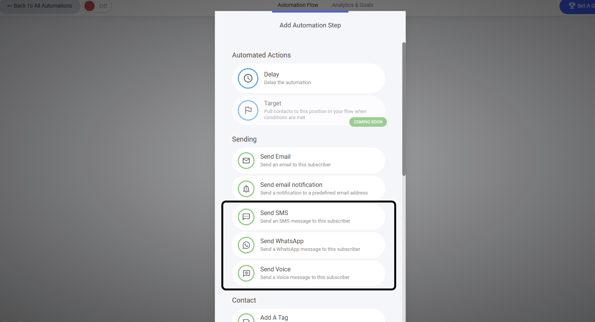<figcaption></figcaption></figure>

フローにメッセージを追加するには、追加したい場所を選択し、使用するメッセージングチャネルを選択します。

メッセージングチャネルを選択したら、**新しいメッセージを作成**するか、WhatsAppの場合は以前に保存した[テンプレート](#whatsappテンプレート)を使用できます。

<figure>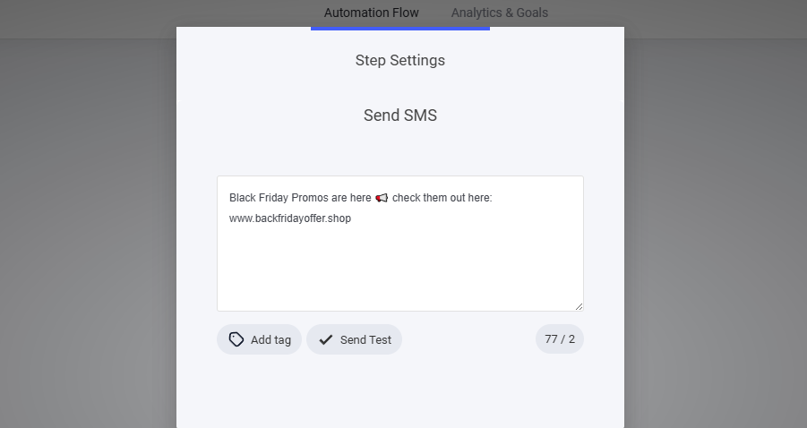<figcaption></figcaption></figure>
