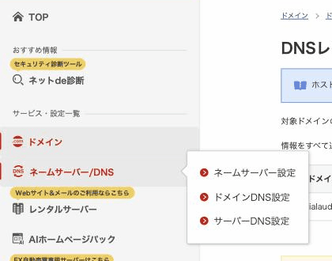
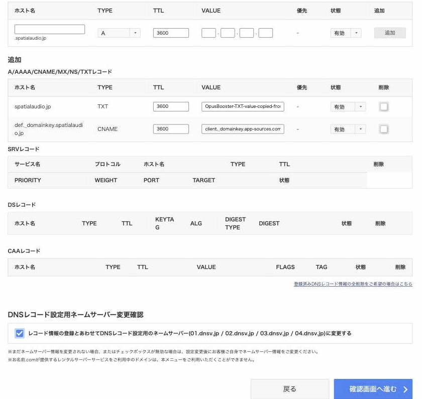
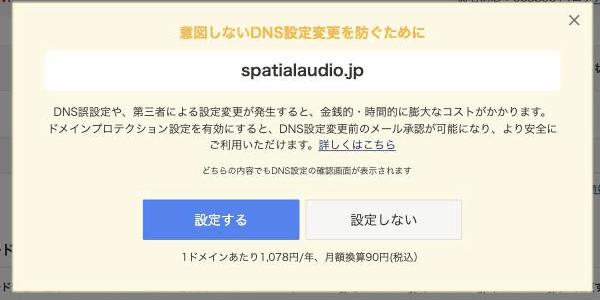
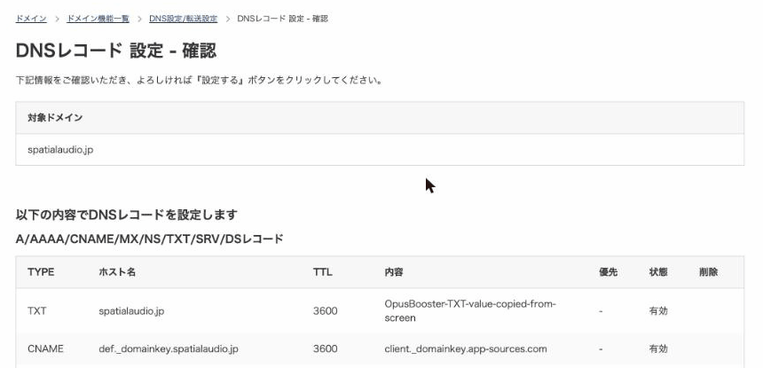

# お名前.com でレコードを追加する

## この手順を使う人

ドメインの**ネームサーバーが お名前.com のもの**（`01.dnsv.jp` 〜 `04.dnsv.jp`）になっている方です。お名前.com で買っていても、エックスサーバーなど別の会社で運用している場合は、**その会社の手順**を使ってください。→ [どこで管理されているか調べる](where-is-my-domain.md)

## 追加する行を決める

やりたいことに合わせて、A・B のどちらか、または両方の行を用意します。同じ画面で足せるので、両方やるなら一度で済みます。

**A. サイトを自分のドメインで表示する（2行）** — 値は OpusBooster の「**ウェブサイト/ファネルの設定 → ドメイン**」画面に表示されたものを使います。→ [カスタムドメインの接続](../custom-domain.md)

| TYPE | ホスト名 | VALUE |
|---|---|---|
| **A** | 空欄 | 画面に表示された数字（IPアドレス。4つの欄に分けて入れます） |
| **CNAME** | `www` | 画面に表示された値 |

**B. メールを自分のドメインから送る（2行）** — 値は「**メール & オートメーション → 設定 → ドメインと送信者**」画面のものを使います。→ [メールドメインの接続](../../email-and-automation/email-domain-connection.md)

| TYPE | ホスト名 | VALUE |
|---|---|---|
| **TXT** | 空欄 | 画面に表示された長い文字列 |
| **CNAME** | `def._domainkey` | `client._domainkey.app-sources.com` |


**A（サイト用）を入れると、サイトの表示先が OpusBooster に切り替わります。** サイトができてから行ってください。元からある「ホスト名が空欄の A」や「www」の行がある場合は、足すのではなく**値を書き換え**ます（A が2つあると繋がりません）。パーキングや URL 転送の行は消します。B（メール用）は足すだけで、今あるものは変わりません。


## 手順

1. [お名前.com Navi](https://navi.onamae.com/) にログインします。
2. 左のメニューの「**ネームサーバー/DNS**」を押し、出てきた小さなメニューの「**ドメインDNS設定**」を押します。

<figure><figcaption>
左のメニュー「ネームサーバー/DNS」→「ドメインDNS設定」
</figcaption></figure>

3. 「**DNS設定/転送設定 ドメイン一覧**」で、対象のドメインの右端にある「**ドメインDNS**」ボタンを押します。
4. 「**DNS設定/転送設定 - 機能一覧**」で、無料機能の「**DNSレコード設定**」を押します。
5. 「**DNSレコード設定 - 入力**」で「**レコード追加**」のタブを押し、上で決めた行を **1行ずつ**入れて、右端の「**追加**」を押します。入れた行は、すぐ下の「追加」の欄に並びます。
   * **ホスト名**: 表のとおり（空欄はそのまま空欄。`www` や `def._domainkey` を入れると、あとの「.あなたのドメイン」は自動で付きます）
   * **TYPE**: 表の「TYPE」を選ぶ（選ぶと VALUE の欄の形が変わります。A は数字4つの欄、TXT と CNAME は1つの欄）
   * **VALUE**: OpusBooster の画面からコピーボタンで貼る

<figure><figcaption>
メール用の2行（TXT と CNAME）を「追加」したところ。下に「追加」の欄として並びます
</figcaption></figure>

6. 同じ画面のいちばん下、「**DNSレコード設定用ネームサーバー変更確認**」のチェックはそのままで、「**確認画面へ進む**」を押します（この記事の対象の方は、ネームサーバーがすでに お名前.com なので、チェックが入っていても何も変わりません）。
7. **「意図しないDNS設定変更を防ぐために」という案内が出たら、「設定しない」を押します。** これは「ドメインプロテクション」という**有料オプション（1ドメイン 1,078円/年）**の申し込み案内で、今回の作業には要りません。「設定する」を押すと申し込みになります。

<figure><figcaption>
この案内が出たら「設定しない」。「設定する」は有料オプションの申し込みです
</figcaption></figure>

8. 「**DNSレコード 設定 - 確認**」で、いちばん上に今回の行が並んでいることを確かめて、ページの下の「**設定する**」を押します。もともとあった行も一緒に表示されますが、消えるわけではありません。

<figure><figcaption>
確認画面。上の2行が今回入れたもの。この下に元からある行が続きます
</figcaption></figure>


**「DNSレコード設定用ネームサーバー変更確認」のチェックについて**
このチェックが入ったまま設定すると、ドメインのネームサーバーが お名前.com のもの（01〜04.dnsv.jp）に書き換わります。**すでに他社（エックスサーバーなど）でサイトやメールを運用している方が押すと、サイトやメールが止まることがあります。** そういう方は、そもそもこの記事ではなく、運用している会社の手順を使ってください。→ [どこで管理されているか調べる](where-is-my-domain.md)


## 追加したあと

* **サイト用**: OpusBooster の「ドメイン」画面で接続の状態を確認します。反映まで最長 48 時間。→ [カスタムドメインの接続](../custom-domain.md)
* **メール用**: 「ドメインと送信者」で「**ステータスを更新**」を押します。通常 10〜15 分、長くて 48 時間で「確認済み」。→ [反映を待つ・うまくいかないとき](../../email-and-automation/email-domain-connection.md#not-verified)

## お名前.com の公式の説明

* [DNSレコード設定（お名前.com Navi ガイド）](https://www.onamae.com/guide/p/70)
* [DNSレコード設定を利用する際のネームサーバー](https://help.onamae.com/answer/7878)

---

<!-- cta:opusbooster -->

**自分の場合はどう使えばいいか**

[OpusBoosterの機能全体](https://opusbooster.com/features)を見る。設計から相談したい方は[15分の無料相談](https://opusbooster.com/consultation)、まず触ってみたい方は[14日間の無料トライアル](https://opusbooster.com/register)（クレジットカード不要）から。

