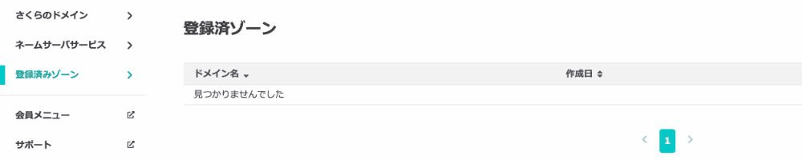

# さくらインターネットでレコードを追加する

## この手順を使う人

ドメインの**ネームサーバーがさくらのもの**（`ns1.dns.ne.jp` / `ns2.dns.ne.jp`）になっている方です。→ [どこで管理されているか調べる](where-is-my-domain.md)


**さくらのレンタルサーバの「メールドメイン設定」にある SPF / DKIM / DMARC の「利用する」は、今回の設定ではありません。**
あれは「さくらのメール」から送るときの設定です。OpusBooster 用の行は、下の手順で**レコードを直接追加**します。


## 追加する行を決める

やりたいことに合わせて、A・B のどちらか、または両方の行を用意します。同じ画面で足せるので、両方やるなら一度で済みます。

**A. サイトを自分のドメインで表示する（2行）** — 値は OpusBooster の「**ウェブサイト/ファネルの設定 → ドメイン**」画面のもの。→ [カスタムドメインの接続](../custom-domain.md)

| タイプ | エントリー名 | データ |
|---|---|---|
| **A（IPアドレス）** | `@` | 画面に表示された数字（IPアドレス） |
| **別名 (CNAME)** | `www` | 画面に表示された値 |

**B. メールを自分のドメインから送る（2行）** — 値は「**メール & オートメーション → 設定 → ドメインと送信者**」画面のもの。→ [メールドメインの接続](../../email-and-automation/email-domain-connection.md)

| タイプ | エントリー名 | データ |
|---|---|---|
| **テキスト (TXT)** | `@` | 画面に表示された長い文字列 |
| **別名 (CNAME)** | `def._domainkey` | `client._domainkey.app-sources.com` |


**A（サイト用）を入れると、サイトの表示先が OpusBooster に切り替わります。** さくらでサイトを動かしている場合、元からある「@」の A や「www」の行は、足すのではなく**値を書き換え**ます（A が2つあると繋がりません）。B（メール用）は足すだけで、今あるものは変わりません。


## 手順（ドメインコントロールパネルで追加する）

1. [会員メニュー](https://secure.sakura.ad.jp/menu/) にログインし、「**契約中のドメイン一覧**」から「**ドメインコントロールパネル**」を開きます。
2. 左のメニューの「**登録済みゾーン**」を押し、一覧から対象のドメインを押します。開いた画面の「**レコード設定**」で「**編集**」を押します。

<figure><figcaption>
ドメインコントロールパネルの左メニュー「登録済みゾーン」。ここに対象ドメインが並びます（写真は 0 件の状態）
</figcaption></figure>
3. 上で決めた行を **1行ずつ**入れて「**追加**」を押します（さくらでは `@` がドメイン自体を表します）。
4. 最後に「**保存**」を押します。押し忘れると反映されません。

<!-- 📷 スクショ: 手順2 ドメインコントロールパネルの「ゾーン」→「レコード設定」 -->
<!-- 📷 スクショ: 手順3 行を入れて保存前の状態 -->

さくらのレンタルサーバの**サーバコントロールパネル**で DNS を管理している方は、「**ドメイン/SSL**」→ 対象ドメインの「**設定**」→「**DNSレコード設定**」から、同じ内容を追加できます（上級者向け機能と案内されています）。

## 追加したあと

* **サイト用**: OpusBooster の「ドメイン」画面で接続の状態を確認します。さくらの反映は数時間、最長 48 時間。→ [カスタムドメインの接続](../custom-domain.md)
* **メール用**: 「ドメインと送信者」で「**ステータスを更新**」を押します。数時間、長くて 48 時間で「確認済み」。→ [反映を待つ・うまくいかないとき](../../email-and-automation/email-domain-connection.md#not-verified)

## さくらインターネットの公式の説明

* [ドメインのゾーン情報を編集したい](https://help.sakura.ad.jp/domain/2302/)
* [ドメインのゾーン情報を編集したい（さくらのレンタルサーバ利用）](https://help.sakura.ad.jp/rs/2852/)
* [独自ドメインを利用する際のDNSレコードを知りたい](https://help.sakura.ad.jp/domain/2865/)

---

<!-- cta:opusbooster -->

**自分の場合はどう使えばいいか**

[OpusBoosterの機能全体](https://opusbooster.com/features)を見る。設計から相談したい方は[15分の無料相談](https://opusbooster.com/consultation)、まず触ってみたい方は[14日間の無料トライアル](https://opusbooster.com/register)（クレジットカード不要）から。

