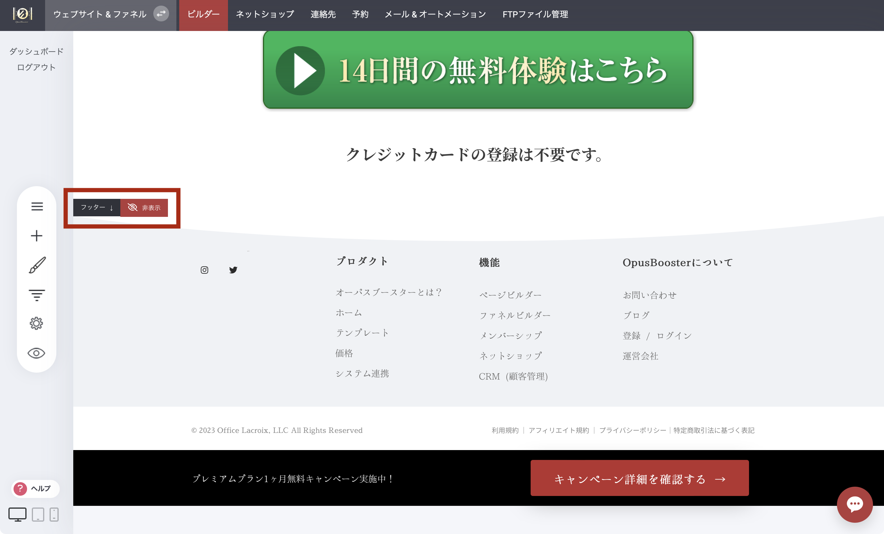

# フッター - 使い方と編集方法

ページの一番下までスクロールすると、画面左側に「フッター」と表示され、フッターエリアを示す矢印が表示されます。

**フッター**エリアに追加したものはすべて、フッターを有効にしたすべてのページに共通して表示されます。フッターを隠すには、「非表示」ボタンをクリックしてください。

<figure><figcaption></figcaption></figure>

---

<!-- cta:opusbooster -->

**自分の場合はどう使えばいいか**

[OpusBoosterの機能全体](https://opusbooster.com/all-features)を見る。設計から相談したい方は[15分の無料相談](https://opusbooster.com/consultation)、まず触ってみたい方は[14日間の無料トライアル](https://opusbooster.com/register)（クレジットカード不要）から。

