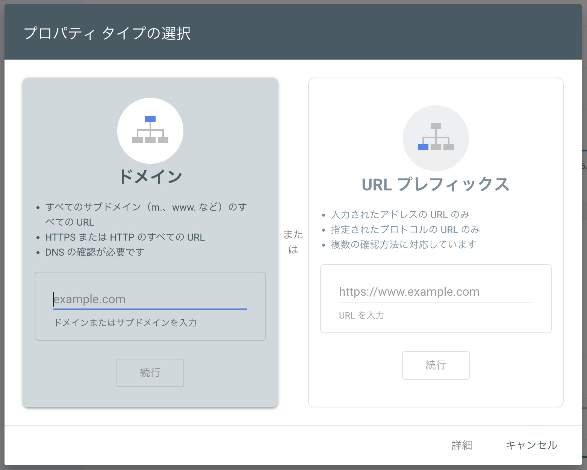
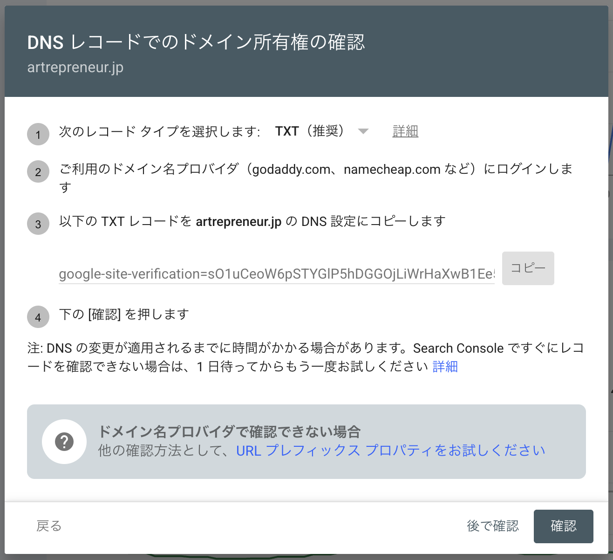
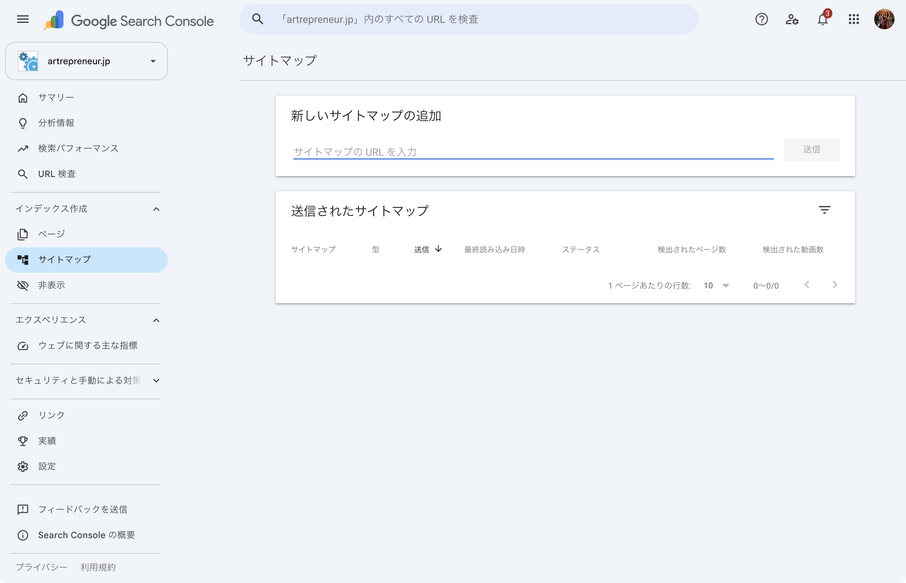
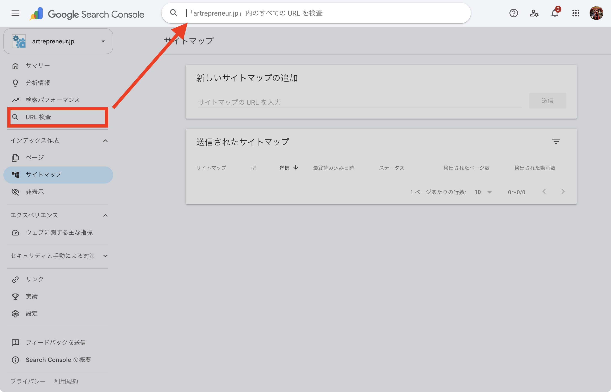

# Google Search Consoleに登録する

[カスタムドメインの接続](custom-domain.md)を済ませてサイトを公開したら、次はGoogleにサイトの存在を伝える番です。ここを飛ばしてしまうと、せっかく書いたページがなかなか検索結果に出てこない、ということが起こりえます。

## サイトマップ自体は自動で作られています

まず安心していただきたいのですが、検索エンジンにページの一覧を伝えるための「サイトマップ」というファイルは、OpusBoosterが自動で作成しています。次のURLで確認できます（「あなたのドメイン」の部分は、ご自身のドメインに置き換えてください）。

```
https://あなたのドメイン/sitemap.xml
```

ただし、サイトマップが存在することと、それをGoogleに知らせることは別の話です。ここから先の手順で、Googleにサイトの存在をきちんと伝えます。

## 1. Google Search Consoleにサイトを登録する

まず、[Google Search Console](https://search.google.com/search-console)にGoogleアカウントでログインし、「プロパティを追加」からサイトを登録します。

登録方法には「ドメイン」と「URLプレフィックス」の2種類があります。迷ったら、あなたのドメインを丸ごと管理できる「**ドメイン**」を選び、独自ドメイン（`example.com`のような形）を入力してください。

<figure><figcaption>プロパティタイプの選択画面。「ドメイン」を選び、独自ドメインを入力します</figcaption></figure>

## 2. 所有権を確認する

「ドメイン」を選んだ場合、**DNSレコードでの確認**が必要になります。画面に表示される「TXTレコード」の値をコピーして、ドメインの管理画面（ドメインを購入したサービスの設定画面）に追加してください。

これは、[カスタムドメインの接続](custom-domain.md)でDNSレコードを追加したときと同じ場所での作業です。あわせてDNS設定を行うと、迷わず進められます。

<figure><figcaption>DNSレコードでのドメイン所有権確認画面。表示されたTXTレコードをドメインの管理画面に追加します</figcaption></figure>


DNSの変更が反映されるまで、数時間から最大1日ほどかかることがあります。「確認」を押してもすぐに認識されない場合は、少し時間を置いてから再度お試しください。


## 3. サイトマップを送信する

所有権の確認が済んだら、左メニューの「**サイトマップ**」を開き、「新しいサイトマップの追加」の欄に、次のように入力して送信します。

```
sitemap.xml
```

<figure><figcaption>サイトマップの送信画面。「サイトマップのURLを入力」欄に sitemap.xml と入力して送信します</figcaption></figure>

送信した直後は「取得できませんでした」のような表示になることがありますが、数時間〜1日ほどで「成功しました」に変わります。すぐに反映されなくても心配いりません。

## 4. 主要なページのインデックス登録をリクエストする

サイトマップを送るだけでも、Googleはいずれページを見つけてくれます。ただ、特に早く登録してほしいページ（トップページや、力を入れた記事など）があれば、左メニューの「**URL検査**」から個別にリクエストできます。

<figure><figcaption>左メニューの「URL検査」から、個別のページのインデックス状況を確認・リクエストできます</figcaption></figure>

「URL検査」を開いたら、上部の検索欄にページのURLを貼り付けて検査します。「URLはGoogleに登録されていません」と表示された場合は、「**インデックス登録をリクエスト**」ボタンを押してください。数分の検証のあと、リクエストが完了します。


インデックス登録をリクエストしても、実際に検索結果に載るかどうかはGoogleの判断次第です。多くの場合は数日で反映されますが、もう少しかかることもあります。


## 上手に使うコツ

* **サイトを公開したら、なるべく早めに登録する** — 後回しにするほど、検索に出てくるまでの時間が延びてしまいます
* **サイトマップの送信は最初の一度だけで大丈夫** — 新しいページを追加しても、サイトマップは自動で更新されるので、送信し直す必要はありません
* **急いで見てほしいページだけ、個別にインデックス登録をリクエストする** — すべてのページを1つずつ登録する必要はありません
* **反映には数日かかることもあると心得ておく** — インデックス登録リクエストをしてもすぐに検索結果に出てこないのは、故障ではなく通常の動きです
