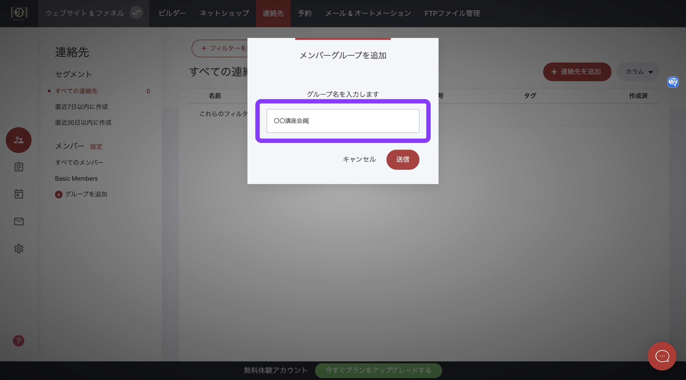
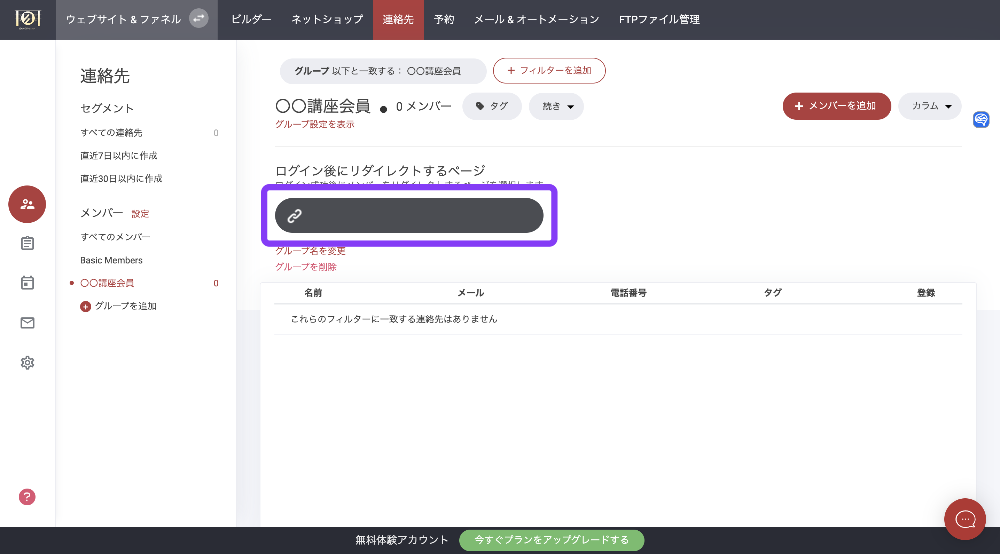
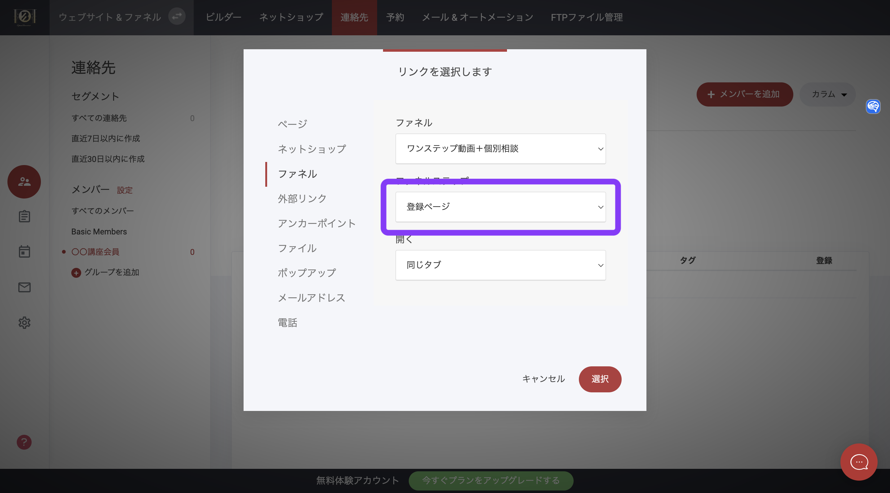

# メンバーシップグループの作成

この記事では、**メンバーシップグループの作成方法**、グループの管理方法、フォームによるグループへのユーザーの追加、ストア商品の購入について説明します。

メンバーシップグループの作成を開始するには、**「連絡先」タブ**を開き、以下のように「**グループを追加**」を選択します。

<figure><figcaption></figcaption></figure>

「グループを追加」を選択したら、後で参照できるようにグループ名を付けてください。このグループ名は、メンバーにも表示されます。

<figure><figcaption></figcaption></figure>

グループを作成したら、会員が以下の動作をした後のリダイレクト先を選択します。

* ストアでの購入後
* フォーム送信後
* チェックアウト後のリダイレクト
* 会員ログイン時

メンバーを誘導するページやファネルステップを選択するだけです。

<figure><figcaption></figcaption></figure>

<figure><figcaption></figcaption></figure>

### メンバーのインポート

すでに他のプラットフォームやEメールリストで既存のメンバーリストをお持ちの場合は、CSVですべてのメンバーを自動的にインポートすることができます。メンバーグループがあり、あるグループから別のグループへユーザーを移動させる必要がある場合は、「エクスポート」タブを使用することができます。

### メンバー詳細ページ

会員には、会員管理ページが自動的に割り当てられます。会員管理ページを編集するには、ページ一覧のなかから「**システムページ」**&#x30D5;ォルダを開き、「**メンバー詳細**」を選択します。

<figure><figcaption></figcaption></figure>

他のページと同様に、新しいブロックやウィジェットを追加して、ページ全体を編集することができます。

下図は会員管理パネルで、ここで会員は以下の内容を管理できるようになっています。

* サブスクリプション
* ダウンロード
* 注文履歴
* 顧客の詳細

### 商品購入時にユーザーをメンバーシップグループに追加する

メンバーシップ商品を作成する場合、商品種別として「メンバーシップ」を選択してください。これにより、メンバーシップグループを商品に割り当てることができます。

ネットショップタブで商品タブを選択します。

.png>)

「**メンバーシップ商品**」を作成する際に、「メンバーシップグループ」タブが表示されるようになります。&#x20;

**「選択」**&#x3092;押すと、新しいポップアウトウィンドウが表示されます。ここで、このメンバーシップ商品に割り当てる特定のメンバーグループを選択することができます。**注：複数のメンバーズグループを選択することもできます。**

### チェックアウト画面でメンバーシップ商品を表示する

メンバーシップ商品のために特定のページを作成する場合、チェックアウトウィジェットに直接追加することができます。また、複数のメンバーシップ商品を追加することもできます。顧客が必要なメンバーシップを選択できるようにするか、複数のメンバーシップ製品をセットにすることもできます。

顧客がメンバーシップ商品を購入すると、メンバーシップエリアへ再度誘導するか、カスタムサンキューページを表示することができます。注：システムで生成されたEメールが顧客に送信され、会員の詳細と、会員管理エリアに誘導するボタンが表示されます。


システムから顧客にメールが自動的に送信され、そのメールにはメンバーシップの詳細と、会員管理エリアにアクセスするためのボタンが含まれています。


<figure><figcaption></figcaption></figure>

### フォームウィジェットを使ってグループにメンバーを追加する

ウェブサイト、ファネル、ランディングページのフォームから、ユーザーをメンバーシップエリアに追加する必要がある場合があります。以下に示すように、フォームを作成し、追加したいメンバーシップグループを追加するだけです。

<figure><figcaption></figcaption></figure>

