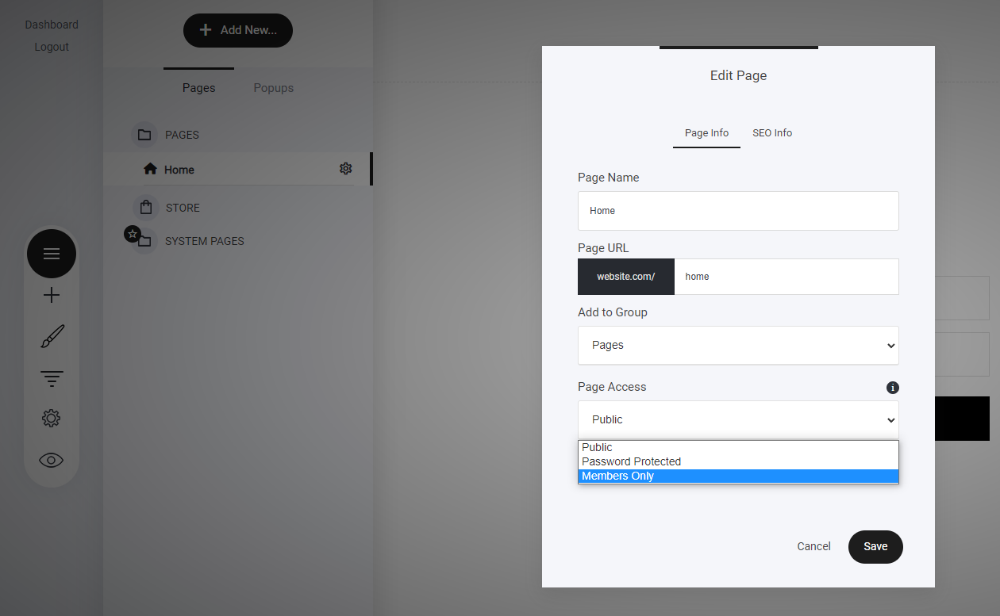

# メンバーシップ限定コンテンツの設定

グループメンバーのみがアクセスできるページを作成するには、ページまたはページが配置されているフォルダに移動します。目的のページを見つけ、**3つのドットアイコン**をクリックしてページ設定にアクセスします。

「ページアクセス」のドロップダウンメニューから「**メンバーのみ**」を選択し、「メンバーグループの選択」をクリックします。次に、ページへのアクセスを許可するグループを選択します。このプロセスは、ファネルステップにも適用されます。

